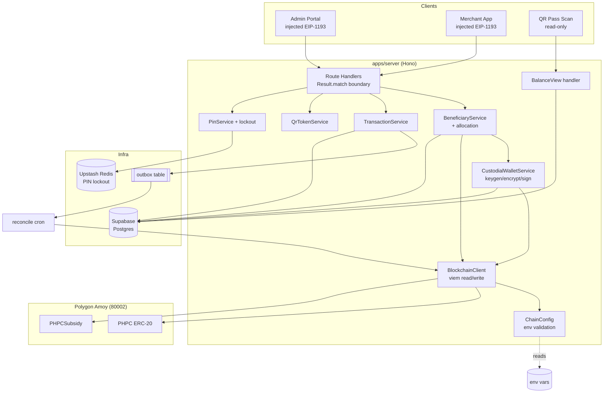
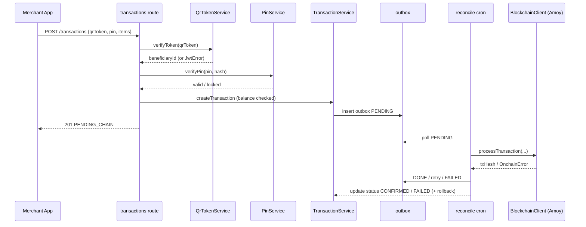

# Design Document

## Overview

This design migrates BANTAYOG's blockchain integration from the local Hardhat network (chain ID 31337) and the Ronin Saigon testnet to the **Polygon Amoy testnet (chain ID 80002)**. It replaces the Ronin/Sky Mavis wallet adapters (Tanto Connect, Waypoint) with standard injected EIP-1193 wallets for admin/merchant connections, and introduces **custodial EVM wallets** for beneficiaries whose keys are generated, encrypted, and held server-side.

The migration touches five layers of the existing `apps/server` codebase and the `packages/contracts` package:

1. **Chain configuration and client** (`src/services/chain.client.ts`, `src/types/env.ts`) — retarget to Polygon Amoy, add strict config validation, chain-ID verification, and real error propagation (removing the "return mock on failure" fallback that currently masks connection errors).
2. **Custodial wallet management** (new `src/services/custodial-wallet.service.ts`) — generate/encrypt/store/decrypt beneficiary keypairs and sign on their behalf.
3. **Allocation and purchase flows** (`src/services/beneficiary.service.ts`, `src/routes/beneficiaries.ts`, `src/routes/transactions.ts`) — one-time tier allocation with treasury checks and duplicate prevention; PIN-authorized purchases with lockout, balance checks, and compensating rollback.
4. **QR token integrity** (`src/services/qr-token.service.ts`) — confirm signing/verification round-trip and configurable TTL (default 300s).
5. **Contract deployment** (`packages/contracts`) — deploy mock PHPC + PHPCSubsidy to Amoy and mint 100,000 PHPC to the LGU admin wallet.

A cross-cutting **cleanup** requirement removes dropped Ronin/Sky Mavis adapter code, chain ID 31337 references, and dead Hardhat-only artifacts, ensuring the build, type-check, and test suite pass with zero references to removed code.

The design preserves the existing architectural conventions: `neverthrow` `AppResult<T>` return types from every service, `Result.match` at the Hono HTTP boundary, repository pattern over Supabase, the transaction outbox + reconcile cron for on-chain settlement, and `viem` as the EVM client library.

### Research Notes

- **Polygon Amoy chain parameters.** Amoy is the current Polygon PoS testnet (successor to Mumbai). Its chain ID is **80002** and its native currency is **POL** (18 decimals). Public JSON-RPC endpoints include `https://rpc-amoy.polygon.technology`; the RPC URL is treated as an environment-provided value in this design so it can be swapped for a provider (Alchemy/Infura) without code changes. Source: [Polygon Amoy documentation](https://docs.polygon.technology/pos/reference/rpc-endpoints/). Content was rephrased for compliance with licensing restrictions.
- **`viem` chain definition.** `viem` ships a built-in `polygonAmoy` chain object (`viem/chains`), which encodes id 80002 and the default RPC. We will use `defineChain` with the env-provided RPC URL to allow overrides while retaining id 80002. Source: [viem chains reference](https://viem.sh/docs/chains/introduction). Content was rephrased for compliance with licensing restrictions.
- **Key encryption.** Node's built-in `crypto` module provides AES-256-GCM, which gives authenticated encryption (confidentiality + tamper detection). This avoids adding a new dependency and satisfies the "encrypted at rest, key stored separately" requirement by sourcing the encryption key from an environment variable distinct from the datastore.
- **Existing stack confirmed from code:** `viem ^2.54`, `jose ^6` (HS256 QR tokens), `@node-rs/argon2` (PIN hashing), `@upstash/ratelimit` (sliding window, already used for a `pin` limiter), `xstate ^5` (transaction lifecycle machine), `vitest ^2` (test runner). No property-based testing library is currently present; `fast-check` will be added for the correctness properties.

## Architecture

### High-Level Component Diagram



### Migration Strategy

The migration is additive-then-subtractive to keep the build green throughout:

1. Introduce `ChainConfig` with Polygon Amoy definitions and strict validation.
2. Rewrite `BlockchainClient` to consume `ChainConfig`, verify chain ID 80002, enforce timeouts, and return typed `OnchainError` results instead of silently returning mock hashes.
3. Add `CustodialWalletService` and wire it into beneficiary registration and purchase signing.
4. Update deployment scripts and `hardhat.config.ts` to add the `amoy` network and mint logic.
5. Remove Ronin/Sky Mavis adapter paths, `wallet-adapter.gateway.ts` non-injected branches, chain ID 31337 network entries, and the `SKY_MAVIS_APP_ID`/Ronin env vars.
6. Update `env.ts`, `.env.example`, and referencing code; run type-check and tests to confirm zero unresolved references.

### On-Chain Settlement Flow (unchanged control flow, retargeted network)



## Components and Interfaces

### 1. ChainConfig (new module: `src/lib/chain/config.ts`)

Centralizes all Polygon Amoy configuration reading and validation. Replaces the ad-hoc `process.env` reads scattered through `chain.client.ts`.

```typescript
export const POLYGON_AMOY_CHAIN_ID = 80002 as const

export interface ChainConfig {
  rpcUrl: string                 // POLYGON_AMOY_RPC_URL
  chainId: 80002
  deployerKey: `0x${string}`     // DEPLOYER_PRIVATE_KEY
  lguAdminWallet: `0x${string}`  // LGU_ADMIN_WALLET_ADDRESS
  phpcTokenAddress: `0x${string}`
  phpcSubsidyAddress: `0x${string}`
  keyEncryptionKey: string       // CUSTODIAL_KEY_ENCRYPTION_KEY (separate store)
  qrTokenSecret: string
  qrTokenTtlSeconds: number      // default 300
}

// Returns Ok(config) or Err(ConfigError) naming EVERY offending variable.
export function loadChainConfig(env: NodeJS.ProcessEnv): AppResult<ChainConfig>

// Validators
export function isHttpUrl(v: string): boolean               // http/https, non-empty
export function isEvmAddress(v: string): boolean            // ^0x[0-9a-fA-F]{40}$
export function isEvmPrivateKey(v: string): boolean         // ^0x[0-9a-fA-F]{64}$
```

Validation rules (Requirements 1.1, 1.4, 1.5, 1.8, 10.1, 10.2, 10.3, 10.5):
- Every required variable must be present and non-empty; missing/empty variables are collected and reported together (no partial config applied).
- `rpcUrl` must be a non-empty http/https URL.
- `deployerKey` must be a valid 0x-prefixed 64-hex private key.
- `lguAdminWallet`, `phpcTokenAddress`, `phpcSubsidyAddress` must be 0x-prefixed 40-hex addresses.
- The config MUST NOT accept chain ID 31337 or a localhost/127.0.0.1 RPC endpoint for runtime operations.
- `qrTokenTtlSeconds` defaults to 300 when unset.

### 2. BlockchainClient (rewrite of `src/services/chain.client.ts`)

Renamed conceptually to a Polygon-Amoy client. Key behavioral changes vs. current implementation:

- Uses `viem`'s `polygonAmoy` chain (id 80002) built from `ChainConfig.rpcUrl`.
- **Removes the mock-on-failure fallbacks.** Current code catches errors and returns fake balances/hashes; the new client returns `Err(OnchainError)` identifying the failed operation and target network, leaving persisted state untouched (Requirements 1.6, 3.2, 3.4, 4.8, 7.10).
- Verifies the connected network reports chain ID 80002 on initialization; a mismatch aborts with an error naming the reported ID (Requirement 1.7).
- Enforces a 30-second bound on read/write connection setup and operations (Requirements 1.2, 1.3, 1.6) using `viem` client `timeout` options and `waitForTransactionReceipt` timeouts.
- Fails fast when a required env var is missing by delegating to `loadChainConfig` (Requirement 1.5).

```typescript
export class BlockchainClient {
  static create(config: ChainConfig): AppResult<BlockchainClient>  // verifies chainId

  getTreasuryBalance(): Promise<AppResult<bigint>>                 // PHPC.balanceOf(lguAdminWallet)
  getBalance(address: string): Promise<AppResult<bigint>>
  allocateCredits(beneficiaryId: string, amountWei: bigint): Promise<AppResult<Hex>>
  transferPHPC(to: string, amountWei: bigint): Promise<AppResult<Hex>>
  signAndSend(account: Account, tx: TxRequest): Promise<AppResult<Hex>>  // custodial signing
  waitForConfirmation(hash: Hex, timeoutMs: number): Promise<AppResult<Receipt>>
}
```

### 3. CustodialWalletService (new: `src/services/custodial-wallet.service.ts`)

Generates and protects beneficiary keypairs; signs transactions on their behalf.

```typescript
export interface EncryptedKey {
  ciphertext: string   // base64
  iv: string           // base64, per-record random
  authTag: string      // base64 (AES-GCM)
  // NOTE: the encryption key itself is NOT stored here — it comes from env.
}

export class CustodialWalletService {
  constructor(config: ChainConfig, repo: BeneficiaryWalletRepository)

  // Generates keypair, ensures address uniqueness (retry up to 3), encrypts key.
  generateWallet(beneficiaryId: string): Promise<AppResult<{ address: `0x${string}` }>>

  // Decrypts in-memory only, signs, then zeroizes the decrypted key buffer.
  signWithBeneficiaryKey<T>(
    beneficiaryId: string,
    signFn: (account: Account) => Promise<T>
  ): Promise<AppResult<T>>
}
```

Behavior:
- `generateWallet` uses `viem/accounts` `generatePrivateKey` + `privateKeyToAccount`, checks the derived address for global uniqueness against stored wallets, retrying up to 3 attempts before treating generation as failed (Requirements 5.3, 5.4).
- Private keys are encrypted with AES-256-GCM using `ChainConfig.keyEncryptionKey`; only the ciphertext/iv/authTag are persisted, never plaintext (Requirement 6.1).
- `signWithBeneficiaryKey` decrypts into a `Buffer` held only for the signing call, then overwrites the buffer (`buf.fill(0)`) in a `finally` block regardless of success/failure (Requirements 6.2, 6.3).
- On decryption failure the operation aborts, the stored ciphertext is left unchanged, and the returned error excludes all key material (Requirement 6.4).
- Key material (encrypted or decrypted) is never placed in API responses, logs, or the balance page. A shared `redactSecrets` helper enforces this for logger calls (Requirements 6.5, 10.4).

### 4. AllocationService (extends `BeneficiaryService`)

Implements one-time tier-based allocation, replacing the unconstrained `addCredits`.

```typescript
const TIER_ALLOCATIONS = { 1: 5000, 2: 3500 } as const  // PHPC

allocateTierCredits(beneficiaryId: string): Promise<AppResult<{
  beneficiary: BeneficiaryDTO
  amount: number
  txHash: string
}>>
```

Rules (Requirement 4):
- Resolve the beneficiary's tier; reject if not Tier 1 or Tier 2 (4.9).
- Reject if a prior allocation exists (idempotency guard via an `allocations` record / `allocated_at` flag) (4.7).
- Check treasury balance ≥ allocation amount; reject with insufficient-funds error if not (4.4).
- Submit the on-chain allocation and wait ≤ 60s; abort with no balance changes on failure/timeout (4.8).
- On success, increase beneficiary balance, decrease treasury balance by the same amount, and write a `Transaction_Record` with beneficiary id, amount, tier, timestamp (4.1, 4.2, 4.3, 4.5).
- Reconciliation mismatch between recorded and on-chain balance flags the allocation as unreconciled and returns an error identifying it (4.6).

### 5. Purchase Flow (updates to `src/routes/transactions.ts` + `PinService`)

Adds PIN lockout and compensating rollback to the existing flow.

- QR token verified; invalid/expired rejected without resolving a beneficiary (Requirements 7.1, 7.2).
- PIN verified against stored Argon2id hash (7.3, 7.4).
- **Lockout:** 5 consecutive incorrect PIN attempts block further attempts for 900 seconds; tracked in Redis keyed by beneficiary id (7.5). Existing Upstash infra is reused; a failure counter with TTL implements the window.
- Amount validation: reject amounts ≤ 0 (7.9) and amounts exceeding balance (7.7).
- On authorized purchase within balance, deduct recorded balance and transfer PHPC to the merchant wallet (7.6).
- Persist a `Transaction_Record` (beneficiary ref, merchant wallet, amount, on-chain hash, timestamp) after successful on-chain processing (7.8).
- **Compensating action:** if the on-chain transfer fails after the recorded balance was deducted, restore the balance, record the discrepancy for manual reconciliation, and report failure (7.10). This is the existing outbox/reconcile responsibility, extended with a restore step.

### 6. QrTokenService (confirm + adjust `src/services/qr-token.service.ts`)

The service already uses `jose` HS256. Adjustments:
- Default expiration TTL becomes **300 seconds** when no TTL is configured (Requirement 9.1), configurable via `ChainConfig.qrTokenTtlSeconds`.
- Verification accepts only when signature matches AND expiration > now (9.2, 9.6).
- Round-trip: a token generated from a valid payload verifies back to the same beneficiary identity and wallet reference (9.3).
- Tampered payloads / bad signatures are rejected with an invalid-signature error returning no identity (9.4, 9.5).

### 7. BalanceView handler (new: `src/routes/balance.ts`)

Read-only endpoint reachable by scanning the QR pass; no PIN.

```
GET /api/balance/view?token=<qrToken>
```

- Decodes/verifies the QR token; on invalid/expired returns a "pass is invalid" response withholding all data (Requirements 8.3, 8.6).
- Resolves the single beneficiary encoded in the token; if none resolves, returns "cannot be matched" withholding data (8.7).
- Returns current balance + up to 50 transaction records, most-recent first (8.2), scoped to that one beneficiary (8.4), with no mutating controls (read-only) (8.5).
- Target: page/data available within 3 seconds of the token being decoded (8.1).
- If balance/history retrieval fails, withholds partial data and returns "temporarily unavailable" (8.8).

### 8. Wallet Integration Cleanup (`src/services/wallet-adapter.gateway.ts` and config)

- Remove the `waypoint` and `tanto` branches; retain only injected EIP-1193 signature verification via `viem.verifyMessage` (Requirements 2.1, 2.2).
- Remove `SKY_MAVIS_APP_ID`, `RONIN_*` env vars, and Ronin chain definitions.
- Remove chain ID 31337 / localhost network entries from runtime config and `hardhat.config.ts` runtime paths (keep only what tests need) (Requirements 2.3, 2.6, 1.8).
- Update all referencing code so type-check and tests pass with zero unresolved references (Requirements 2.4, 2.5, 2.7).

### 9. Contract Deployment (`packages/contracts`)

- Add an `amoy` network entry (chainId 80002, env RPC + deployer key) to `hardhat.config.ts`; drop `saigon`/`ronin` from the v1 runtime path.
- `deploy.ts` deploys `PHPC` then `PHPCSubsidy`, confirms each deployment on-chain before proceeding, then mints exactly `100000 * 10^18` base units to the LGU admin wallet and confirms the mint (Requirements 3.1, 3.3, 3.5).
- On deployment or mint failure, abort and report failure producing no addresses / no minted supply (3.2, 3.4).
- Output the deployed PHPC and PHPCSubsidy addresses as valid EVM addresses (3.6).
- Treasury balance reads exactly 100,000 PHPC while holding initial supply with no allocations (3.7).

## Data Models

### Environment Configuration (Polygon Amoy)

| Variable | Purpose | Validation |
|---|---|---|
| `POLYGON_AMOY_RPC_URL` | JSON-RPC endpoint for Amoy | non-empty http/https URL |
| `POLYGON_AMOY_CHAIN_ID` | Expected chain id (optional; fixed 80002) | equals 80002 |
| `DEPLOYER_PRIVATE_KEY` | Deployer/treasury signer | 0x + 64 hex |
| `LGU_ADMIN_WALLET_ADDRESS` | Treasury wallet holding supply | 0x + 40 hex |
| `PHPC_TOKEN_ADDRESS` | Deployed PHPC token | 0x + 40 hex |
| `PHPC_SUBSIDY_ADDRESS` | Deployed subsidy contract | 0x + 40 hex |
| `CUSTODIAL_KEY_ENCRYPTION_KEY` | AES-256 key for beneficiary keys (separate store) | ≥ 32 bytes |
| `QR_TOKEN_SECRET` | HS256 signing secret | non-empty |
| `QR_TOKEN_TTL_SECONDS` | QR token TTL | positive int, default 300 |

Secret-bearing variables in `.env.example` contain only non-functional placeholders (Requirement 10.2).

### Beneficiary Wallet (new table `beneficiary_wallets`)

```
beneficiary_wallets
├── beneficiary_id   uuid  PK/FK -> beneficiaries.id (one-to-one)
├── address          text  UNIQUE, 0x + 40 hex   (globally unique)
├── enc_ciphertext   text  base64 (AES-256-GCM)
├── enc_iv           text  base64 (per-record)
├── enc_auth_tag     text  base64
└── created_at       timestamptz
```

Uniqueness constraint enforces Requirement 5.3; plaintext key is never a column (Requirement 6.1).

### Allocation Record (extends `transactions` / new `allocations`)

```
allocations
├── id               uuid PK
├── beneficiary_id   uuid FK  UNIQUE   (one-time allocation guard, Req 4.7)
├── tier             int      (1 | 2)
├── amount_phpc      numeric  (5000 | 3500)
├── onchain_tx_hash  text
├── reconciled       boolean  (false => flagged, Req 4.6)
└── allocated_at     timestamptz
```

### Transaction Record (existing `transactions`, reused)

Fields already present: `beneficiary_id`, `merchant_id`, `item_list_jsonb`, `total_credit_deducted`, `stablecoin_amount_wei`, `idempotency_key`, `status` (`PENDING_CHAIN` → `CONFIRMED`/`RECONCILED`/`FAILED`), `onchain_tx_hash`, `confirmed_at`. Purchase records satisfy Requirement 7.8; the balance view reads these ordered `created_at DESC` limit 50 (Requirement 8.2).

### PIN Lockout State (Upstash Redis)

```
key:   pin_fail:{beneficiaryId}   value: attempt count   TTL: 900s on lock
```

5 consecutive failures set a lock flag with a 900s TTL (Requirement 7.5).

### QR Token Payload (JWS/HS256)

```json
{
  "beneficiaryId": "uuid",
  "walletRef": "0x… (beneficiary wallet address reference)",
  "childName": "…",
  "guardianName": "…",
  "tier": 1,
  "iat": 0,
  "exp": 0
}
```

`walletRef` resolves to the stored `beneficiary_wallets.address` (Requirement 5.5); `exp` set from configured TTL (Requirement 9.1).

## Correctness Properties

*A property is a characteristic or behavior that should hold true across all valid executions of a system — essentially, a formal statement about what the system should do. Properties serve as the bridge between human-readable specifications and machine-verifiable correctness guarantees.*

These properties were derived from the acceptance criteria after a prework analysis. Criteria that describe infrastructure, one-shot setup, code cleanup, UI presentation, or timing bounds are covered by integration/smoke/example tests (see Testing Strategy) rather than property-based tests. Redundant criteria were consolidated so each property below provides unique validation value.

### Property 1: Chain config loads valid env and reports every offender otherwise

*For any* environment map, `loadChainConfig` returns `Ok(config)` whose fields equal the env-provided values (with `chainId` fixed at 80002 and `qrTokenTtlSeconds` defaulting to 300 when unset) when all required variables are present, non-empty, and correctly formatted; and *for any* environment map in which one or more required variables are missing, empty, or malformed (RPC URL not a non-empty http/https URL, deployer key not a 0x + 64-hex private key, or any address not a 0x + 40-hex EVM address), it returns an error that names every offending variable, applies no partial configuration, and permits no write connection.

**Validates: Requirements 1.1, 1.4, 1.5, 10.1, 10.3, 10.5**

### Property 2: Runtime config never targets the local Hardhat network

*For any* loaded runtime configuration, the resolved chain ID is 80002 and the RPC URL is neither a localhost/127.0.0.1 endpoint nor associated with chain ID 31337.

**Validates: Requirements 1.8**

### Property 3: Connected-network chain-ID verification

*For any* chain ID reported by the connected network, `BlockchainClient.create` succeeds only when that ID equals 80002, and otherwise aborts with an error that names the mismatched chain ID.

**Validates: Requirements 1.7**

### Property 4: Chain operation failures propagate as typed errors with no state change

*For any* chain read or write operation whose transport times out or is refused, the client returns an error result that identifies the failed operation and the target network, and no persisted state is modified.

**Validates: Requirements 1.6**

### Property 5: Injected-wallet signature verification round-trip

*For any* generated EVM keypair and message, verifying a signature produced by that key returns the signer's address, and *for any* tampered signature or mismatched address the verification is rejected.

**Validates: Requirements 2.2**

### Property 6: Tier allocation credits the correct amount and conserves total supply

*For any* beneficiary classified as Tier 1 (5,000 PHPC) or Tier 2 (3,500 PHPC) with no prior allocation and a treasury balance at least the tier amount, a successful allocation increases the beneficiary balance by exactly the tier amount, decreases the treasury balance by exactly the same amount (total conserved), and records a Transaction_Record containing the beneficiary identifier, allocated amount, tier classification, and timestamp.

**Validates: Requirements 4.1, 4.2, 4.3, 4.5**

### Property 7: Rejected allocations leave balances unchanged

*For any* allocation attempt that is rejected — because the treasury balance is less than the tier amount, because a prior allocation already exists, because the tier classification is not Tier 1 or Tier 2, or because the on-chain allocation fails or does not confirm within 60 seconds — the beneficiary balance and the treasury balance are both left unchanged and an error is returned identifying the specific rejection cause.

**Validates: Requirements 4.4, 4.7, 4.8, 4.9**

### Property 8: Reconciliation mismatch flags the allocation

*For any* allocation whose recorded balance diverges from the on-chain balance, reconciliation marks the allocation as unreconciled and returns an error that identifies the mismatched allocation.

**Validates: Requirements 4.6**

### Property 9: Each beneficiary maps to exactly one globally unique wallet address, with collision retry

*For any* sequence of beneficiary registrations, every generated wallet address is well-formed and globally unique across all beneficiaries, each beneficiary is associated with exactly one address, and when address generation collides with an existing address it retries up to 3 attempts before treating wallet generation as failed.

**Validates: Requirements 5.1, 5.3, 5.4**

### Property 10: Beneficiary private keys are persisted only in encrypted form

*For any* generated beneficiary keypair, the persisted representation contains only ciphertext (with a per-record IV and auth tag) that differs from the plaintext key, the plaintext key is never persisted, and the encryption key is sourced separately (from configuration) rather than stored alongside the ciphertext.

**Validates: Requirements 5.2, 6.1**

### Property 11: Wallet key encryption/decryption round-trip enables signing

*For any* generated private key, decrypting its stored ciphertext yields the original key, and an account derived from the decrypted key produces valid signatures.

**Validates: Requirements 6.2**

### Property 12: Decrypted key material is erased after signing

*For any* signing operation performed with a beneficiary key, whether the operation succeeds or fails, the decrypted key buffer is zeroized before control returns to the caller.

**Validates: Requirements 6.3**

### Property 13: Decryption failure aborts signing without exposing or mutating key material

*For any* corrupted ciphertext or auth tag, the signing operation aborts, the stored encrypted key is left unchanged, and the returned error contains neither the encrypted nor the decrypted key material.

**Validates: Requirements 6.4**

### Property 14: Secrets are redacted from all serialized output

*For any* object containing secret material (deployer key, beneficiary private keys in encrypted or decrypted form, QR token signing secret, or key-encryption key), the redaction applied before it reaches an API response or log output produces text in which no secret value appears.

**Validates: Requirements 6.5, 10.4**

### Property 15: Registration wallet failure persists no partial state

*For any* registration in which wallet generation fails, no beneficiary record and no partial wallet data are persisted, and an error indicating the beneficiary was not created is returned.

**Validates: Requirements 5.6**

### Property 16: PIN hashing/verification round-trip

*For any* 6-digit PIN, verifying that PIN against its stored hash returns true, and verifying any different PIN against that hash returns false while leaving the recorded balance unchanged.

**Validates: Requirements 7.3, 7.4**

### Property 17: PIN lockout after five consecutive failures

*For any* beneficiary, after 5 consecutive incorrect PIN attempts, further purchase PIN attempts are blocked for 900 seconds and reported as temporarily locked.

**Validates: Requirements 7.5**

### Property 18: Authorized in-balance purchase deducts and transfers the exact amount

*For any* PIN-authorized purchase whose amount is positive and less than or equal to the beneficiary's recorded balance, the recorded balance decreases by exactly the purchase amount, the equivalent PHPC is transferred to the merchant wallet, and a Transaction_Record is persisted containing the beneficiary reference, merchant wallet, purchase amount, on-chain transaction hash, and timestamp.

**Validates: Requirements 7.6, 7.8**

### Property 19: Invalid-amount and over-balance purchases are rejected without balance change

*For any* purchase whose amount is less than or equal to zero, or whose amount exceeds the beneficiary's recorded balance, the purchase is rejected with the corresponding error (invalid amount or insufficient balance) and the recorded balance is unchanged.

**Validates: Requirements 7.7, 7.9**

### Property 20: Failed on-chain transfer restores the recorded balance

*For any* purchase in which the on-chain PHPC transfer fails after the recorded balance was deducted, the recorded balance is restored to its pre-deduction value (net change zero), the discrepancy is recorded for manual reconciliation, and the purchase is reported as failed.

**Validates: Requirements 7.10**

### Property 21: QR token generation embeds signature and TTL-based expiration

*For any* beneficiary payload and configured time-to-live, the generated QR token is signed with the configured secret and embeds an expiration equal to issued-at plus the configured TTL, defaulting to 300 seconds when no TTL is configured.

**Validates: Requirements 9.1**

### Property 22: QR token generate-then-verify round-trip resolves the same beneficiary and wallet

*For any* valid beneficiary payload, verifying the generated token succeeds only when the signature matches the configured secret and the embedded expiration is greater than the current time, and returns the same beneficiary identity and wallet reference that were encoded at generation time (which in turn resolves the associated beneficiary and Beneficiary_Wallet).

**Validates: Requirements 7.1, 9.2, 9.3, 5.5**

### Property 23: Tampered, mis-signed, or expired QR tokens are rejected without resolving data

*For any* QR token whose payload was modified after signing, whose signature does not match the configured secret, or whose embedded expiration is less than or equal to the current time, verification is rejected with the corresponding error (invalid signature or expired), no beneficiary identity or wallet reference is returned, and no purchase or balance resolution proceeds.

**Validates: Requirements 7.2, 9.4, 9.5, 9.6**

### Property 24: Balance view returns the beneficiary's own history, ordered and capped

*For any* valid QR token and any set of stored transaction records, the balance view returns only records belonging to the beneficiary encoded in the token, ordered from most recent to oldest, capped at 50 entries.

**Validates: Requirements 8.2, 8.4**

### Property 25: Balance view withholds all data on invalid access or retrieval failure

*For any* balance-view request whose QR token is invalid or expired, whose valid token resolves to no beneficiary or wallet, or for which balance/transaction retrieval fails, the page denies access or reports unavailability, withholds all balance and transaction data (no partial data), and returns the corresponding message.

**Validates: Requirements 8.6, 8.7, 8.8**

## Error Handling

The design reuses the existing `neverthrow` `AppResult<T>` taxonomy in `src/lib/errors.ts` and the `errorToHttpStatus` / `errorToResponseBody` HTTP-boundary mappers. Error categories map as follows:

| Scenario | Error type | HTTP | Notes |
|---|---|---|---|
| Missing/invalid Amoy config var | `ValidationError` (config) | 400/500 at init | Names every offending variable; no partial config (Req 1.5, 10.3, 10.5). Initialization failures abort startup. |
| Chain read/write timeout or refusal | `OnchainError` (code, no txHash mutation) | 502 | Identifies operation + target network; no persisted state change (Req 1.6, 4.8, 7.10). |
| Chain ID mismatch | `OnchainError` | 502 at init | Names mismatched ID (Req 1.7). |
| Insufficient treasury / duplicate / invalid tier | `PolicyError` / `ValidationError` | 422/400 | Balances unchanged (Req 4.4, 4.7, 4.9). |
| Reconciliation mismatch | `OnchainError` | 502 | Allocation flagged unreconciled (Req 4.6). |
| Wallet generation failure | `PersistenceError` | 500 | Registration aborts, no partial state (Req 5.6). |
| Key decryption failure | `OnchainError` / `ValidationError` | 502/400 | No key material in error (Req 6.4); ciphertext retained. |
| Invalid/expired QR token | `JwtError` (`invalid` / `expired`) | 401 | No identity resolved (Req 7.2, 9.4–9.6, 8.6). |
| Wrong PIN | `AuthError('invalid_credentials')` | 403 | Balance unchanged (Req 7.4). |
| PIN lockout | `RateLimitError(retryAfter=900)` | 429 | 900s block (Req 7.5). |
| Insufficient balance / invalid amount | `ValidationError` | 400 | Balance unchanged (Req 7.7, 7.9). |
| Balance retrieval failure | `PersistenceError` | 500 | Withhold all data (Req 8.8). |

**Compensating actions.** For purchases, the deduct-then-settle flow uses the existing `outbox` + reconcile cron. If on-chain settlement fails permanently, the reconcile worker restores the recorded balance and records the discrepancy (Req 7.10). Allocation performs the on-chain step before committing balance changes so a chain failure leaves balances untouched (Req 4.8).

**Secret redaction.** A `redactSecrets` helper wraps logger calls and response serialization to guarantee deployer keys, beneficiary keys (encrypted/decrypted), the QR signing secret, and the key-encryption key never appear in logs or responses (Req 6.5, 10.4).

## Testing Strategy

The feature involves pure logic with strong universal properties (config validation, QR token signing round-trips, key encryption round-trips, allocation/purchase conservation invariants, uniqueness), so **property-based testing applies** to the logic layer. Infrastructure, deployment, cleanup, and UI/timing criteria are covered by integration, smoke, and example tests.

### Property-Based Tests

- **Library:** `fast-check` (add as a dev dependency), integrated with the existing `vitest` runner. Property-based testing is NOT implemented from scratch.
- **Iterations:** each property test runs a minimum of **100 iterations** (`fc.assert(..., { numRuns: 100 })`).
- **Tagging:** each property test is tagged with a comment referencing its design property in the format:
  `// Feature: polygon-amoy-phpc-migration, Property {number}: {property_text}`
- **Coverage:** one property-based test implements each of Properties 1–25 above. Generators include: arbitrary env maps (valid and with missing/empty/malformed subsets), EVM keypairs and messages, beneficiary payloads with Tier 1/2/invalid tiers, treasury/beneficiary balances, purchase amounts (positive, zero, negative, over/under balance), transaction-history lists of varying length, 6-digit PIN strings, and tampered/expired token variants.
- **Isolation:** chain interactions are exercised through a mocked `BlockchainClient` transport so properties test our logic (not Amoy) and remain cheap to run 100+ times; Supabase and Redis are backed by in-memory fakes.

### Unit / Example Tests

- Deployment orchestration error handling with mocked deploy/mint steps (Req 3.2, 3.4).
- PHPC decimals equals 18; treasury reports exactly 100,000 PHPC post-mint (Req 3.5, 3.7).
- Deployed addresses match EVM format (Req 3.6).
- Balance-view read-only surface and no-PIN access (Req 8.1, 8.3, 8.5).

### Integration Tests

- Read/write connection to Polygon Amoy (or a forked/mocked node) succeeds and targets chain ID 80002 within the timeout (Req 1.2, 1.3).
- End-to-end contract deployment + mint against a test node confirming on-chain gating (Req 3.1, 3.3).

### Smoke / Static Checks

- `tsc --noEmit` type-check passes with zero unresolved references (Req 2.4, 2.5).
- Grep-based assertions that no runtime references to Ronin/Tanto/Waypoint adapters or chain ID 31337 remain (Req 1.8, 2.1, 2.3, 2.6).
- Full `vitest run` completes with zero failures (Req 2.7).
- `.env.example` enumerates every required Amoy variable with only non-functional placeholder secrets (Req 10.2).

### Requirements Coverage Summary

- Property-based: Requirements 1.1, 1.4–1.8, 2.2, 4.1–4.9, 5.1–5.6, 6.1–6.5, 7.1–7.10, 8.2, 8.4, 8.6–8.8, 9.1–9.6, 10.1, 10.3–10.5.
- Example/unit: Requirements 3.2, 3.4, 3.5, 3.6, 3.7, 8.1, 8.3, 8.5.
- Integration: Requirements 1.2, 1.3, 3.1, 3.3.
- Smoke/static: Requirements 2.1, 2.3, 2.4, 2.5, 2.6, 2.7, 10.2.
