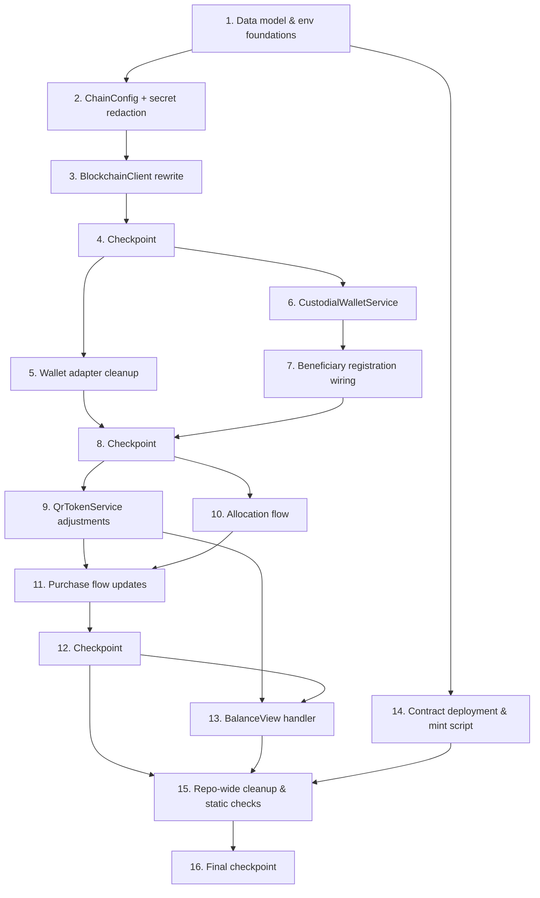

# Implementation Plan: Polygon Amoy PHPC Migration

## Overview

This plan migrates `apps/server` and `packages/contracts` from the local Hardhat network / Ronin Saigon + Sky Mavis wallet stack to **Polygon Amoy (chain ID 80002)** with custodial beneficiary wallets, tier-based allocation, PIN-authorized purchases, a read-only balance view, and PHPC contract deployment/minting. Implementation is TypeScript (existing stack: `viem`, `neverthrow`, `jose`, `@node-rs/argon2`, `@upstash/ratelimit`, `xstate`, `vitest`), with `fast-check` added for the 25 correctness properties defined in `design.md`. Work proceeds bottom-up: data model → chain config → blockchain client → wallet adapter cleanup → custodial wallets → beneficiary registration → QR tokens → allocation → purchases → balance view → contract deployment → repo-wide cleanup/static checks.

## Task Dependency Graph



```json
{
  "waves": [
    { "wave": 1, "tasks": ["1"] },
    { "wave": 2, "tasks": ["2", "14"] },
    { "wave": 3, "tasks": ["3"] },
    { "wave": 4, "tasks": ["4"] },
    { "wave": 5, "tasks": ["5", "6"] },
    { "wave": 6, "tasks": ["7"] },
    { "wave": 7, "tasks": ["8"] },
    { "wave": 8, "tasks": ["9", "10"] },
    { "wave": 9, "tasks": ["11"] },
    { "wave": 10, "tasks": ["12"] },
    { "wave": 11, "tasks": ["13"] },
    { "wave": 12, "tasks": ["15"] },
    { "wave": 13, "tasks": ["16"] }
  ]
}
```

Notes on dependencies:
- Task 3 (BlockchainClient) depends on Task 2 (ChainConfig) because it consumes `loadChainConfig`.
- Task 6 (CustodialWalletService) depends on Task 4 checkpoint (stable ChainConfig/BlockchainClient) and Task 1 (beneficiary_wallets table/repository).
- Task 7 (registration wiring) depends on Task 6.
- Task 9 (QrTokenService) and Task 10 (Allocation) both depend on the Task 8 checkpoint, and can proceed in parallel.
- Task 11 (Purchase flow) depends on both Task 9 (QR verification) and Task 10 (uses the same BlockchainClient/allocation patterns) being stable.
- Task 13 (BalanceView) depends on Task 9 (QR verification) and the Task 12 checkpoint (transaction records exist and are stable).
- Task 14 (contract deployment) only depends on Task 1 (env/config placeholders) and can proceed independently of the server-side service work.
- Task 15 (cleanup/static checks) depends on all functional work being complete (Tasks 12, 13, 14) since it verifies zero dangling references across the whole repo.

## Tasks

- [x] 1. Data model and environment foundations
  - [x] 1.1 Write Supabase migration `00003_polygon_amoy_migration.sql`
    - Add `beneficiary_wallets` table (`beneficiary_id` PK/FK unique, `address` unique, `enc_ciphertext`, `enc_iv`, `enc_auth_tag`, `created_at`)
    - Add `allocations` table (`id`, `beneficiary_id` FK unique, `tier`, `amount_phpc`, `onchain_tx_hash`, `reconciled`, `allocated_at`)
    - _Requirements: 5.3, 6.1, 4.5, 4.6, 4.7_
  - [x] 1.2 Update `@bantayog/db` types (`packages/db/src/types.ts`)
    - Add `BeneficiaryWalletRow` and `AllocationRow` interfaces, plus their `Insert`/`Update` variants in the `Database['public']['Tables']` map
    - _Requirements: 5.3, 6.1, 4.5, 4.6, 4.7_
  - [x] 1.3 Add `BeneficiaryWalletRepository` and `AllocationRepository`
    - Create `apps/server/src/repositories/beneficiary-wallet.repository.ts` and `allocation.repository.ts` extending `BaseRepository`
    - _Requirements: 5.3, 4.7_
  - [x] 1.4 Retarget environment typing and templates to Polygon Amoy
    - Rewrite `apps/server/src/types/env.ts`: remove `RONIN_RPC_URL`, `RONIN_SAIGON_RPC_URL`, `RONIN_SAIGON_CHAIN_ID`, `BENEFICIARY_REGISTRY_ADDRESS`/`MERCHANT_REGISTRY_ADDRESS` (unless still used elsewhere), `LGU_TREASURY_ADDRESS` rename; add `POLYGON_AMOY_RPC_URL`, `DEPLOYER_PRIVATE_KEY`, `LGU_ADMIN_WALLET_ADDRESS`, `PHPC_TOKEN_ADDRESS`, `PHPC_SUBSIDY_ADDRESS`, `CUSTODIAL_KEY_ENCRYPTION_KEY`, `QR_TOKEN_SECRET`, `QR_TOKEN_TTL_SECONDS`
    - Rewrite `apps/server/.env.example` removing `RONIN_*`/`SKY_MAVIS_APP_ID`/`SERVER_WALLET_PRIVATE_KEY` and adding every Amoy variable with non-functional placeholders only
    - Update `packages/contracts/.env.example` similarly (Amoy RPC URL + deployer key placeholder, drop Ronin/Saigon entries)
    - _Requirements: 10.1, 10.2, 1.4, 1.8_
  - [x] 1.5 Add `fast-check` as a dev dependency
    - Add `fast-check` to `apps/server/package.json` `devDependencies`, install, confirm it resolves under the existing `vitest` runner
    - _Requirements: (testing infrastructure, supports all property tests below)_

- [x] 2. ChainConfig module and secret redaction helper
  - [x] 2.1 Implement `apps/server/src/lib/chain/config.ts`
    - Export `POLYGON_AMOY_CHAIN_ID = 80002`, `ChainConfig` interface, `isHttpUrl`, `isEvmAddress`, `isEvmPrivateKey` validators, and `loadChainConfig(env)` returning `AppResult<ChainConfig>` that collects and reports every offending variable, applies no partial config, defaults `qrTokenTtlSeconds` to 300, and rejects chain ID 31337 / localhost RPC endpoints
    - _Requirements: 1.1, 1.4, 1.5, 1.8, 10.1, 10.2, 10.3, 10.5_
  - [x] 2.2 Implement `apps/server/src/lib/redact.ts`
    - Export `redactSecrets(value)` that scans an object/string for configured secret values (deployer key, beneficiary keys encrypted/decrypted, QR signing secret, key-encryption key) and replaces them with a fixed redaction marker before it can reach logs or responses
    - Wire `redactSecrets` into `apps/server/src/lib/logger.ts` so all logger calls pass through it
    - _Requirements: 6.5, 10.4_
  - [x]* 2.3 Write property test for ChainConfig validation
    - **Property 1: Chain config loads valid env and reports every offender otherwise**
    - **Validates: Requirements 1.1, 1.4, 1.5, 10.1, 10.3, 10.5**
    - Use `fast-check` with arbitrary env maps (valid and with missing/empty/malformed subsets), 100+ iterations, tag: `// Feature: polygon-amoy-phpc-migration, Property 1: ...`
  - [x]* 2.4 Write property test for runtime network targeting
    - **Property 2: Runtime config never targets the local Hardhat network**
    - **Validates: Requirements 1.8**
    - Generate arbitrary valid configs and assert chain ID is always 80002 and RPC URL is never localhost/127.0.0.1
  - [x]* 2.5 Write property test for secret redaction
    - **Property 14: Secrets are redacted from all serialized output**
    - **Validates: Requirements 6.5, 10.4**
    - Generate arbitrary objects embedding secret values (deployer key, beneficiary keys, QR secret, key-encryption key) and assert `redactSecrets` output never contains the raw secret string
  - [x]* 2.6 Write unit tests for specific ChainConfig error messages
    - Missing RPC URL, malformed private key, malformed address — assert the returned error names each offending variable by name
    - _Requirements: 1.5, 10.3, 10.5_

- [x] 3. Rewrite BlockchainClient for Polygon Amoy
  - [x] 3.1 Rewrite `apps/server/src/services/chain.client.ts` as `BlockchainClient`
    - Build a `viem` `polygonAmoy`-based chain via `defineChain` using `ChainConfig.rpcUrl`; implement `BlockchainClient.create(config)` verifying the connected network reports chain ID 80002 (abort naming the mismatched ID otherwise)
    - Implement `getTreasuryBalance`, `getBalance`, `allocateCredits`, `transferPHPC`, `signAndSend`, `waitForConfirmation`, each returning `AppResult<T>` and enforcing a 30-second bound on connection/read/write via `viem` client `timeout` options and `waitForTransactionReceipt` timeouts
    - Remove all "return mock on failure" fallback branches; on timeout/refusal return `Err(OnchainError)` naming the failed operation and target network, leaving persisted state untouched
    - _Requirements: 1.2, 1.3, 1.5, 1.6, 1.7, 1.8_
  - [x]* 3.2 Write property test for chain-ID verification
    - **Property 3: Connected-network chain-ID verification**
    - **Validates: Requirements 1.7**
    - Mock the transport to report arbitrary chain IDs; assert `create` only succeeds at 80002 and otherwise returns an error naming the mismatched ID
  - [x]* 3.3 Write property test for typed failure propagation
    - **Property 4: Chain operation failures propagate as typed errors with no state change**
    - **Validates: Requirements 1.6**
    - Mock transport to time out/refuse on arbitrary operations; assert every method returns an `OnchainError` identifying the operation/network and that no persisted state (mocked repo) was mutated
  - [x] 3.4 Write unit tests for `BlockchainClient` initialization and reads
    - Deployer-key-present vs. absent wallet client construction, `getTreasuryBalance` reading `PHPC.balanceOf(lguAdminWallet)`, `getBalance` for arbitrary address
    - _Requirements: 1.2, 1.3_
  - [x] 3.5 Update callers of the old `ChainClient` API
    - Update `apps/server/src/routes/chain.ts` and `apps/server/src/cron/reconcile.ts` to use the new `BlockchainClient` construction (`BlockchainClient.create(config)`), the renamed methods, and `Result.match` at the HTTP boundary instead of try/catch
    - _Requirements: 1.6, 2.4, 2.5_

- [x] 4. Checkpoint — ensure ChainConfig and BlockchainClient tests pass
  - Ensure all tests pass, ask the user if questions arise.

- [x] 5. Wallet adapter cleanup (injected EIP-1193 only)
  - [x] 5.1 Rewrite `apps/server/src/services/wallet-adapter.gateway.ts`
    - Remove the `waypoint` and `tanto` branches entirely; retain only injected EIP-1193 signature verification via `viem.verifyMessage`, returning the verified address or rejecting on tampered signature/mismatched address
    - _Requirements: 2.1, 2.2_
  - [x]* 5.2 Write property test for injected-wallet signature verification round-trip
    - **Property 5: Injected-wallet signature verification round-trip**
    - **Validates: Requirements 2.2**
    - Generate arbitrary EVM keypairs/messages via `viem/accounts`; assert verifying a genuine signature returns the signer address, and tampered signatures/mismatched addresses are rejected
  - [x] 5.3 Remove Ronin/Sky Mavis references from remaining runtime code
    - Update every caller of `WalletAdapterGateway` (e.g. auth routes/middleware) to only pass `'injected'`, remove `SKY_MAVIS_APP_ID`/`RONIN_*` reads wherever they still occur, remove chain ID 31337 / localhost network entries from any remaining runtime config paths outside `hardhat.config.ts` test paths
    - _Requirements: 2.3, 2.6, 1.8_

- [x] 6. CustodialWalletService
  - [x] 6.1 Implement `apps/server/src/services/custodial-wallet.service.ts`
    - `generateWallet(beneficiaryId)`: use `viem/accounts` `generatePrivateKey` + `privateKeyToAccount`, check derived address against `BeneficiaryWalletRepository` for global uniqueness, retry up to 3 attempts before failing, encrypt the private key with AES-256-GCM (Node `crypto`) using `ChainConfig.keyEncryptionKey`, persist only `{ ciphertext, iv, authTag }`
    - `signWithBeneficiaryKey(beneficiaryId, signFn)`: decrypt into a `Buffer` held only for the signing call, invoke `signFn` with the derived account, then zeroize the buffer (`buf.fill(0)`) in a `finally` block regardless of success/failure; on decryption failure abort without mutating stored ciphertext and exclude key material from the returned error
    - _Requirements: 5.1, 5.2, 5.3, 5.4, 6.1, 6.2, 6.3, 6.4_
  - [x]* 6.2 Write property test for wallet uniqueness and collision retry
    - **Property 9: Each beneficiary maps to exactly one globally unique wallet address, with collision retry**
    - **Validates: Requirements 5.1, 5.3, 5.4**
  - [x]* 6.3 Write property test for encrypted-only persistence
    - **Property 10: Beneficiary private keys are persisted only in encrypted form**
    - **Validates: Requirements 5.2, 6.1**
  - [x]* 6.4 Write property test for encryption/decryption round-trip signing
    - **Property 11: Wallet key encryption/decryption round-trip enables signing**
    - **Validates: Requirements 6.2**
  - [x]* 6.5 Write property test for key buffer zeroization
    - **Property 12: Decrypted key material is erased after signing**
    - **Validates: Requirements 6.3**
  - [x]* 6.6 Write property test for decryption-failure abort behavior
    - **Property 13: Decryption failure aborts signing without exposing or mutating key material**
    - **Validates: Requirements 6.4**
  - [x] 6.7 Write unit tests for the 3-attempt collision-retry exhaustion path
    - Force repository uniqueness check to always collide; assert wallet generation is treated as failed after exactly 3 attempts
    - _Requirements: 5.4_

- [x] 7. Wire custodial wallets into beneficiary registration
  - [x] 7.1 Update `BeneficiaryService.register` in `apps/server/src/services/beneficiary.service.ts`
    - Call `CustodialWalletService.generateWallet` before persisting the beneficiary record; on failure, persist no beneficiary record and no partial wallet data, returning an error indicating the beneficiary was not created
    - On success, persist the `beneficiary_wallets` row and embed the resulting address as `walletRef` in the QR token payload passed to `QrTokenService.generateToken`
    - _Requirements: 5.1, 5.5, 5.6_
  - [x]* 7.2 Write property test for registration failure atomicity
    - **Property 15: Registration wallet failure persists no partial state**
    - **Validates: Requirements 5.6**
  - [x] 7.3 Write unit tests for successful registration wiring
    - Assert a successful registration persists exactly one `beneficiary_wallets` row and that the QR token payload's `walletRef` matches the stored address
    - _Requirements: 5.5_

- [x] 8. Checkpoint — ensure wallet adapter and custodial wallet tests pass
  - Ensure all tests pass, ask the user if questions arise.

- [x] 9. QrTokenService adjustments
  - [x] 9.1 Update `apps/server/src/services/qr-token.service.ts`
    - Read TTL from `ChainConfig.qrTokenTtlSeconds` (default 300 when unset) instead of the hardcoded `'30d'` default; include `walletRef` and `tier` in the signed payload; verification must accept only when the signature matches the configured secret AND the embedded expiration is greater than current time, returning the specific `JwtError` reason (`invalid` vs `expired`)
    - _Requirements: 9.1, 9.2, 9.4, 9.5, 9.6_
  - [ ]* 9.2 Write property test for TTL-based expiration embedding
    - **Property 21: QR token generation embeds signature and TTL-based expiration**
    - **Validates: Requirements 9.1**
  - [ ]* 9.3 Write property test for generate-then-verify round-trip
    - **Property 22: QR token generate-then-verify round-trip resolves the same beneficiary and wallet**
    - **Validates: Requirements 7.1, 9.2, 9.3, 5.5**
  - [ ]* 9.4 Write property test for tampered/mis-signed/expired rejection
    - **Property 23: Tampered, mis-signed, or expired QR tokens are rejected without resolving data**
    - **Validates: Requirements 7.2, 9.4, 9.5, 9.6**
  - [x] 9.5 Write unit tests for default-TTL fallback
    - Assert that omitting `qrTokenTtlSeconds` from config yields an embedded expiration of exactly `iat + 300`
    - _Requirements: 9.1_

- [x] 10. Allocation flow (AllocationService)
  - [x] 10.1 Implement `allocateTierCredits` on `BeneficiaryService` (or a new `AllocationService` composed into it) in `apps/server/src/services/beneficiary.service.ts`
    - Resolve beneficiary tier (reject if not Tier 1/2), reject if an `allocations` row already exists for the beneficiary, check treasury balance via `BlockchainClient.getTreasuryBalance` against the tier amount (5000 for Tier 1, 3500 for Tier 2), submit the on-chain allocation via `BlockchainClient.allocateCredits` and wait up to 60s via `waitForConfirmation`, and only after confirmation increase the beneficiary balance, decrease the treasury-tracking balance, and write an `allocations` + `Transaction_Record` row with beneficiary id, amount, tier, timestamp
    - On any rejection path (insufficient treasury, duplicate, invalid tier, on-chain failure/timeout) leave both balances unchanged and return an error identifying the specific cause
    - _Requirements: 4.1, 4.2, 4.3, 4.4, 4.5, 4.7, 4.8, 4.9_
  - [x] 10.2 Implement reconciliation mismatch detection
    - Add a method that compares the recorded allocation balance against `BlockchainClient.getBalance`/`getTreasuryBalance` and flags the `allocations.reconciled` column `false` with an identifying error on mismatch
    - _Requirements: 4.6_
  - [ ]* 10.3 Write property test for correct tier crediting and supply conservation
    - **Property 6: Tier allocation credits the correct amount and conserves total supply**
    - **Validates: Requirements 4.1, 4.2, 4.3, 4.5**
  - [ ]* 10.4 Write property test for rejected-allocation balance invariance
    - **Property 7: Rejected allocations leave balances unchanged**
    - **Validates: Requirements 4.4, 4.7, 4.8, 4.9**
  - [ ]* 10.5 Write property test for reconciliation mismatch flagging
    - **Property 8: Reconciliation mismatch flags the allocation**
    - **Validates: Requirements 4.6**
  - [x] 10.6 Update `apps/server/src/routes/beneficiaries.ts`
    - Replace the unconstrained `PATCH /:id/credits` (`addCredits`) route with an allocation-triggering endpoint calling `allocateTierCredits`, returning `Result.match` responses mapped via `errorToHttpStatus`/`errorToResponseBody`
    - _Requirements: 4.1, 4.2_

- [x] 11. Purchase flow updates (PIN lockout, deduction, compensating rollback)
  - [x] 11.1 Add PIN attempt lockout tracking
    - Extend `apps/server/src/services/pin.service.ts` (or a small companion module) with a Redis-backed failure counter keyed `pin_fail:{beneficiaryId}`; on the 5th consecutive failure set a lock with 900s TTL and report a `RateLimitError(retryAfterSeconds=900)`; reset the counter on a successful verification
    - _Requirements: 7.3, 7.4, 7.5_
  - [x] 11.2 Update `apps/server/src/routes/transactions.ts` purchase handler
    - Reject invalid/expired QR tokens without resolving a beneficiary (using the Task 9 `QrTokenService`); check PIN lockout before verifying PIN; reject amounts `<= 0` and amounts exceeding the beneficiary's recorded balance without mutating the balance; on authorized purchase within balance, deduct the recorded balance and call `BlockchainClient.transferPHPC` to the merchant wallet; persist the `Transaction_Record` (beneficiary ref, merchant wallet, amount, on-chain hash, timestamp) only after on-chain success
    - _Requirements: 7.1, 7.2, 7.3, 7.4, 7.6, 7.7, 7.8, 7.9_
  - [x] 11.3 Implement compensating rollback on failed on-chain transfer
    - In `apps/server/src/cron/reconcile.ts` (or the purchase handler's failure branch), if the on-chain PHPC transfer fails after the recorded balance was deducted, restore the beneficiary's recorded balance, record the discrepancy for manual reconciliation, and mark the transaction/outbox entry as failed
    - _Requirements: 7.10_
  - [x]* 11.4 Write property test for PIN hash verify round-trip
    - **Property 16: PIN hashing/verification round-trip**
    - **Validates: Requirements 7.3, 7.4**
  - [ ]* 11.5 Write property test for PIN lockout
    - **Property 17: PIN lockout after five consecutive failures**
    - **Validates: Requirements 7.5**
  - [ ]* 11.6 Write property test for authorized in-balance purchase deduction
    - **Property 18: Authorized in-balance purchase deducts and transfers the exact amount**
    - **Validates: Requirements 7.6, 7.8**
  - [ ]* 11.7 Write property test for invalid-amount / over-balance rejection
    - **Property 19: Invalid-amount and over-balance purchases are rejected without balance change**
    - **Validates: Requirements 7.7, 7.9**
  - [ ]* 11.8 Write property test for compensating rollback
    - **Property 20: Failed on-chain transfer restores the recorded balance**
    - **Validates: Requirements 7.10**
  - [x] 11.9 Write unit tests for purchase route HTTP responses
    - Assert 401 for invalid/expired pass, 403 for wrong PIN, 429 for lockout, 400 for invalid amount/insufficient balance
    - _Requirements: 7.2, 7.4, 7.5, 7.7, 7.9_

- [x] 12. Checkpoint — ensure QR token, allocation, and purchase-flow tests pass
  - Ensure all tests pass, ask the user if questions arise.

- [x] 13. BalanceView read-only handler
  - [x] 13.1 Implement `GET /api/balance/view` in new `apps/server/src/routes/balance.ts`
    - Decode/verify the QR token (Task 9 `QrTokenService`); on invalid/expired token, deny access and withhold all data with an "invalid pass" message; resolve the single beneficiary/wallet encoded in the token, denying access with a "cannot be matched" message if resolution fails; return current balance plus up to 50 `Transaction_Record` entries ordered most-recent-first, scoped to that beneficiary only, with no mutating fields in the response; on balance/history retrieval failure, withhold partial data and return a "temporarily unavailable" message
    - Mount the route in `apps/server/src/app.ts`
    - _Requirements: 8.1, 8.2, 8.3, 8.4, 8.5, 8.6, 8.7, 8.8_
  - [x]* 13.2 Write property test for scoped, ordered, capped history
    - **Property 24: Balance view returns the beneficiary's own history, ordered and capped**
    - **Validates: Requirements 8.2, 8.4**
  - [x]* 13.3 Write property test for withholding data on invalid access/failure
    - **Property 25: Balance view withholds all data on invalid access or retrieval failure**
    - **Validates: Requirements 8.6, 8.7, 8.8**
  - [x] 13.4 Write unit tests for read-only surface and no-PIN access
    - Assert the response contains no create/modify/deduct controls and that no PIN parameter is required or accepted
    - _Requirements: 8.1, 8.3, 8.5_

- [x] 14. Contract deployment and mint script updates
  - [x] 14.1 Add `amoy` network to `packages/contracts/hardhat.config.ts`
    - Add a `type: "http"` network entry named `amoy` with `chainId: 80002` reading `POLYGON_AMOY_RPC_URL` and `DEPLOYER_PRIVATE_KEY`; remove the `saigon` and `ronin` network entries and their env-var helpers
    - _Requirements: 1.8, 2.3_
  - [x] 14.2 Update `packages/contracts/scripts/deploy.ts`
    - Deploy `PHPC` then `PHPCSubsidy` to the target network, confirming each deployment transaction on-chain before proceeding; after `PHPCSubsidy` is confirmed, mint exactly `100000n * 10n**18n` base units to `LGU_ADMIN_WALLET_ADDRESS` and confirm the mint transaction; on any deployment or mint failure, abort the script, log a failure indicating no contract was deployed / no supply was minted, and exit non-zero without emitting addresses; on success, print the PHPC and PHPCSubsidy addresses
    - _Requirements: 3.1, 3.2, 3.3, 3.4, 3.6_
  - [x] 14.3 Write unit tests for deployment orchestration error handling
    - Mock the deploy/mint steps to fail individually; assert the script reports the corresponding failure and produces no addresses / no minted supply
    - _Requirements: 3.2, 3.4_
  - [x] 14.4 Write unit tests for PHPC decimals and treasury balance
    - Assert `PHPC.decimals()` returns 18 and that a freshly deployed+minted treasury balance equals exactly `100000n * 10n**18n` with no allocations
    - _Requirements: 3.5, 3.7_
  - [x] 14.5 Write unit tests for deployed-address format
    - Assert both deployed addresses match `^0x[0-9a-fA-F]{40}$`
    - _Requirements: 3.6_
  - [x] 14.6 Write integration test for deploy + mint against a local/forked node
    - Run the deploy script against the Hardhat in-process network (or an Amoy fork) and assert both deployment and mint transactions confirm on-chain before addresses are returned
    - _Requirements: 3.1, 3.3_

- [x] 15. Repository-wide cleanup and static verification
  - [x] 15.1 Remove dead Hardhat-localhost and Ronin/Sky Mavis artifacts
    - Delete/update any remaining scripts, config entries, or imports whose sole purpose is targeting chain ID 31337 or the Ronin/Tanto/Waypoint adapters (e.g. `apps/server/scripts/boot-local.ts` chain bootstrapping, any residual `SKY_MAVIS_APP_ID` usage) while retaining files still used by tests or the Amoy integration
    - _Requirements: 2.3, 2.5_
  - [x] 15.2 Fix all unresolved references from removed code
    - Run `pnpm --filter @bantayog/server type-check` (and `packages/contracts` type-check) and resolve every unresolved-reference error introduced by the migration
    - _Requirements: 2.4_
  - [x]* 15.3 Write a smoke/static-check test asserting zero forbidden references
    - Grep-based `vitest` test asserting no runtime source file contains `Ronin`, `Tanto`, `Waypoint`, `SKY_MAVIS`, or chain ID `31337` outside of `hardhat.config.ts`'s local test network entry
    - _Requirements: 1.8, 2.1, 2.3, 2.6_
  - [x] 15.4 Run the full test suite and confirm zero failures
    - Run `pnpm --filter @bantayog/server test` (vitest run) and `pnpm --filter @bantayog/contracts test`; fix any failures attributable to the migration
    - _Requirements: 2.7_

- [x] 16. Final checkpoint — ensure all tests pass
  - Ensure all tests pass, ask the user if questions arise.

## Notes

- Tasks marked with `*` are optional (test-only) and can be skipped for a faster MVP; core implementation tasks are never marked optional.
- Each property-based test task references its Property number and Requirements from `design.md`'s Correctness Properties section and must run a minimum of 100 iterations via `fast-check`.
- Chain interactions in property/unit tests use a mocked `BlockchainClient` transport (per the design's Testing Strategy) so tests remain deterministic and inexpensive; Supabase and Redis are backed by in-memory fakes in those tests.
- Integration tests (Task 3.4, Task 14.6) and smoke/static checks (Task 15.3) are the only places that touch a real or forked network / grep the repository; everything else runs against mocks.
