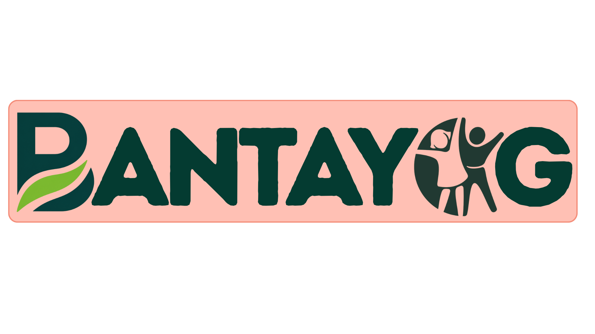

  

 

## Team Information

**Team Name:**
Team Bantayog

**Project Name:**
BANTAYOG

---

## Project Brief

**The problem your solution addresses**
One in four Filipino children under five suffers irreversible stunting caused by chronic malnutrition during their first 1,000 days of life. Government nutrition cash assistance is often diverted to non-nutritious items (like junk food or tobacco) due to a lack of traceability, while merchants face complex reimbursements that discourage program participation.

**Your proposed solution**
BANTAYOG transforms loose cash grants into targeted, tracked, nutrition-locked subsidies. Guardians are given a physical QR "Nutri-Pass" that acts as an offline digital wallet. Subsidies can only be spent on nutrient-dense foods at local sari-sari stores, validated via AI product recognition, and every transaction is securely settled and traced on the Polygon blockchain.

**The intended users or beneficiaries**
* Infants & guardians in the First 1,000 Days cohort
* Low-income families relying on local credit
* LGUs (Local Government Units) administering the subsidies
* Local sari-sari store merchants

**The impact of your project**
BANTAYOG gives LGUs full financial oversight over nutrition spending and ensures that every peso disbursed actively combats stunting. By working within existing community micro-economies (sari-sari stores) and locking funds to healthy food, we close the loop between government funding and measurable child nutrition outcomes.

---

## Team Members

| Name | Role |
| --- | --- |
| Bennett P. Payoyo | Developer / Researcher |
| Alex L. Berin Jr. | Developer / Researcher |
| Anjoe Mikael T. Albano | Developer / Researcher |
| Tyrone Loius V. Teemer | Developer / Researcher |

---

## Google Technologies Used

* **Gemini API**: Integrated into the Merchant App's Point-of-Sale system. When a merchant scans a product with their smartphone, we use Gemini's multimodal vision capabilities to extract the product brand and name, and verify child safety/suitability before authorizing the purchase against our eligibility catalog.

---

## SparkFest 2026

This project was developed as part of **SparkFest 2026**, the flagship hackathon organized by the **Google Developer Groups on Campus – Polytechnic University of the Philippines (GDG on Campus PUP)**.

---

## Repository Information

* **Live Demo:** [Watch Demo](https://drive.google.com/file/d/1HbexEd2dmRrOxbiT5l1bJY4QRoW5PWiQ/view?usp=drive_link)
* **APK Download:** [Download APK](https://drive.google.com/file/d/18q8w3sBZ_LTyUhZUgBFY5QM1DU8yiZrz/view?usp=sharing)
