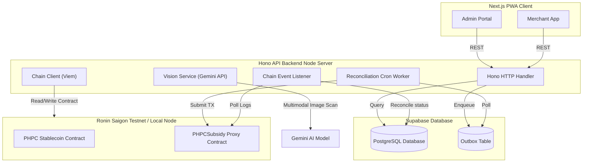

# BANTAYOG

<div align="center">
  <h1>BANTAYOG</h1>
  <h3>Blockchain-Based Secure Nutrition Subsidy System</h3>

  <p>
    <a href="https://nextjs.org/"></a>
    <a href="https://hono.dev/"></a>
    <a href="https://supabase.com/"></a>
    <a href="https://roninchain.com/"></a>
    <a href="https://ai.google.dev/"></a>
    <a href="https://soliditylang.org/"></a>
    <a href="https://www.typescriptlang.org/"></a>
  </p>
</div>

BANTAYOG converts loose nutrition cash grants into a nutrition-locked, blockchain-settled digital wallet — guardians get a physical QR "Nutri-Pass" that can only be spent on approved nutritious food at local sari-sari stores, with every transaction traceable on-chain.

> [!NOTE]
> Built for SparkFest 2026 (theme: Building Smarter, Safer, and More Inclusive Communities) to close the gap between government nutrition funding and actual child nutrition outcomes.

---

## 1. Project Specifications

| Attribute | Details |
| :--- | :--- |
| Project Name | BANTAYOG |
| Team Name | Team Bantayog |
| Team Members | Bennett P. Payoyo · Alex L. Berin Jr. · Anjoe Mikael T. Albano · Tyrone Loius V. Teemer |
| Google Technology | Gemini API (gemini-2.5-flash) for product recognition |
| Target Chain | Ronin Saigon Testnet (EVM) |
| Target Community | Infants & guardians in the First 1,000 Days cohort · Low-income families · LGUs and local sari-sari store merchants |

---

## 2. The Problem: A Poverty Trap

One in four Filipino children under five suffers irreversible stunting caused by chronic malnutrition during their first 1,000 days of life. Poverty compounds the issue: an estimated 64.9% of families rely on credit at local sari-sari stores, pushing them toward cheap, non-nutritious fillers instead of the proteins infants need for brain development. The government already funds nutrition assistance under the First 1,000 Days policy (RA 11148), but traditional distribution methods break down in practice:

* Fund Diversion — cash and unmonitored vouchers are often spent on non-essential items (chips, sugary drinks, alcohol, tobacco) instead of nutrition.
* Lack of Transparency — no tamper-proof audit trail exists for LGUs to verify that funds reached beneficiaries and were spent on eligible items.
* Inconvenient Settlement — merchants face complex verification and delayed reimbursement, discouraging participation in the program.

---

## 3. The Solution

BANTAYOG transforms loose cash grants into targeted, tracked, nutrition-locked subsidies — guaranteeing that financial aid directly improves nutritional outcomes, without requiring guardians to own a smartphone or have internet access.

Key innovations:

* Offline-First Nutri-Pass — guardians are issued a physical, laminated QR card containing a secure JWT that functions as a paper digital wallet, purpose-built for rural populations with limited connectivity.
* Nutrition-Locked Catalog — subsidies can only be spent on nutrient-dense foods (fresh milk, eggs, vegetables, etc.) explicitly defined in a database catalog; junk food and soda are rejected automatically.
* AI-Assisted Merchant Scanning — merchants scan items with their own smartphone; Gemini 2.5 Flash identifies the product, which is then cross-checked against the deterministic eligibility catalog (see [ADR 003](docs/adr/003-product-eligibility.md)).
* Dynamic Intervention Tiers — children within the critical first 1,000 days from conception (Tier 1) automatically receive a 1.5× subsidy multiplier, smoothly transitioning to standard rates (Tier 2) once that threshold passes (see [ADR 002](docs/adr/002-tier-computation.md)).
* Transparent Blockchain Settlement — approved purchases are settled instantly in mock Philippine Peso Coin (PHPC) stablecoin directly to the merchant's Ronin Wallet, eliminating intermediary payment processors and reimbursement delays.

### System Workflow

1. LGU Registration — LGU administrators register eligible beneficiaries (infants and guardians) and verified merchants (e.g., local sari-sari stores) on the Admin Portal.
2. Credential Issuance (Nutri-Pass) — the LGU issues a physical QR-card containing encrypted digital nutrition credits.
3. Point-of-Sale Eligibility Scanning — the guardian presents the Nutri-Pass; the merchant scans the items via the web app, which identifies them with Gemini Vision AI and validates them against the catalog. Non-approved items are rejected immediately.
4. On-Chain Settlement — the guardian confirms the purchase with a secure PIN; the app deducts the credit and transfers PHPC stablecoins on-chain from the LGU Treasury to the merchant's wallet.

---

## 4. Why Blockchain?

* Transparency & Traceability — every credit allocation and redemption is permanently recorded on-chain, giving LGUs an immutable, audit-ready ledger of public expenditure.
* Cryptographic Security — security assertions are enforced at the smart-contract level (onlyOwner controls, cryptographic signing), making the registry tamper-proof.
* Direct Merchant Settlement — merchants receive PHPC tokens instantly in their Ronin Wallet at checkout, with no intermediary processor or delay.
* Idempotency & Double-Spend Prevention — smart contracts use each transaction's unique UUID hash as a de-duplication key, preventing double-redemption even under unstable network conditions.

---

## 5. System Architecture

Built as a TypeScript monorepo using Turborepo:



### Key Technical Implementations

* Product Identification & Eligibility Isolation ([ADR 003](docs/adr/003-product-eligibility.md)) — the backend separates product identification from eligibility validation. Gemini Vision API extracts the brand/product name from an image; the backend then runs a trigram fuzzy search against the database catalog. Eligibility is determined strictly by database state, preventing model hallucination and keeping rules deterministic.
* Dynamic Backend-Only Tier Computation ([ADR 002](docs/adr/002-tier-computation.md)) — child tiers (Tier 1 ≤ 1,000 days, Tier 2 beyond) are computed dynamically during list reads, card scans, and checkout, rather than stored statically. A nightly cron job auto-migrates children who cross the threshold to Tier 2.
* Transactional Outbox Pattern ([ADR 001](docs/adr/001-transactional-outbox.md)) — redemptions are written to the database and an outbox queue atomically; a background worker submits them to the PHPCSubsidy proxy contract on-chain, handling RPC timeouts and retries without delaying checkout.
* Security & Rate Limiting ([Security Policy](docs/SECURITY.md)) — guardian PINs are hashed with Argon2id and rate-limited (max 3 attempts/60s per beneficiary); auth and Gemini classification endpoints are rate-limited via Upstash Redis (max 10 requests/60s); the Pino logger redacts PIN hashes, keys, and authorization headers from logs.

---

## 6. Monorepo Directory Structure

```
├── apps/
│   ├── server/         # Hono API backend node server
│   └── web/            # Next.js frontend (Admin & Merchant views)
├── packages/
│   ├── config/         # Shared build and lint configurations
│   ├── contracts/      # Hardhat smart contracts (PHPC, PHPCSubsidy, registries)
│   ├── db/             # Supabase schema definitions and DB client/repositories
│   └── schema/         # Zod schemas for shared input validation
```

---

## 7. Setup & Local Development

### Prerequisites
* Node.js >= 20.0.0
* pnpm >= 9.0.0

### Installation
```bash
pnpm install
```

### Configuration
Copy and fill out environment variables in both .env files:
* *Root .env* — Hono server and Hardhat credentials.
* *apps/web/.env.local* — Next.js client configuration.

### Deploy contracts
```bash
# Terminal 1: start local Hardhat EVM node
pnpm --filter @bantayog/contracts hardhat node

# Terminal 2: compile and deploy contracts to the local node
pnpm deploy:contracts
```

### Run
```bash
pnpm dev   # starts the Hono backend and Next.js frontend concurrently
```

### Test
```bash
pnpm test  # runs the full monorepo test suite (Vitest)
```

---

## 8. Demo Access (For Judges)

An LGU admin account is pre-seeded for evaluation on the deployed demo/testnet environment:

| Field | Value |
| :--- | :--- |
| Username | admin@bantayog.test |
| Password | TestPassword123! |

Testnet demo credentials only — no real funds or production data are involved.

---

## 9. Impact

BANTAYOG gives LGUs full financial oversight over nutrition spending, works within existing community micro-economies (sari-sari stores) rather than replacing them, and ensures that every peso disbursed actively combats stunting — closing the loop between government funding and measurable child nutrition outcomes.

---

## 10. Project Documentation

* [Security Policy](docs/SECURITY.md) — authentication patterns, RBAC, logging, and rate-limiting parameters.
* [Smart Contract Operations Guide](docs/SMART_CONTRACT_OPS.md) — Solidity deployment, UUPS proxies, local testing.
* [ADR 001: Transactional Outbox](docs/adr/001-transactional-outbox.md)
* [ADR 002: Dynamic Tier Computation](docs/adr/002-tier-computation.md)
* [ADR 003: Product Eligibility Identification](docs/adr/003-product-eligibility.md)