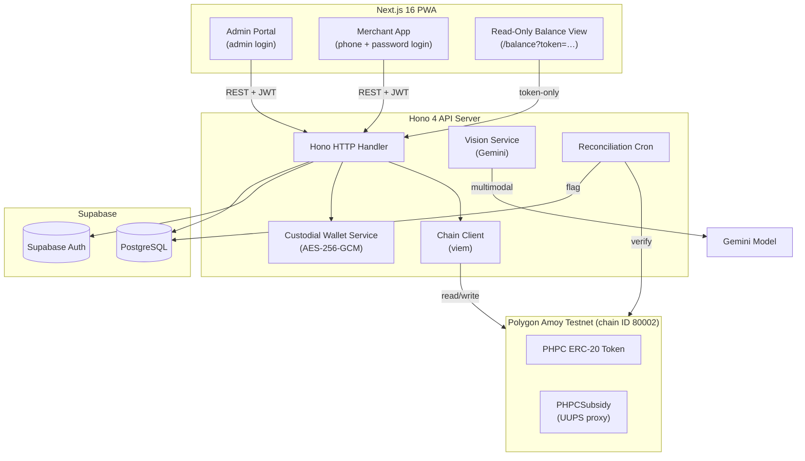

<div align="center">
  <h1>BANTAYOG</h1>
  <h3>Blockchain-Based Secure Nutrition Subsidy System</h3>

  <p>
    <a href="https://nextjs.org/"></a>
    <a href="https://hono.dev/"></a>
    <a href="https://supabase.com/"></a>
    <a href="https://polygon.technology/"></a>
    <a href="https://ai.google.dev/"></a>
    <a href="https://soliditylang.org/"></a>
    <a href="https://www.typescriptlang.org/"></a>
    <a href="https://viem.sh/"></a>
  </p>
</div>

BANTAYOG converts loose nutrition cash grants into a nutrition-locked, blockchain-settled digital wallet. Guardians get a physical QR "Nutri-Pass" that can only be spent on approved nutritious food at local sari-sari stores, with every transaction traceable on-chain on the Polygon Amoy testnet.


[!NOTE]
Built for SparkFest 2026 (theme: Building Smarter, Safer, and More Inclusive Communities) to close the gap between government nutrition funding and actual child nutrition outcomes.


---

## Table of Contents

1. [Project Specifications](#1-project-specifications)
2. [The Problem](#2-the-problem-a-poverty-trap)
3. [The Solution](#3-the-solution)
4. [Why Blockchain?](#4-why-blockchain)
5. [System Architecture](#5-system-architecture)
6. [Monorepo Structure](#6-monorepo-structure)
7. [Local Development Setup](#7-local-development-setup)
8. [Application Routes](#8-application-routes)
9. [Test Credentials](#9-test-credentials)
10. [Deployed Contracts (Polygon Amoy)](#10-deployed-contracts-polygon-amoy)
11. [Troubleshooting](#11-troubleshooting)
12. [Deployment Status](#12-deployment-status)
13. [Documentation](#13-documentation)

---

## 1. Project Specifications

| Attribute | Details |
| :--- | :--- |
| Project Name | BANTAYOG |
| Team Name | Team Bantayog |
| Team Members | Bennett P. Payoyo · Alex L. Berin Jr. · Anjoe Mikael T. Albano · Tyrone Loius V. Teemer |
| Google Technology | Gemini API (product recognition) · Google Fonts |
| Target Chain | Polygon Amoy Testnet (chain ID 80002) |
| Target Community | Infants & guardians in the First 1,000 Days cohort · Low-income families · LGUs and local sari-sari store merchants |
| Submission | SparkFest 2026 |

---

## 2. The Problem: A Poverty Trap

One in four Filipino children under five suffers irreversible stunting caused by chronic malnutrition during their first 1,000 days of life. An estimated 64.9% of families rely on credit at local sari-sari stores, pushing them toward cheap, non-nutritious fillers instead of the proteins infants need for brain development. The government already funds nutrition assistance under the First 1,000 Days policy (RA 11148), but traditional distribution breaks down in practice:

- **Fund Diversion** — cash and unmonitored vouchers are often spent on chips, sugary drinks, alcohol, or tobacco instead of nutrition.
- **Lack of Transparency** — no tamper-proof audit trail exists for LGUs to verify that funds reached beneficiaries and were spent on eligible items.
- **Inconvenient Settlement** — merchants face complex verification and delayed reimbursement, discouraging participation in the program.

---

## 3. The Solution

BANTAYOG transforms loose cash grants into targeted, tracked, nutrition-locked subsidies, without requiring guardians to own a smartphone or have internet access.

**Key innovations:**

- **Offline-First Nutri-Pass** — guardians get a physical, laminated QR card whose signed JWT functions as a paper digital wallet. Scanning the QR opens a public, read-only balance view at `/balance?token=…`.
- **Auto-Provisioned Custodial Wallets** — the backend generates and encrypts (AES-256-GCM) an EVM keypair for each beneficiary at registration. Guardians never manage a wallet, seed phrase, or gas.
- **Fixed Tier-Based Allocations** — Tier 1 (Critical 1,000-Day Window) gets exactly 5,000 PHPC; Tier 2 (Standard) gets exactly 3,500 PHPC. The allocation amount is server-derived from the beneficiary's tier and cannot be modified by the caller.
- **Nutrition-Locked Catalog** — subsidies can only be spent on nutrient-dense foods (fresh milk, eggs, vegetables, etc.) explicitly defined in a database catalog; junk food and soda are rejected automatically.
- **AI-Assisted Merchant Scanning** — merchants scan items with their smartphone; Gemini identifies the product, then the backend cross-checks the deterministic eligibility catalog (see [ADR 003](docs/adr/003-product-eligibility.md)).
- **Guardian-PIN-Authorized On-Chain Settlement** — the guardian confirms the purchase with a 6-digit PIN (Argon2id, 5-attempt lockout). The server transfers PHPC on-chain from the LGU treasury to the merchant's MetaMask wallet, waits for confirmation, then deducts the recorded balance.

### System Workflow

1. **LGU Registration** — LGU administrators register beneficiaries (auto-issued a custodial wallet) and merchants (each supplies their own MetaMask 0x address).
2. **Credential Issuance** — the admin prints/downloads a physical Nutri-Pass QR card containing the signed token.
3. **Point-of-Sale Scan** — the guardian presents the Nutri-Pass; the merchant scans items with AI Vision, and the backend validates each against the catalog. Ineligible items are rejected.
4. **PIN + On-Chain Settlement** — guardian enters their PIN, the server signs and submits the PHPC transfer to the merchant's wallet on Polygon Amoy, and the beneficiary's balance is deducted after on-chain confirmation.
5. **Read-Only Balance View** — any time, the guardian can scan their own Nutri-Pass to open `/balance?token=…` and see their current balance and history. No PIN required — the URL is authorized solely by the signed token.

---

## 4. Why Blockchain?

- **Transparency & Traceability** — every allocation and redemption is permanently recorded on Polygon Amoy, giving LGUs an immutable, audit-ready ledger.
- **Cryptographic Security** — mint and allocation authority is enforced at the contract level (`onlyOwner`), and every purchase carries a signed guardian PIN check.
- **Direct Merchant Settlement** — merchants receive PHPC tokens instantly to their MetaMask wallet at checkout, with no intermediary processor.
- **Idempotency & Double-Spend Prevention** — each transaction submission carries a client-generated `idempotencyKey` (UUID) that is enforced server-side to prevent double-redemption under retries or network flakiness.

---

## 5. System Architecture

Built as a TypeScript monorepo using [Turborepo](https://turbo.build/) and [pnpm workspaces](https://pnpm.io/workspaces).



### Key Technical Implementations

- **Custodial Wallets for Beneficiaries** — the backend generates each beneficiary's EVM keypair on registration and stores the private key encrypted with AES-256-GCM (`CUSTODIAL_KEY_ENCRYPTION_KEY`). The wallet address is embedded in the signed QR token as `walletRef`.
- **Fixed Tier Allocation** — `beneficiary.service.ts#allocateTierCredits` resolves the tier from the beneficiary's `created_at` + `child_age_months`, checks for duplicate allocations, verifies the on-chain treasury balance, submits the allocation, waits up to 60 seconds for confirmation, and only then credits the recorded balance. Any earlier failure short-circuits without touching balances.
- **Synchronous On-Chain Purchase Settlement** — `routes/transactions.ts` transfers PHPC to the merchant, waits for confirmation, and only after success deducts the beneficiary's recorded balance. A reconciliation cron catches the rare case where the on-chain transfer succeeded but the DB deduction failed.
- **Read-Only Balance Route** — `GET /api/balance/view?token=…` is intentionally public and PIN-less, authorized solely by the signed QR token's signature and expiry. It exposes no mutating fields or actions.
- **Guardian PIN Lockout** — PINs are hashed with Argon2id; five wrong attempts in a row lock the beneficiary out for 900 seconds via Upstash Redis.
- **Product Identification vs. Eligibility Isolation** ([ADR 003](docs/adr/003-product-eligibility.md)) — Gemini extracts the product name; the database is the sole authority on whether it is eligible.
- **Dynamic Tier Computation** ([ADR 002](docs/adr/002-tier-computation.md)) — tiers are recomputed on every list/scan; a nightly cron moves children who cross the 1,000-day threshold.
- **Transactional Outbox** ([ADR 001](docs/adr/001-transactional-outbox.md)) — background reconciliation of on-chain state against the database ledger.
- **Structured Redaction** ([Security Policy](docs/SECURITY.md)) — the Pino logger scrubs PIN hashes, private keys, and Authorization headers from every log line.

---

## 6. Monorepo Structure

```
├── apps/
│   ├── server/         # Hono 4 API — auth, transactions, chain, vision, balance view
│   └── web/            # Next.js 16 PWA — admin portal, merchant app, /balance view
├── packages/
│   ├── config/         # Shared TSConfig / ESLint
│   ├── contracts/      # Hardhat 3 — PHPC, PHPCSubsidy (UUPS), registries
│   ├── db/             # Typed Supabase clients + generated types
│   └── schema/         # Zod schemas shared between server & web
├── supabase/
│   ├── migrations/     # 00001, 00002, 00003_polygon_amoy_migration.sql
│   ├── seed.sql        # Seed products/beneficiaries/merchants
│   └── setup-test-users.js
├── scripts/            # Repo-level maintenance scripts
└── docs/               # ADRs, security policy, contract ops guide
```

---

## 7. Local Development Setup

### 7.1 Prerequisites

| Tool | Minimum Version | Verify |
| :--- | :--- | :--- |
| Node.js | 20.0.0 | `node --version` |
| pnpm | 9.0.0 | `pnpm --version` |
| Git | any | `git --version` |
| Supabase account | free tier | [supabase.com](https://supabase.com) |
| MetaMask wallet | any | required for admin/merchant testing |

> This monorepo uses pnpm workspaces. `npm` and `yarn` will not work correctly.

Install pnpm if you don't have it:

```bash
npm install -g pnpm@9.15.0
```

### 7.2 Clone & Install

```bash
git clone <repository-url> bantayog
cd bantayog
pnpm install

### 7.3 Environment Variables

BANTAYOG needs three env files. Copy each example and fill in real values.

```bash
cp .env.example .env
cp apps/server/.env.example apps/server/.env
cp apps/web/.env.example apps/web/.env.local
```

**Root `.env`** and **`apps/server/.env`** need (at minimum):

```env
# Supabase
SUPABASE_URL=https://<your-project-ref>.supabase.co
SUPABASE_ANON_KEY=<anon-key>
SUPABASE_SERVICE_ROLE_KEY=<service-role-key>

# JWT / QR token signing (any random string, min 32 chars)
JWT_SIGNING_SECRET=<random-string>
QR_TOKEN_SECRET=<random-string>

# Upstash Redis (rate limiting + PIN lockout)
UPSTASH_REDIS_REST_URL=https://<your-instance>.upstash.io
UPSTASH_REDIS_REST_TOKEN=<token>

# Gemini (product recognition)
GEMINI_API_KEY=<key-from-aistudio.google.com>

# Polygon Amoy (chain ID 80002)
POLYGON_AMOY_RPC_URL=https://rpc-amoy.polygon.technology
DEPLOYER_PRIVATE_KEY=0x<64-hex-testnet-only-key>
LGU_ADMIN_WALLET_ADDRESS=0x<your-lgu-treasury-address>

# AES-256-GCM key for custodial beneficiary wallets
# Generate with:  openssl rand -hex 32
CUSTODIAL_KEY_ENCRYPTION_KEY=<64-hex>

# Deployed contract addresses — populated after running the deploy script
PHPC_TOKEN_ADDRESS=
PHPC_SUBSIDY_ADDRESS=
BENEFICIARY_REGISTRY_ADDRESS=
MERCHANT_REGISTRY_ADDRESS=
```

**`apps/web/.env.local`** needs the public browser subset:

```env
NEXT_PUBLIC_SUPABASE_URL=https://<your-project-ref>.supabase.co
NEXT_PUBLIC_SUPABASE_ANON_KEY=<anon-key>
NEXT_PUBLIC_POLYGON_AMOY_RPC_URL=https://rpc-amoy.polygon.technology
NEXT_PUBLIC_POLYGON_AMOY_CHAIN_ID=80002
NEXT_PUBLIC_PHPC_TOKEN_ADDRESS=<same as server>
NEXT_PUBLIC_PHPC_SUBSIDY_ADDRESS=<same as server>
NEXT_PUBLIC_BENEFICIARY_REGISTRY_ADDRESS=<same as server>
NEXT_PUBLIC_MERCHANT_REGISTRY_ADDRESS=<same as server>
```

> **Security:** `SUPABASE_SERVICE_ROLE_KEY`, `DEPLOYER_PRIVATE_KEY`, `CUSTODIAL_KEY_ENCRYPTION_KEY`, `JWT_SIGNING_SECRET`, and `QR_TOKEN_SECRET` must never be committed. All three env files are already in `.gitignore`.

### 7.4 Set Up Supabase

1. Create a free project at [supabase.com/dashboard](https://supabase.com/dashboard).
2. In **Project Settings → API**, copy the URL, anon key, and service role key into your env files.
3. Run migrations via the **SQL Editor** (in order):
   - `supabase/migrations/00001_init_core_tables.sql`
   - `supabase/migrations/00002_phase4_hardening.sql`
   - `supabase/migrations/00003_polygon_amoy_migration.sql` (adds `beneficiary_wallets` and `allocations`)
4. Seed catalog data via SQL Editor: paste and run `supabase/seed.sql`.
5. Create the test admin/merchant auth users:
   ```bash
   node supabase/setup-test-users.js
   ```

### 7.5 Get Test POL for Gas

Your deployer wallet needs POL to pay gas on Polygon Amoy.

1. Go to the [Polygon Amoy faucet](https://faucet.polygon.technology/) and select **Amoy**.
2. Paste your `LGU_ADMIN_WALLET_ADDRESS`.
3. Request test POL (repeat every ~24h until you have ~0.5 POL).

### 7.6 Deploy Contracts to Polygon Amoy

```bash
pnpm deploy:contracts

This runs `packages/contracts/scripts/deploy.ts` against the `amoy` network:

1. Deploys `PHPC` (ERC-20).
2. Deploys `PHPCSubsidy` behind a UUPS proxy.
3. Mints exactly 100,000 PHPC to `LGU_ADMIN_WALLET_ADDRESS`.
4. Deploys `BeneficiaryRegistry` and `MerchantRegistry` (best-effort).

Copy the printed addresses into every env file (`PHPC_TOKEN_ADDRESS`, `PHPC_SUBSIDY_ADDRESS`, etc.). Also mirror them into `apps/web/.env.local` with the `NEXT_PUBLIC_` prefix.

> **Optional top-up:** To mint additional PHPC to the treasury without redeploying, use the maintenance script:
> ```bash
> MINT_ADDITIONAL_PHPC=900000 pnpm --filter @bantayog/contracts hardhat run scripts/mint-additional.ts --network amoy
> ```

### 7.7 Start the Dev Servers

Two terminals:

```bash
# Terminal 1 — Hono API on http://localhost:3001
pnpm --filter @bantayog/server dev

# Terminal 2 — Next.js on http://localhost:3000
pnpm --filter @bantayog/web dev
```

Sanity check:

```bash
curl http://localhost:3001/health
# → {"status":"ok","service":"bantayog-server",...}
```

Open http://localhost:3000 in your browser.

### 7.8 Test the Full Suite

```bash
pnpm test          # runs Vitest across the monorepo
pnpm type-check    # runs tsc --noEmit across all packages
```

---

## 8. Application Routes

### Public

| URL | Purpose |
| :--- | :--- |
| `/` | Landing page |
| `/login` | LGU admin login |
| `/merchant-login` | Merchant login (phone number + password) |
| `/balance?token=<qr-token>` | **Read-only balance & transaction view** — reached by scanning a Nutri-Pass QR. Public and PIN-less; authorized only by the signed token. |

### Admin Portal (requires admin login)

| URL | Purpose |
| :--- | :--- |
| `/admin/register` | Default admin landing — register beneficiaries + merchants side-by-side. Beneficiary registration auto-provisions a custodial wallet and issues a QR pass. |
| `/admin/beneficiaries` | Active Beneficiary Directory. **LGU Treasury card** reads the live on-chain PHPC balance. **Add Credits** shows the fixed tier amount (5,000 / 3,500 PHPC) as a read-only confirmation. |
| `/admin/merchants` | Merchant Directory. |

### Merchant App (requires merchant login)

| URL | Purpose |
| :--- | :--- |
| `/dashboard` | Store dashboard — wallet balance, recent transactions. |
| `/cart` / `/cart/ai-scan` / `/cart/manual` | Add items via AI or manual entry. |
| `/checkout` | Scan the beneficiary Nutri-Pass, enter guardian PIN, and settle on-chain. |
| `/checkout/complete` | Receipt with remaining balance. |

### API (all under `/api/*`, proxied to `localhost:3001` in dev)

| Endpoint | Auth | Purpose |
| :--- | :--- | :--- |
| `GET /health` | public | Server liveness |
| `POST /api/auth/login` | public | Admin login |
| `POST /api/auth/merchant-login` | public | Merchant login |
| `POST /api/auth/verify-pin` | public | Guardian PIN verification |
| `GET /api/balance/view?token=…` | token | Read-only balance + history |
| `POST /api/beneficiaries/register` | admin | Register beneficiary + auto-generate custodial wallet |
| `GET /api/beneficiaries` | admin | List beneficiaries (with dynamic tier) |
| `GET /api/beneficiaries/metrics` | admin | Dashboard aggregates |
| `PATCH /api/beneficiaries/:id/credits` | admin | Trigger the one-time tier allocation |
| `POST /api/merchants/register` | admin | Register merchant with their MetaMask address |
| `POST /api/transactions` | merchant | Submit a redemption (verifies PIN, settles PHPC on-chain, deducts balance) |
| `GET /api/chain/balance` | admin/merchant | LGU treasury balance (on-chain) |
| `POST /api/vision/classify` | merchant | Gemini product classification |

---

## 9. Test Credentials

After running `node supabase/setup-test-users.js`:

### Admin

| Field | Value |
| :--- | :--- |
| URL | `http://localhost:3000/login` |
| Email | `admin@bantayog.test` |
| Password | `TestPassword123!` |

### Merchant (seeded phone-based accounts)

| Store | Phone | Password |
| :--- | :--- | :--- |
| Aling Nena's Store | `+639913800307` (or `09913800307`) | `merchant123` |
| Mang Pedro Sari-Sari | `+639171234567` | `merchant123` |
| Tita Maria Grocery | `+639181234567` | `merchant123` |
| Bayan Mini Mart | `+639191234567` | `merchant123` |
| Nanay's Fresh Market | `+639201234567` | `merchant123` |

> Testnet demo credentials only. No real funds or production data are involved.

---

## 10. Deployed Contracts (Polygon Amoy)

Active testnet deployment, viewable at [amoy.polygonscan.com](https://amoy.polygonscan.com/):

| Contract | Address |
| :--- | :--- |
| PHPC (ERC-20) | `0x5078966Cd562Ef190e680BeEB8386738a63F8a7c` |
| PHPCSubsidy (UUPS proxy) | `0xdd9fa49f88d150d947e8cfdc49e09252a2067a31` |
| BeneficiaryRegistry | `0xe7f4874cd8eeb0b48e17e3b4900e168d3feaf2b8` |
| MerchantRegistry | `0x51cbc39b455b9ebf8f865ac736ff73bcac00f1df` |
| LGU Treasury Wallet | `0x1329636107bfc3A708824aE84Faf7C2AD8e3572B` |

Current treasury balance: **1,000,000 PHPC** (100,000 initial mint + a 900,000 top-up minted via `scripts/mint-additional.ts`).

---

## 11. Troubleshooting

**`pnpm install` errors about workspace protocol** — make sure you're running from the repo root, not a subdirectory.

**Server logs "Missing Supabase env vars" on start** — the `.env` file must be inside `apps/server/`, not the repo root. The server's dev script loads `--env-file=.env` relative to `apps/server/`.

**Admin login redirects back to `/login`** — verify Supabase is reachable and that `setup-test-users.js` completed. Recreate the admin user manually in the Supabase Dashboard → Authentication → Users, and set `app_metadata` to `{"role": "admin"}`.

**Merchant login "Invalid credentials"** — merchants log in with an email derived from their phone number (e.g., `639913800307@merchant.bantayog.local`). If `setup-test-users.js` didn't create the merchant user, use the admin portal to register a fresh merchant, then log in with the phone number you supplied and password `merchant123`.

**On-chain call fails with `insufficient funds`** — the LGU deployer wallet is out of POL. Refill via the [Amoy faucet](https://faucet.polygon.technology/).

**Balance page shows "This pass is invalid or has expired"** — QR tokens default to a 300-second TTL. To extend, set `QR_TOKEN_TTL_SECONDS` (e.g. `2592000` for 30 days) in `apps/server/.env` and re-issue passes.

**AI Vision returns an error** — `GEMINI_API_KEY` isn't set in `apps/server/.env`. Grab a key at [Google AI Studio](https://aistudio.google.com/app/apikey) and restart the server.

**Port already in use** — `npx kill-port 3000` or `npx kill-port 3001`.

---

## 12. Deployment Status

**Local dev:** fully working — Hono API + Next.js frontend + Supabase + live Polygon Amoy contracts.

**Cloud deploy (Railway + Vercel):** the repo contains a `railway.json` and Dockerfile scaffold, but the current server Dockerfile and web app config are **not** production-ready. Before cloud deploy, the following must be fixed:

- **Server Dockerfile** runs `pnpm ... dev` (tsx watch mode with `--env-file .env`), which crashes without a `.env` file inside the image. Needs a real `build` + `node dist/index.js` production start path.
- **Web `next.config.ts`** hardcodes `/api/*` rewrites to `http://localhost:3001`. Needs to read the API base URL from env for Vercel.
- **Server CORS** defaults to `http://localhost:3000`. Needs the deployed Vercel domain in `CORS_ORIGIN`.
- **Upstash placeholders** in `.env.example` need real credentials for rate limiting + PIN lockout.

Track this in the future work section of the polygon-amoy-phpc-migration spec.

---

## 13. Documentation

- [Security Policy](docs/SECURITY.md) — auth patterns, RBAC, logging, rate-limiting parameters.
- [Smart Contract Operations Guide](docs/SMART_CONTRACT_OPS.md) — Solidity deployment, UUPS proxies, local testing.
- [ADR 001: Transactional Outbox](docs/adr/001-transactional-outbox.md)
- [ADR 002: Dynamic Tier Computation](docs/adr/002-tier-computation.md)
- [ADR 003: Product Eligibility Identification](docs/adr/003-product-eligibility.md)

---

## Impact

BANTAYOG gives LGUs full financial oversight over nutrition spending, works within existing community micro-economies (sari-sari stores) rather than replacing them, and ensures that every peso disbursed actively combats stunting — closing the loop between government funding and measurable child nutrition outcomes.
