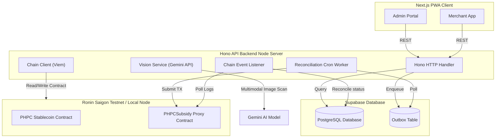
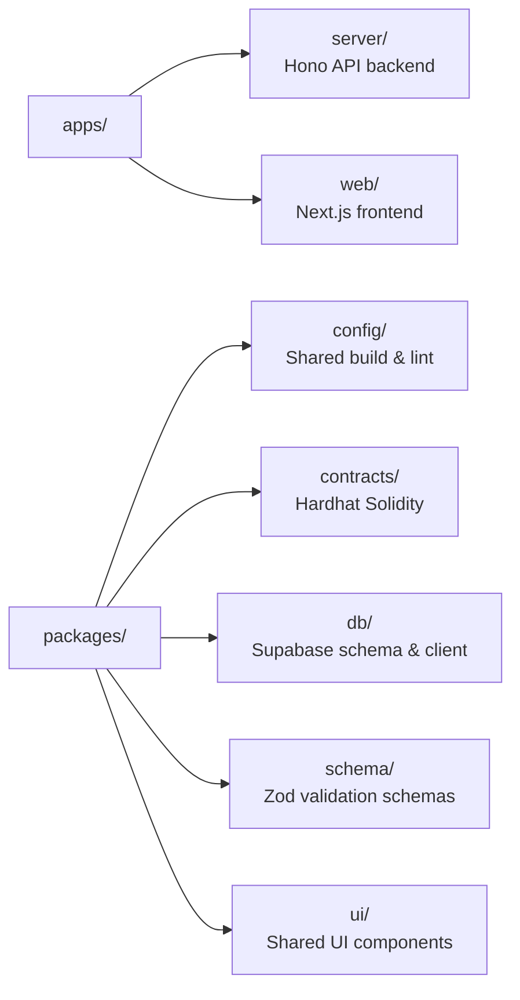

# BANTAYOG

<div align="center">
  <h1>BANTAYOG</h1>
  <h3>Blockchain-Based Secure Nutrition Subsidy System</h3>

  <p>
    <a href="https://nextjs.org/"></a>
    <a href="https://hono.dev/"></a>
    <a href="https://supabase.com/"></a>
    <a href="https://roninchain.com/"></a>
    <a href="https://ai.google.dev/"></a>
    <a href="https://soliditylang.org/"></a>
    <a href="https://www.typescriptlang.org/"></a>
  </p>
</div>

BANTAYOG converts loose nutrition cash grants into a nutrition-locked, blockchain-settled digital wallet — guardians get a physical QR "Nutri-Pass" that can only be spent on approved nutritious food at local sari-sari stores, with every transaction traceable on-chain.


[!NOTE]
Built for SparkFest 2026 (theme: Building Smarter, Safer, and More Inclusive Communities) to close the gap between government nutrition funding and actual child nutrition outcomes.


---

## 1. Project Specifications

| Attribute | Details |
| :--- | :--- |
| *Project Name* | BANTAYOG |
| *Team Name* | Team Bantayog |
| *Team Members* | Bennett Payoyo · Alex Berin Jr. · Anjo Albano · Tl Teemer |
| *Google Technology* | Gemini API (gemini-2.5-flash) for product recognition, Google Fonts |
| *Target Chain* | Ronin Saigon Testnet (EVM) |
| *Target Community* | Infants & guardians in the First 1,000 Days cohort · Low-income families · LGUs and local sari-sari store merchants |
| *Submission* | SparkFest 2026 — Elimination Round |

---

## 2. The Problem: A Poverty Trap

*One in four Filipino children under five suffers irreversible stunting* caused by chronic malnutrition during their first 1,000 days of life. Poverty compounds the issue: an estimated *64.9% of families rely on credit at local sari-sari stores*, pushing them toward cheap, non-nutritious fillers instead of the proteins infants need for brain development. The government already funds nutrition assistance under the *First 1,000 Days policy (RA 11148)*, but traditional distribution methods break down in practice:

* *Fund Diversion* — cash and unmonitored vouchers are often spent on non-essential items (chips, sugary drinks, alcohol, tobacco) instead of nutrition.
* *Lack of Transparency* — no tamper-proof audit trail exists for LGUs to verify that funds reached beneficiaries and were spent on eligible items.
* *Inconvenient Settlement* — merchants face complex verification and delayed reimbursement, discouraging participation in the program.

---

## 3. The Solution

BANTAYOG transforms loose cash grants into *targeted, tracked, nutrition-locked subsidies* — guaranteeing that financial aid directly improves nutritional outcomes, without requiring guardians to own a smartphone or have internet access.

*Key innovations:*

* *Offline-First Nutri-Pass* — guardians are issued a physical, laminated QR card containing a secure JWT that functions as a paper digital wallet, purpose-built for rural populations with limited connectivity.
* *Nutrition-Locked Catalog* — subsidies can only be spent on nutrient-dense foods (fresh milk, eggs, vegetables, etc.) explicitly defined in a database catalog; junk food and soda are rejected automatically.
* *AI-Assisted Merchant Scanning* — merchants scan items with their own smartphone; *Gemini 2.5 Flash* identifies the product, which is then cross-checked against the deterministic eligibility catalog (see [ADR 003](docs/adr/003-product-eligibility.md)).
* *Dynamic Intervention Tiers* — children within the critical first 1,000 days from conception (Tier 1) automatically receive a *1.5× subsidy multiplier*, smoothly transitioning to standard rates (Tier 2) once that threshold passes (see [ADR 002](docs/adr/002-tier-computation.md)).
* *Transparent Blockchain Settlement* — approved purchases are settled instantly in mock Philippine Peso Coin (PHPC) stablecoin directly to the merchant's Ronin Wallet, eliminating intermediary payment processors and reimbursement delays.

### System Workflow

1. *LGU Registration* — LGU administrators register eligible beneficiaries (infants and guardians) and verified merchants (e.g., local sari-sari stores) on the Admin Portal.
2. *Credential Issuance (Nutri-Pass)* — the LGU issues a physical QR-card containing encrypted digital nutrition credits.
3. *Point-of-Sale Eligibility Scanning* — the guardian presents the Nutri-Pass; the merchant scans the items via the web app, which identifies them with Gemini Vision AI and validates them against the catalog. Non-approved items are rejected immediately.
4. *On-Chain Settlement* — the guardian confirms the purchase with a secure PIN; the app deducts the credit and transfers PHPC stablecoins on-chain from the LGU Treasury to the merchant's wallet.

---

## 4. Why Blockchain?

* *Transparency & Traceability* — every credit allocation and redemption is permanently recorded on-chain, giving LGUs an immutable, audit-ready ledger of public expenditure.
* *Cryptographic Security* — security assertions are enforced at the smart-contract level (onlyOwner controls, cryptographic signing), making the registry tamper-proof.
* *Direct Merchant Settlement* — merchants receive PHPC tokens instantly in their Ronin Wallet at checkout, with no intermediary processor or delay.
* *Idempotency & Double-Spend Prevention* — smart contracts use each transaction's unique UUID hash as a de-duplication key, preventing double-redemption even under unstable network conditions.

---

## 5. System Architecture

Built as a TypeScript monorepo using Turborepo:



### Key Technical Implementations

* *Product Identification & Eligibility Isolation* ([ADR 003](docs/adr/003-product-eligibility.md)) — the backend separates product identification from eligibility validation. Gemini Vision API extracts the brand/product name from an image; the backend then runs a trigram fuzzy search against the database catalog. Eligibility is determined strictly by database state, preventing model hallucination and keeping rules deterministic.
* *Dynamic Backend-Only Tier Computation* ([ADR 002](docs/adr/002-tier-computation.md)) — child tiers (Tier 1 ≤ 1,000 days, Tier 2 beyond) are computed dynamically during list reads, card scans, and checkout, rather than stored statically. A nightly cron job auto-migrates children who cross the threshold to Tier 2.
* *Transactional Outbox Pattern* ([ADR 001](docs/adr/001-transactional-outbox.md)) — redemptions are written to the database and an outbox queue atomically; a background worker submits them to the PHPCSubsidy proxy contract on-chain, handling RPC timeouts and retries without delaying checkout.
* *Security & Rate Limiting* ([Security Policy](docs/SECURITY.md)) — guardian PINs are hashed with Argon2id and rate-limited (max 3 attempts/60s per beneficiary); auth and Gemini classification endpoints are rate-limited via Upstash Redis (max 10 requests/60s); the Pino logger redacts PIN hashes, keys, and authorization headers from logs.

---

## 6. Monorepo Directory Structure



---

## 7. Setup & Local Development

### Prerequisites
* Node.js >= 20.0.0
* pnpm >= 9.0.0

### Installation
pnpm install

### Configuration
Copy and fill out environment variables in both .env files:
* **Root .env** — Hono server and Hardhat credentials.
* **apps/web/.env.local** — Next.js client configuration.

### Deploy contracts
# Terminal 1: start local Hardhat EVM node
pnpm --filter @bantayog/contracts hardhat node

# Terminal 2: compile and deploy contracts to the local node
pnpm deploy:contracts

### Run
pnpm dev   # starts the Hono backend and Next.js frontend concurrently

### Test
pnpm test  # runs the full monorepo test suite (Vitest)

---

## 8. Demo Access (For Judges)

An LGU admin account is pre-seeded for evaluation on the deployed demo/testnet environment:

| Field | Value |
| :--- | :--- |
| *Username* | admin@bantayog.test |
| *Password* | TestPassword123! |

Testnet demo credentials only — no real funds or production data are involved.

---

## 9. Impact

BANTAYOG gives LGUs full financial oversight over nutrition spending, works within existing community micro-economies (sari-sari stores) rather than replacing them, and ensures that every peso disbursed actively combats stunting — closing the loop between government funding and measurable child nutrition outcomes.

---

## 10. Project Documentation

* [Security Policy](docs/SECURITY.md) — authentication patterns, RBAC, logging, and rate-limiting parameters.
* [Smart Contract Operations Guide](docs/SMART_CONTRACT_OPS.md) — Solidity deployment, UUPS proxies, local testing.
* [ADR 001: Transactional Outbox](docs/adr/001-transactional-outbox.md)
* [ADR 002: Dynamic Tier Computation](docs/adr/002-tier-computation.md)
* [ADR 003: Product Eligibility Identification](docs/adr/003-product-eligibility.md)

# BANTAYOG — Local Development Setup Guide

> **Last updated:** 2026-07-02  
> **Purpose:** This guide enables anyone to run the BANTAYOG nutrition-subsidy PWA locally without AI assistance. Follow each section in order.

---

## Table of Contents

1. [What You Are Building](#1-what-you-are-building)
2. [Prerequisites](#2-prerequisites)
3. [Step 1 — Clone & Install Dependencies](#3-step-1--clone--install-dependencies)
4. [Step 2 — Configure Environment Variables](#4-step-2--configure-environment-variables)
5. [Step 3 — Set Up the Supabase Database](#5-step-3--set-up-the-supabase-database)
6. [Step 4 — Seed Mock Data](#6-step-4--seed-mock-data)
7. [Step 5 — Start the Development Servers](#7-step-5--start-the-development-servers)
8. [Application Routes & How to Navigate](#8-application-routes--how-to-navigate)
9. [Test Credentials](#9-test-credentials)
10. [Known Issues & Workarounds](#10-known-issues--workarounds)
11. [Troubleshooting](#11-troubleshooting)

---

## 1. What You Are Building

BANTAYOG is a civic-tech nutrition-subsidy progressive web application (PWA) with three surfaces:

| Surface | Role | Tech Stack |
|---------|------|------------|
| **Admin Portal** | LGU officers register beneficiaries & merchants, allocate credits, view dashboards | Next.js 16 (runs on `localhost:3000`) |
| **Merchant App** | Sari-sari store owners scan QR cards, verify carts, process checkouts | Next.js 16 (same origin, different routes) |
| **API Server** | Hono backend handling auth, transactions, AI vision, blockchain | Hono 4 + Node.js (runs on `localhost:3001`) |
| **Database** | PostgreSQL + Auth via Supabase | Cloud-hosted (free tier) |
| **Smart Contracts** | Mock PHPC stablecoin + subsidy registry on Ronin Saigon testnet | Hardhat (optional for local chain) |

**Architecture in one sentence:** The Next.js frontend proxies `/api/*` requests to the Hono server (`localhost:3001`), which talks to Supabase PostgreSQL and the Ronin blockchain.

---

## 2. Prerequisites

Before starting, ensure you have:

| Tool | Minimum Version | How to Verify |
|------|----------------|---------------|
| **Node.js** | `>= 20.0.0` | `node --version` |
| **pnpm** | `>= 9.0.0` | `pnpm --version` |
| **Git** | any recent | `git --version` |
| **A Supabase account** | free tier is fine | [supabase.com](https://supabase.com) |

> **Why pnpm?** This monorepo uses pnpm workspaces. `npm` or `yarn` will NOT work correctly.

### Install pnpm (if missing)

```bash
npm install -g pnpm@9.15.0
```

---

## 3. Step 1 — Clone & Install Dependencies

```bash
# Clone the repository
git clone <repository-url> bantayog
cd bantayog

# Install all dependencies across the monorepo
pnpm install
```

**What this does:**
- Installs dependencies for `apps/web`, `apps/server`, `packages/contracts`, `packages/db`, `packages/schema`, and `packages/config`
- Sets up symlinks via pnpm workspaces

**Verify it worked:**
```bash
pnpm --version   # should print 9.x.x
node --version   # should print v20.x.x
```

---

## 4. Step 2 — Configure Environment Variables

BANTAYOG needs **two** environment files. Create both by copying the examples and filling in your own Supabase credentials.

### 4.1 `apps/server/.env` file (for the Hono server)

```bash
cp apps/server/.env.example apps/server/.env
```

Open `apps/server/.env` in your editor and fill in **at minimum** these values:

```env
# ---- Supabase (required) ----
# Get these from your Supabase project dashboard → Project Settings → API
SUPABASE_URL=https://<your-project-ref>.supabase.co
SUPABASE_ANON_KEY=<your-anon-key>
SUPABASE_SERVICE_ROLE_KEY=<your-service-role-key>

# ---- Auth / JWT (required) ----
# Any random string, minimum 32 characters. Used to sign QR tokens.
JWT_SIGNING_SECRET=change-this-to-a-random-32-char-string-at-least

# ---- Ronin / Chain (optional for basic local run) ----
# Saigon testnet RPC — public endpoint, safe to use as-is
RONIN_SAIGON_RPC_URL=https://saigon-testnet.roninchain.com/rpc
RONIN_SAIGON_CHAIN_ID=202601

# ---- Deployed contract addresses (optional for basic run) ----
# Leave blank initially. The boot script will populate these if you run local Hardhat.
PHPC_TOKEN_ADDRESS=
PHPC_SUBSIDY_ADDRESS=
BENEFICIARY_REGISTRY_ADDRESS=
MERCHANT_REGISTRY_ADDRESS=

# ---- Gemini AI (optional — only needed for AI cart scanning) ----
GEMINI_API_KEY=your-gemini-api-key
```

> **Where do I get Supabase credentials?**
> 1. Go to [supabase.com](https://supabase.com) and create a free project.
> 2. In your project dashboard, click **Project Settings** (gear icon) → **API**.
> 3. Copy:
>    - `URL` → paste into `SUPABASE_URL` and `NEXT_PUBLIC_SUPABASE_URL`
>    - `anon public` → paste into `SUPABASE_ANON_KEY` and `NEXT_PUBLIC_SUPABASE_ANON_KEY`
>    - `service_role secret` → paste into `SUPABASE_SERVICE_ROLE_KEY`

### 4.2 `apps/web/.env.local` file (for the Next.js frontend)

```bash
cp apps/web/.env.example apps/web/.env.local
```

Open `apps/web/.env.local` and fill in:

```env
# ---- Supabase (browser client) ----
NEXT_PUBLIC_SUPABASE_URL=https://<your-project-ref>.supabase.co
NEXT_PUBLIC_SUPABASE_ANON_KEY=<your-anon-key>

# ---- Hono API base URL ----
# The Next.js dev server proxies /api/* to this URL via rewrites
NEXT_PUBLIC_API_BASE_URL=http://localhost:3001

# ---- Ronin / Chain (read-only client-side) ----
NEXT_PUBLIC_RONIN_SAIGON_RPC_URL=https://saigon-testnet.roninchain.com/rpc
NEXT_PUBLIC_RONIN_SAIGON_CHAIN_ID=202601

# ---- Contract addresses (leave blank initially) ----
NEXT_PUBLIC_PHPC_TOKEN_ADDRESS=
NEXT_PUBLIC_PHPC_SUBSIDY_ADDRESS=
NEXT_PUBLIC_BENEFICIARY_REGISTRY_ADDRESS=
NEXT_PUBLIC_MERCHANT_REGISTRY_ADDRESS=

# ---- Sky Mavis Wallet (optional) ----
NEXT_PUBLIC_SKY_MAVIS_APP_ID=your-sky-mavis-app-id
```

> **Security note:** `SUPABASE_SERVICE_ROLE_KEY` and `JWT_SIGNING_SECRET` must NEVER be committed to Git. Both `apps/server/.env` and `apps/web/.env.local` are already in `.gitignore`.
>
> **Why two files?** The server's dev script (`pnpm --filter @bantayog/server dev`) explicitly loads `--env-file=./.env` from the `apps/server/` directory. It does **not** read a `.env` file from the project root.

---

## 5. Step 3 — Set Up the Supabase Database

### 5.1 Create the project (if you haven't already)

1. Go to [supabase.com](https://supabase.com/dashboard) and sign in.
2. Click **New Project**.
3. Choose an organization, give it a name (e.g., `bantayog-dev`), and set a secure database password. (You won't need this password for the JS-client workflow below — only if you connect directly via psql.)
4. Wait for provisioning (~1–2 minutes).

### 5.2 Run the SQL migrations

BANTAYOG uses two migration files located in `supabase/migrations/`.

**Method A: Supabase Dashboard SQL Editor (Recommended)**

1. In your Supabase project dashboard, click **SQL Editor** (left sidebar).
2. Click **New query**.
3. Open `supabase/migrations/00001_init_core_tables.sql` in your local editor, copy the entire contents, paste into the SQL Editor, and click **Run**.
4. Repeat for `supabase/migrations/00002_phase4_hardening.sql`.

**Method B: Supabase CLI (Advanced)**

If you have the Supabase CLI installed **and** the project is linked (`npx supabase link`):

```bash
npx supabase db push
```

> If `npx supabase` is not installed or the project is not linked, use Method A (Dashboard SQL Editor) instead.

### 5.3 Verify tables were created

In the Supabase Dashboard, click **Table Editor** (left sidebar). You should see these tables:

- `beneficiaries`
- `merchants`
- `transactions`
- `products`
- `qr_passes`
- `outbox` (added by migration 00002)

If any table is missing, re-run the corresponding migration SQL.

---

## 6. Step 4 — Seed Mock Data

The project includes a seed script that creates test users, products, beneficiaries, and merchants.

### 6.1 Run the seed script

```bash
node supabase/seed-mock-data.js
```

**What this does:**
1. Creates two test auth users in Supabase:
   - `admin@bantayog.test` (role: admin)
   - `merchant@bantayog.test` (role: merchant)
2. Seeds 15 nutritional products (10 eligible, 5 ineligible)
3. Inserts 12 mock beneficiaries with Filipino names and realistic data
4. Inserts 5 mock sari-sari store merchants with auth accounts
5. Creates QR pass records for each beneficiary

**Expected output:**
```
🌱 BANTAYOG — Database Seed & Mock Data Script
===============================================
👤 Setting up test auth users...
  ✓ CREATED admin@bantayog.test (role: admin)
  ✓ CREATED merchant@bantayog.test (role: merchant)
🥚 Seeding products catalog...
  ✓ Seeded 10 eligible + 5 ineligible products
👶 Seeding mock beneficiaries...
  ✓ Seeded 12 mock beneficiaries
🏪 Seeding mock merchants...
  ✓ Seeded 5 mock merchants
```

> **If you see "already seeded — skipping":** This is fine. It means the data already exists and won't be duplicated.

### 6.2 Verify seed data

In the Supabase Dashboard:
1. Go to **Authentication** → **Users**. You should see `admin@bantayog.test` and `merchant@bantayog.test`.
2. Go to **Table Editor** → `beneficiaries`. You should see rows like "Maria Santos / Jose Santos".
3. Go to **Table Editor** → `merchants`. You should see stores like "Aling Nena's Store".

---

## 7. Step 5 — Start the Development Servers

BANTAYOG requires **two** running processes:

| Process | Command | URL | Purpose |
|---------|---------|-----|---------|
| Hono API Server | `pnpm --filter @bantayog/server dev` | `http://localhost:3001` | Backend API |
| Next.js Web App | `pnpm --filter @bantayog/web dev` | `http://localhost:3000` | Frontend PWA |

### 7.1 Start the Hono API server

Open **Terminal 1** and run:

```bash
pnpm --filter @bantayog/server dev
```

**Expected output:**
```
BANTAYOG server running on http://localhost:3001
```

> **The server reads `apps/server/.env`.** Make sure your `.env` file exists inside `apps/server/`, not the project root.

### 7.2 Start the Next.js web app

Open **Terminal 2** and run:

```bash
pnpm --filter @bantayog/web dev
```

**Expected output:**
```
  ▲ Next.js 16.x.x
  - Local:        http://localhost:3000
  - Network:      http://192.168.x.x:3000
```

### 7.3 Verify both are running

```bash
# In a third terminal, test the API health endpoint
curl http://localhost:3001/health

# Expected response:
# {"status":"ok","service":"bantayog-server","version":"0.1.0","timestamp":"..."}
```

Open your browser to `http://localhost:3000`. You should see the BANTAYOG landing page.

> **Important:** Keep both terminals open. If you close either, that service will stop.

---

## 8. Application Routes & How to Navigate

Below is the complete route map. You can navigate directly by typing the URL in your browser.

### 8.1 Public Routes (no login required)

| URL | What You See |
|-----|-------------|
| `http://localhost:3000` | BANTAYOG landing page with hero section and feature highlights |
| `http://localhost:3000/login` | **LGU Admin login page** — email + password |
| `http://localhost:3000/merchant-login` | **Merchant login page** — phone number + password |

### 8.2 Admin Portal Routes (requires admin login)

| URL | What You See |
|-----|-------------|
| `http://localhost:3000/admin/register` | **Default admin landing page** — register beneficiaries & merchants side-by-side |
| `http://localhost:3000/admin/beneficiaries` | Active Beneficiary Directory — table with credits, tiers, QR passes |
| `http://localhost:3000/admin/merchants` | Merchant Directory — read-only list of approved stores |
| `http://localhost:3000/admin/dashboard` | LGU Onboarding Hub — legacy dashboard with form panels |
| `http://localhost:3000/admin/registry` | Beneficiary Registry view — mock data table with stunting metrics |

### 8.3 Merchant App Routes (requires merchant login)

| URL | What You See |
|-----|-------------|
| `http://localhost:3000/dashboard` | **Merchant Dashboard** — wallet balance, store info, "Scan Cart Items" button |
| `http://localhost:3000/cart` | Cart entry page — choose AI Scan or Manual Input |
| `http://localhost:3000/cart/ai-scan` | AI camera scan — take a photo of cart items for auto-classification |
| `http://localhost:3000/cart/manual` | Manual item entry — type in product names and quantities |
| `http://localhost:3000/checkout` | Checkout review — verify items, credits, and beneficiary QR |
| `http://localhost:3000/checkout/complete` | Transaction success screen |

### 8.4 API Routes (backend, accessed via `/api/*`)

The Next.js dev server proxies these to `localhost:3001`:

| Endpoint | Purpose |
|----------|---------|
| `POST /api/auth/login` | Admin email/password login |
| `POST /api/auth/merchant-login` | Merchant phone/password login |
| `POST /api/beneficiaries/register` | Register a new beneficiary |
| `GET /api/beneficiaries` | List all beneficiaries |
| `GET /api/beneficiaries/metrics` | Dashboard metrics |
| `PATCH /api/beneficiaries/:id/credits` | Add credits to a beneficiary |
| `POST /api/merchants/register` | Register a new merchant |
| `GET /api/merchants` | List all merchants |
| `POST /api/transactions` | Submit a redemption transaction |
| `GET /api/chain/balance` | Get LGU treasury balance |
| `POST /api/vision/classify` | AI image classification (Gemini) |
| `GET /health` | Server health check |

---

## 9. Test Credentials

After running the seed script (`node supabase/seed-mock-data.js`), these accounts exist:

### 9.1 Admin Login

| Field | Value |
|-------|-------|
| **URL** | `http://localhost:3000/login` |
| **Email** | `admin@bantayog.test` |
| **Password** | `TestPassword123!` |
| **Role** | admin |

**What happens after login:**
- You are redirected to `http://localhost:3000/admin/register`
- The admin layout shows a top navigation bar with links to Beneficiaries, Merchants, and Register

### 9.2 Merchant Logins

The seed script creates **5 merchant accounts**. Each merchant has a deterministic email derived from their phone number.

| Store Name | Phone Number | `09…` Format | Password | Email (derived) |
|-----------|-------------|-------------|----------|----------------|
| Aling Nena's Store | `+639913800307` | `09913800307` | `merchant123` | `639913800307@merchant.bantayog.local` |
| Mang Pedro Sari-Sari | `+639171234567` | `09171234567` | `merchant123` | `639171234567@merchant.bantayog.local` |
| Tita Maria Grocery | `+639181234567` | `09181234567` | `merchant123` | `639181234567@merchant.bantayog.local` |
| Bayan Mini Mart | `+639191234567` | `09191234567` | `merchant123` | `639191234567@merchant.bantayog.local` |
| Nanay's Fresh Market | `+639201234567` | `09201234567` | `merchant123` | `639201234567@merchant.bantayog.local` |

**How to log in as a merchant:**
1. Go to `http://localhost:3000/merchant-login`
2. Enter the phone number (e.g., `+639913800307`)
3. Enter password: `merchant123`
4. Click **Get Started**

> **Phone number format:** You can enter either `+639171234567` or `09171234567` (the form auto-converts `09…` to `+63…`).

---

## 10. Known Issues & Workarounds

### 10.1 Merchant login may fail with "Invalid credentials"

**Symptom:** After entering a merchant phone number and password, you see "Invalid phone number or password."

**Root cause:** The merchant login derives an email from the phone number and calls Supabase Auth directly. If the seed script failed to create the merchant's auth user, or if Supabase Auth doesn't recognize the email, login fails.

**Workaround — Navigate directly to the merchant dashboard:**

The merchant dashboard at `http://localhost:3000/dashboard` does **NOT** have a client-side auth guard (unlike the admin pages). You can navigate there directly without logging in.

```
http://localhost:3000/dashboard
```

From the dashboard, you can click **"Scan Cart Items"** to reach the cart flow.

**Alternative workaround — use the test merchant auth user:**

The seed script creates a generic test merchant:
- **Email:** `merchant@bantayog.test`
- **Password:** `TestPassword123!`

However, there is **no phone-based login entry** for this account. If you need to test merchant login specifically, you can manually create a merchant via the admin registration form at `http://localhost:3000/admin/register` (right panel), then use the phone number you entered with password `merchant123`.

### 10.2 Admin pages redirect to `/login` even after logging in

**Symptom:** You log in at `/login`, but when you visit `/admin/beneficiaries` you get redirected back to `/login`.

**Root cause:** The admin layout checks for a Supabase browser session. If the Supabase project is unreachable (network issue) or the session cookies are not set correctly, the guard redirects.

**Workaround — Dev bypass via auth context:**

The admin layout has a **dev bypass** that checks the React auth context. If you click the login button and the `authenticate()` function fires (even if Supabase returns an error), the auth context state changes to `authenticated`, and the layout will let you through on the next check.

If this still fails, you can temporarily navigate directly to the pages that don't have strict guards:

```
http://localhost:3000/admin/register    # default admin landing
```

The `/admin/register` route is the least restrictive admin page.

### 10.3 AI Scan (Gemini) requires an API key

The `/cart/ai-scan` page calls `POST /api/vision/classify`, which uses Google's Gemini API. If `GEMINI_API_KEY` is not set in the server's `.env`, this feature will return an error.

**To enable AI scanning:**
1. Get a Gemini API key from [Google AI Studio](https://aistudio.google.com/app/apikey)
2. Add it to your `apps/server/.env`: `GEMINI_API_KEY=your-key-here`
3. Restart the Hono server (Terminal 1)

### 10.4 Blockchain features require contract deployment (optional)

Credit allocation and on-chain settlement require deployed smart contracts. For basic local testing (viewing beneficiaries, registering merchants, mock checkouts), you do **not** need to deploy contracts.

**If you want full blockchain functionality:**

```bash
# Terminal A — start local Hardhat node
pnpm --filter @bantayog/contracts hardhat node

# Terminal B — deploy contracts (after node is running)
pnpm deploy:contracts
```

The deploy script automatically writes contract addresses to `apps/web/.env.local`.

---

## 11. Troubleshooting

### "Cannot find package '@supabase/supabase-js'"

Run `pnpm install` from the **project root**, not from a subdirectory.

### "Missing Supabase env vars" when starting the server

Make sure your `.env` file is inside **`apps/server/`** (same level as `apps/server/package.json`), not the project root. The server's `dev` script loads `--env-file=./.env` relative to `apps/server/`.

### "Port 3000 is already in use"

Kill the existing process:
```bash
npx kill-port 3000
```

Or start the web app on a different port:
```bash
pnpm --filter @bantayog/web dev --port 3002
```

If you change the web port, update the server's CORS origin in `apps/server/.env`:
```env
CORS_ORIGIN=http://localhost:3002
```

### "Port 3001 is already in use"

Kill the existing process:
```bash
npx kill-port 3001
```

### Admin API returns 401 "Unauthorized"

The Hono server validates the `Authorization: Bearer <jwt>` header on protected routes. If you are logged in via the Next.js app but API calls fail with 401:

1. Open browser DevTools → Application → Cookies
2. Look for `sb-<project-ref>-auth-token`
3. If missing, log out and log back in
4. The `apiFetch` utility in `apps/web/lib/api-fetch.ts` automatically injects this token

### "Database table does not exist" errors

You skipped the SQL migrations. Go back to [Step 3](#5-step-3--set-up-the-supabase-database) and run both migration files.

### Next.js shows "Turbopack" warnings

This is expected. Turbopack is enabled in dev mode. Service workers (Serwist/PWA) are disabled in dev and only built for production.

### "Invalid login credentials" for admin

Make sure you ran the seed script (`node supabase/seed-mock-data.js`). If the admin user doesn't exist in Supabase Auth, create it manually:

1. Go to Supabase Dashboard → Authentication → Users
2. Click **Add user**
3. Email: `admin@bantayog.test`
4. Password: `TestPassword123!`
5. Toggle **Auto-confirm email** ON
6. In the user's **Raw App Metadata**, set: `{"role": "admin"}`

---

## Quick Reference — One-Page Cheat Sheet

```bash
# 1. Install
pnpm install

# 2. Create env files
cp apps/server/.env.example apps/server/.env
cp apps/web/.env.example apps/web/.env.local
# → Fill in your Supabase credentials in BOTH files

# 3. Run Supabase migrations via Dashboard SQL Editor
#    (supabase/migrations/00001_init_core_tables.sql)
#    (supabase/migrations/00002_phase4_hardening.sql)

# 4. Seed data
node supabase/seed-mock-data.js

# 5. Start servers (two terminals)
# Terminal 1:
pnpm --filter @bantayog/server dev
# Terminal 2:
pnpm --filter @bantayog/web dev

# 6. Open browser
# Admin:   http://localhost:3000/login   → admin@bantayog.test / TestPassword123!
# Merchant: http://localhost:3000/merchant-login → +639913800307 / merchant123
# Direct:  http://localhost:3000/dashboard   (merchant dashboard, no login needed)
```

---

*End of guide. If a step fails, check the [Troubleshooting](#11-troubleshooting) section above before restarting.*
