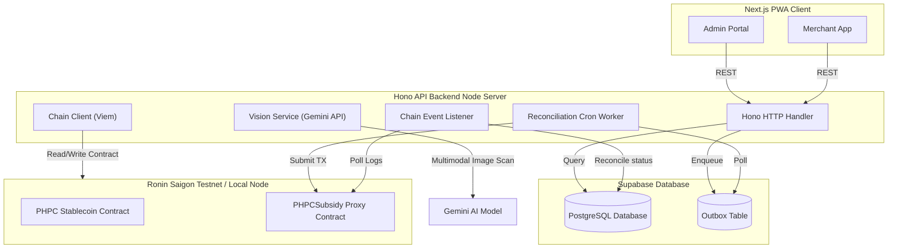

# BANTAYOG

BANTAYOG is a civic-tech nutrition-subsidy progressive web application (PWA) designed to manage subsidy distributions for infants under the First 1,000 Days policy (RA 11148). The application uses physical QR-cards issued to guardians and settles stablecoin transactions via on-chain smart contracts (mock PHPC token) on the Ronin Saigon testnet.

## Architecture



## Monorepo Structure

```
├── apps/
│   ├── server/         # Hono API backend node server
│   └── web/            # Next.js frontend (Admin & Merchant views)
├── packages/
│   ├── config/         # Shared build and lint configurations
│   ├── contracts/      # Hardhat smart contracts (PHPC, PHPCSubsidy)
│   ├── db/             # Supabase schema definitions and database repository clients
│   └── schema/         # Zod input verification schemas shared by web and server
```

## Setup & Local Development

### 1. Install Dependencies
Ensure you have `Node.js >= 20.0.0` and `pnpm >= 9.0.0` installed.
```bash
pnpm install
```

### 2. Configure Environment Variables
Copy and fill out the environment variables in both `.env` and `.env.local` files:
- Root `.env` (Hono Server & Hardhat credentials)
- `apps/web/.env.local` (Next.js Client variables)

### 3. Deploy Smart Contracts locally
In a terminal window, start a local Hardhat node:
```bash
pnpm --filter @bantayog/contracts hardhat node
```
In another terminal window, compile and deploy the contracts onto the local node:
```bash
pnpm deploy:contracts
```

### 4. Run Development Servers
Start both the Hono backend server and the Next.js app runner concurrently:
```bash
pnpm dev
```

### 5. Running Tests
Run the entire monorepo test suite (Vitest):
```bash
pnpm test
```

## Project Documentation & Specifications

For more detailed technical specifications, refer to:
- [Security Policy](docs/SECURITY.md) — Auth schemas, RBAC, Pino logging, Upstash rate limiting configuration
- [Smart Contract Operations Guide](docs/SMART_CONTRACT_OPS.md) — Deployment instructions, compilation, and UUPS upgrades
- [ADR 001: Transactional Outbox](docs/adr/001-transactional-outbox.md)
- [ADR 002: Dynamic Tier Computation](docs/adr/002-tier-computation.md)
- [ADR 003: Product Eligibility Identification](docs/adr/003-product-eligibility.md)
