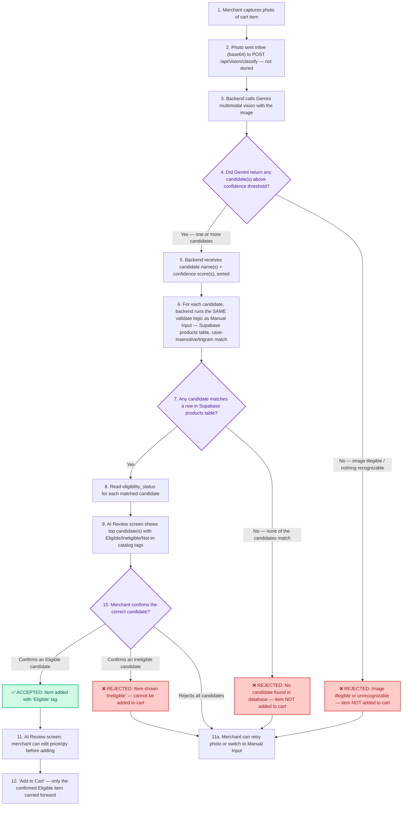
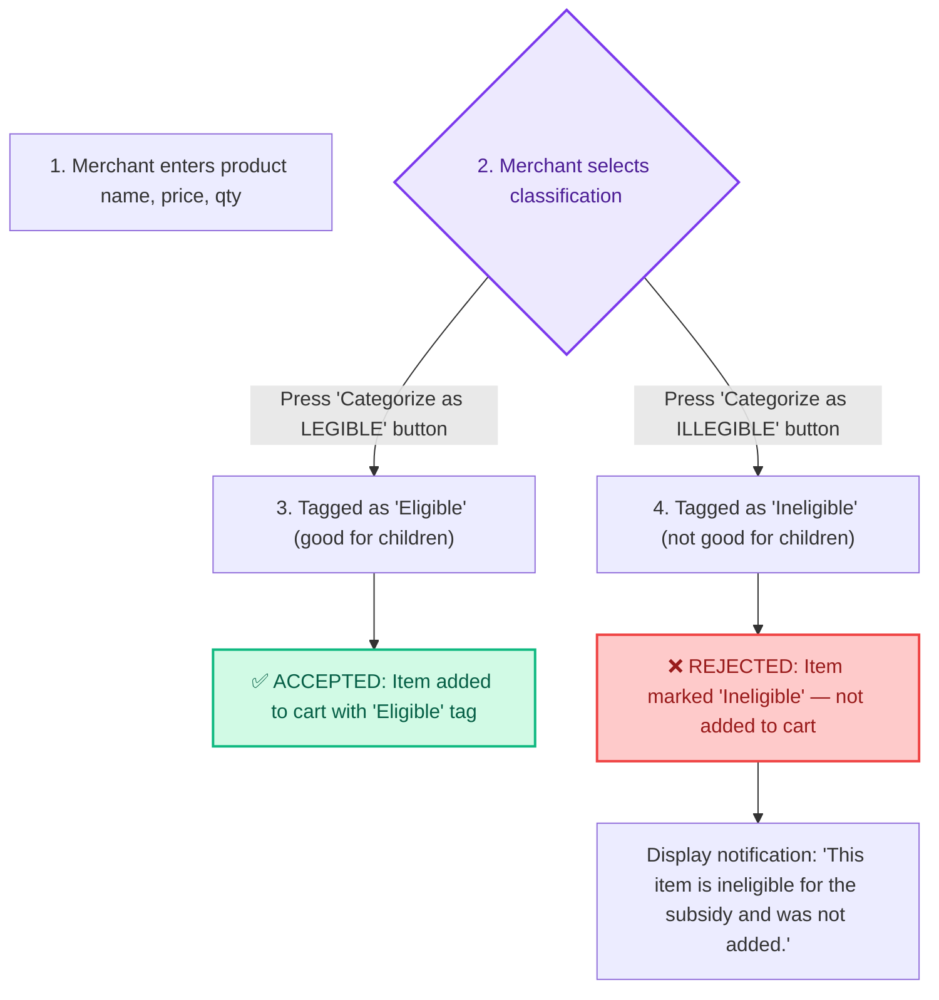
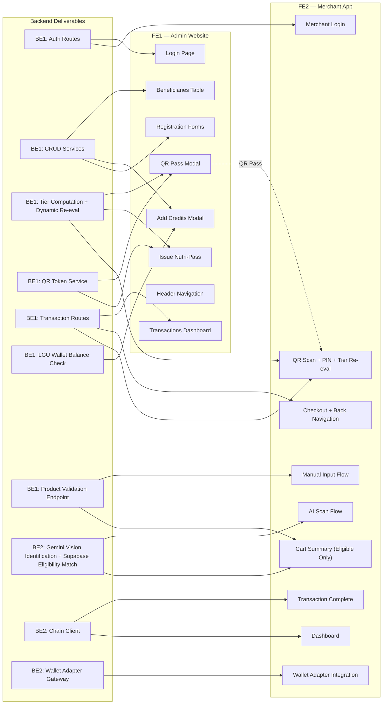

# BANTAYOG — Reorganized Implementation Plan (Phases 2–4)

> **Context:** Phase 1 Foundation is complete. This document merges the original Phases 2–6 into **three consolidated phases (2–4)** without removing, simplifying, or omitting any tasks. Every task is explicitly assigned to either **USER** (you — the developer) or **AI** (me — the coding assistant).
>
> **Two systems, one backend:**
> - **System 1 — LGU Admin Website** (PWA, desktop-first): used by LGU staff / Barangay Health Workers
> - **System 2 — Merchant Application** (APK via App Router + Android SDK): used by verified sari-sari store merchants
>
> **Role Key:**
> - 👤 **USER** — You, the developer. Responsible for UI/UX implementation, visual polish, device testing, design decisions, and manual verification.
> - 🤖 **AI** — Me, the coding assistant. Responsible for backend services, domain logic, API routes, smart contracts, infrastructure, testing scaffolds, and documentation drafts.

---

## Table of Contents

- [External Setup Requirements](#external-setup-requirements)
- [Product Validation Flow](#product-validation-flow)
- [Phase 2 — Core Application Build](#phase-2--core-application-build)
- [Phase 3 — Transaction Flows, AI Scanning, Cart & Integration](#phase-3--transaction-flows-ai-scanning-cart--integration)
- [Phase 4 — Hardening, Accessibility, Polish & Documentation](#phase-4--hardening-accessibility-polish--documentation)
- [Dependency Graph (FE ↔ BE)](#dependency-graph-fe--be)
- [Tech Stack Reference](#tech-stack-reference)

---

## External Setup Requirements

> [!IMPORTANT]
> Every external service listed below **must** be created and configured before the phase that requires it. Each subsection states which phase depends on it.

---

### 1. Supabase Project (Required before Phase 2)

Supabase provides the PostgreSQL database, authentication, row-level security, and file storage for the entire application.

**What to create / configure:**

1. **Create a Supabase project:**
   - Go to [https://supabase.com/dashboard](https://supabase.com/dashboard) and sign in (or create an account).
   - Click **"New Project"**. Choose an organization, enter a project name (e.g., `bantayog-prod`), set a strong database password, and select a region close to your users (e.g., `Southeast Asia (Singapore)`).
   - Wait for provisioning to complete (~2 minutes).

2. **Retrieve API keys:**
   - Go to **Settings → API** in your Supabase dashboard.
   - Copy the following values into your `.env` file:
     - `SUPABASE_URL` — the project URL (e.g., `https://xyzcompany.supabase.co`)
     - `SUPABASE_ANON_KEY` — the `anon` / public API key
     - `SUPABASE_SERVICE_ROLE_KEY` — the `service_role` secret key (server-side only, never expose to client)

3. **Run database migrations:**
   - The `supabase/` directory in the monorepo contains migration files.
   - Install the Supabase CLI: `npm install -g supabase` (or use `npx supabase`).
   - Link your project: `supabase link --project-ref <your-project-ref>` (the ref is in your dashboard URL).
   - Push migrations: `supabase db push`.
   - Verify tables exist: `beneficiaries`, `merchants`, `transactions`, `products`, `qr_passes`.

4. **Configure Authentication:**
   - Go to **Authentication → Providers** in the dashboard.
   - Enable **Email** provider (disable "Confirm email" for development, enable for production).
   - No OAuth providers are needed for v1.

5. **Create Supabase Storage buckets:**
   - Go to **Storage** in the dashboard.
   - Create a bucket named `cart-photos` (for AI scan image uploads). Set it to **private** (authenticated access only).
   - Create a bucket named `qr-passes` (for generated QR pass images if stored). Set to **private**.

6. **Seed the `products` table:**
   - The `products` table must be pre-populated with the product catalog before the AI scanning or manual input flow can validate items. Each row needs at minimum: `id`, `name`, `category`, `eligibility_status` (`eligible` | `ineligible`), `price_range_min`, `price_range_max`.
   - Use the Supabase dashboard's Table Editor or run a seed SQL script to insert the initial product catalog.

**Environment variables to set:**

```env
SUPABASE_URL=https://<your-ref>.supabase.co
SUPABASE_ANON_KEY=eyJ...
SUPABASE_SERVICE_ROLE_KEY=eyJ...
```

---

### 2. Google AI Studio — Gemini API (Required before Phase 3)

Gemini multimodal vision is used to identify products from photos taken by merchants. It does **not** determine eligibility — that is determined by cross-referencing the identified product name against the Supabase `products` table, using the **same matching endpoint** as the Manual Input flow (`POST /api/products/validate`).

> [!NOTE]
> This replaces Google Cloud Vision Product Search, which no longer onboards new projects (`INVALID_ARGUMENT: Product Search doesn't onboard new projects`). No Google Cloud project, billing account, Cloud Storage bucket, or service account is needed for this — Gemini API via AI Studio uses a single API key on its own free tier.

**What to create / configure:**

1. **Create a Gemini API key:**
   - Go to [https://aistudio.google.com/apikey](https://aistudio.google.com/apikey) and sign in.
   - Click **"Create API key"**. Choose an existing Google Cloud project or let AI Studio create one for you — this is unrelated to Cloud Billing and works on the free tier.
   - Copy the generated key (starts with `AIzaSy...`).

2. **No indexing, product sets, or reference images required.** Unlike Product Search, Gemini identifies products directly from the photo using its general vision + reasoning capability — there's no separate catalog to build or index on the Google side. Your existing Supabase `products` table (`id`, `name`, `category`, `eligibility_status`, `price_range_min`, `price_range_max`) remains the single source of truth for what's in your catalog and whether it's eligible.

3. **Scanned photos are not retained.** The merchant app sends the captured photo directly to your backend as inline image data; the backend forwards it to Gemini for identification and discards it after the response — no Cloud Storage or Supabase Storage bucket needed for this flow specifically.

**Environment variables to set:**

```env
GEMINI_API_KEY=AIzaSy...
GEMINI_VISION_MODEL=gemini-flash-latest
GEMINI_CONFIDENCE_THRESHOLD=0.7
```

---

### 3. Local Hardhat Blockchain (Required before Phase 2)

A local Hardhat Node is used for running the local blockchain environment where the PHPC stablecoin, beneficiary registry, and merchant registry smart contracts are deployed and tested.

**What to run / configure:**

1. **Start the local Hardhat Node:**
   - From the `packages/contracts/` directory, run:
     ```bash
     npx hardhat node
     ```
   - This starts a local Ethereum/Ronin-compatible RPC node on `http://127.0.0.1:8545` and prints 20 development accounts with 10000 ETH/RON each. No faucet is required.

2. **Select Deployer and Treasury Wallets:**
   - Use Hardhat's Account #0 (`0xf39fd6e51aad88f6f4ce6ab8827279cfffb92266`) as the **Deployer wallet**.
   - Use Hardhat's Account #1 (`0x70997970C51812dc3A010C7d01b50e0d17dc79C8`) as the **LGU Treasury wallet**.

3. **Deploy smart contracts locally:**
   - In a separate terminal, from the `packages/contracts/` directory, deploy the contracts to the local network:
     ```bash
     npx hardhat run scripts/deploy.ts --network localhost
     ```
   - Record the deployed contract addresses for `PHPC`, `PHPCSubsidy`, `BeneficiaryRegistry`, and `MerchantRegistry`.

**Environment variables to set:**

```env
RONIN_RPC_URL=http://127.0.0.1:8545
DEPLOYER_PRIVATE_KEY=0xac0974bec39a17e36ba4a6b4d238ff944bacb478cbed5efcae784d7bf4f2ff80
LGU_TREASURY_ADDRESS=0x70997970C51812dc3A010C7d01b50e0d17dc79C8
PHPC_CONTRACT_ADDRESS=0x...
PHPC_SUBSIDY_CONTRACT_ADDRESS=0x...
BENEFICIARY_REGISTRY_ADDRESS=0x...
MERCHANT_REGISTRY_ADDRESS=0x...
```

---

### 4. Sky Mavis — Waypoint & Tanto (Required before Phase 3)

Used for merchant wallet authentication options.

**What to create / configure:**

1. **Register a Sky Mavis Developer account:**
   - Go to [https://developers.skymavis.com](https://developers.skymavis.com) and sign up.

2. **Create an application in the Developer Portal:**
   - Navigate to **Applications → Create New App**.
   - Enter app name: `Bantayog Merchant`.
   - Set the redirect URI to your merchant app's callback URL (e.g., `https://your-domain.com/api/auth/callback/waypoint` for production, `http://localhost:3000/api/auth/callback/waypoint` for development).
   - Note the **Client ID** and **API Key**.

3. **Configure Tanto Connect:**
   - Tanto is the Sky Mavis mobile wallet SDK. Install `@sky-mavis/tanto-connect` in Phase 3.
   - No separate portal setup is needed — it uses the same Client ID.

**Environment variables to set:**

```env
SKYMAVIS_CLIENT_ID=your-client-id
SKYMAVIS_API_KEY=your-api-key
WAYPOINT_REDIRECT_URI=http://localhost:3000/api/auth/callback/waypoint
```

---

### 5. Upstash — Redis & Rate Limiting (Required before Phase 4)

Used for API rate limiting and optional caching.

**What to create / configure:**

1. **Create an Upstash account:**
   - Go to [https://console.upstash.com](https://console.upstash.com) and sign up.

2. **Create a Redis database:**
   - Click **"Create Database"**.
   - Name it (e.g., `bantayog-ratelimit`).
   - Select a region close to your deployment (e.g., `ap-southeast-1`).
   - Choose the **Free** tier for development.

3. **Copy connection details:**
   - From the database dashboard, copy the **REST URL** and **REST Token**.

**Environment variables to set:**

```env
UPSTASH_REDIS_REST_URL=https://...upstash.io
UPSTASH_REDIS_REST_TOKEN=AX...
```

---

### 6. Vercel — Deployment & Cron Jobs (Required before Phase 4)

Used for deploying the Next.js app and running scheduled reconciliation tasks.

**What to create / configure:**

1. **Create a Vercel account:**
   - Go to [https://vercel.com](https://vercel.com) and sign up (connect your GitHub account).

2. **Import the project:**
   - Click **"Add New" → "Project"**.
   - Import the BANTAYOG repository from GitHub.
   - Set the **Root Directory** to `apps/web` (or whichever directory contains the Next.js app).
   - Set the **Framework Preset** to **Next.js**.

3. **Configure environment variables:**
   - In the Vercel project dashboard, go to **Settings → Environment Variables**.
   - Add all the environment variables listed in sections 1–5 above.

4. **Configure Cron Jobs (Phase 4):**
   - Create a `vercel.json` in the project root with cron configuration:
     ```json
     {
       "crons": [
         {
           "path": "/api/cron/reconcile",
           "schedule": "*/5 * * * *"
         },
         {
           "path": "/api/cron/tier-reeval",
           "schedule": "0 0 * * *"
         }
       ]
     }
     ```
   - The `CRON_SECRET` env var should be set to a random string for securing cron endpoints.

**Environment variables to set:**

```env
CRON_SECRET=a-random-secure-string
```

---

### 7. JWT Signing Secret (Required before Phase 2)

Used for signing QR Pass JWTs and session tokens.

**What to configure:**

1. Generate a secure random secret:
   ```bash
   node -e "console.log(require('crypto').randomBytes(64).toString('hex'))"
   ```
2. Set it as an environment variable.

**Environment variables to set:**

```env
JWT_SECRET=your-generated-64-byte-hex-string
QR_TOKEN_SECRET=a-separate-generated-secret-for-qr-passes
```

---

### Complete `.env` Template

```env
# ── Supabase ──
SUPABASE_URL=https://<your-ref>.supabase.co
SUPABASE_ANON_KEY=eyJ...
SUPABASE_SERVICE_ROLE_KEY=eyJ...

# ── Gemini Vision ──
GEMINI_API_KEY=AIzaSy...
GEMINI_VISION_MODEL=gemini-flash-latest
GEMINI_CONFIDENCE_THRESHOLD=0.7

# ── Ronin Blockchain ──
RONIN_RPC_URL=http://127.0.0.1:8545
DEPLOYER_PRIVATE_KEY=0xac0974bec39a17e36ba4a6b4d238ff944bacb478cbed5efcae784d7bf4f2ff80
LGU_TREASURY_ADDRESS=0x70997970C51812dc3A010C7d01b50e0d17dc79C8
PHPC_CONTRACT_ADDRESS=0x...
PHPC_SUBSIDY_CONTRACT_ADDRESS=0x...
BENEFICIARY_REGISTRY_ADDRESS=0x...
MERCHANT_REGISTRY_ADDRESS=0x...

# ── Sky Mavis ──
SKYMAVIS_CLIENT_ID=your-client-id
SKYMAVIS_API_KEY=your-api-key
WAYPOINT_REDIRECT_URI=http://localhost:3000/api/auth/callback/waypoint

# ── Upstash ──
UPSTASH_REDIS_REST_URL=https://...upstash.io
UPSTASH_REDIS_REST_TOKEN=AX...

# ── JWT ──
JWT_SECRET=your-generated-64-byte-hex-string
QR_TOKEN_SECRET=a-separate-generated-secret-for-qr-passes

# ── Vercel Cron ──
CRON_SECRET=a-random-secure-string
```

---

## Product Validation Flow

> [!IMPORTANT]
> This section documents the **complete product validation flow** for both manual input and AI scanning. The validation logic is **identical** regardless of input method: every product must be matched against the Supabase `products` table. If the product is legible, recognized, and matches a valid database entry, it is added to the cart. If it is illegible, unrecognized, or does not match a valid product, it **must not** be added to the cart.

---

### Validation via AI Image Scan



**Detailed steps:**

1. **Merchant captures photo:** The merchant opens the AI Image Scan flow and takes a photo of the product using the device camera.
2. **Photo sent inline, not stored:** The captured image is base64-encoded and sent directly in the request body to the backend — it is never uploaded to Supabase Storage or any bucket, and the backend discards it once Gemini has processed it.
3. **Backend receives request:** The frontend calls `POST /api/vision/classify` with the inline image data.
4. **Gemini multimodal vision:** The backend sends the image to the Gemini API with a structured-output prompt asking it to identify the product (name, brand if visible) and return a confidence score per candidate, up to the top 2–3 guesses. Gemini's job is **identification only** — it has no knowledge of your catalog or eligibility rules.
5. **Confidence gate:** Candidates below `GEMINI_CONFIDENCE_THRESHOLD` (default `0.7`, configurable) are discarded. If no candidates remain, the backend treats this as **unrecognizable** and returns a rejection.
6. **Reuse the Manual Input matching logic:** For each remaining candidate name, the backend runs it through the exact same case-insensitive/trigram matching logic used by `POST /api/products/validate` against the Supabase `products` table — one matching codepath serves both AI Scan and Manual Input.
7. **Database match check:** If none of Gemini's candidates match a row in the `products` table, the item is rejected — it is not a recognized product in the program's catalog and cannot be subsidized.
8. **Read eligibility status:** For each matched candidate, the backend reads the `eligibility_status` column from the matched product row. This is the **authoritative** source of eligibility — not Gemini, not the client.
9. **Show candidates to merchant:** The AI Review screen displays Gemini's top candidate(s) with their Eligible/Ineligible/Not-in-catalog tags, letting the merchant pick the one that's actually correct (Gemini's top guess isn't always right).
10. **Merchant confirms:** The merchant taps the correct candidate. If it's tagged Eligible, it proceeds; if Ineligible, it's blocked from the cart; if none of the candidates are correct, the merchant can retry the photo or switch to Manual Input.
11. **AI Review screen:** The confirmed Eligible item can have its price and quantity edited before adding.
12. **Add to Cart:** Only the confirmed Eligible item is carried into the Cart Summary.

---

### Validation via Manual Input



**Detailed steps:**

1. **Merchant enters product details:** The merchant fills in the product name, price, and quantity on the Manual Input form.
2. **Select classification:** The merchant is presented with two explicit actions/buttons on the form instead of a generic "Add to Cart" button:
   - **"Categorize as LEGIBLE (Good for Children)"**
   - **"Categorize as ILLEGIBLE (Not Good for Children)"**
3. **Classification Action:**
   - **If "Categorize as LEGIBLE" is pressed:** The frontend assigns `eligibility_status = 'eligible'` to the item. The item is accepted and added to the cart with the "Eligible" tag.
   - **If "Categorize as ILLEGIBLE" is pressed:** The frontend assigns `eligibility_status = 'ineligible'` to the item. The item is rejected from being added to the cart, and a toast or notification is displayed informing the merchant that the item cannot be added because it is categorized as ineligible.

---

### Validation Consistency Guarantee

> [!IMPORTANT]
> Both flows — AI Image Scan and Manual Input — converge on the **same backend validation logic**:
>
> 1. **Product identification** (Gemini multimodal vision for AI scan, merchant text input for manual)
> 2. **Supabase `products` table lookup** (identical query logic)
> 3. **`eligibility_status` check** (identical eligibility determination)
>
> The only difference is the **input source** (image vs. text). The validation, database lookup, and eligibility determination are the **same code path** on the backend, ensuring consistent behavior.
>
> **Cart filtering** is also identical: the Cart Summary page filters out any item without `eligibility_status === 'eligible'`, regardless of how it was added.

---

## Phase 2 — Core Application Build

> **Goal:** Build all authentication, CRUD services, registration flows, basic screens for both systems, and deploy smart contracts. By the end of Phase 2, both the Admin Website and Merchant App have functional login, registration, data display, and on-chain contract infrastructure.

---

### Backend Tasks — Phase 2

---

#### BE1-2.1 · Domain Logic: Eligibility & Tier Computation

| | |
|---|---|
| **Assigned to** | 🤖 AI |
| **File** | `packages/server/src/domain/eligibility.ts` |
| **Description** | Implement the tier computation engine. This module exports a pure function `computeTier(birthdate: Date, currentDate?: Date): 1 \| 2` that calculates the child's age in days from conception (birthdate minus ~280 days for gestational period, or directly from birthdate depending on policy) and returns Tier 1 (Critical) if ≤ 1,000 days or Tier 2 (Standard) if > 1,000 days. Also exports `reEvaluateTier(beneficiary: Beneficiary): TierResult` that takes a beneficiary record, computes the current tier, and returns whether the tier has changed. This function is called at: (a) beneficiary registration, (b) every QR Pass scan, (c) every credit allocation, (d) every beneficiary list query. |
| **Depends on** | T-1.4 (Supabase schema) |
| **Acceptance** | Unit tests pass for edge cases: exactly 1,000 days, 1,001 days, newborn, future date. Tier transitions are detected correctly. |

---

#### BE1-2.2 · Domain Logic: Nutrition Policy

| | |
|---|---|
| **Assigned to** | 🤖 AI |
| **File** | `packages/server/src/domain/nutrition-policy.ts` |
| **Description** | Define the nutrition policy rules as a pure module. Exports category definitions (nutritious vs. non-nutritious), subsidy calculation rules per tier, and credit allocation constraints. This module is used by the transaction service and cart validation logic. |
| **Depends on** | BE1-2.1 |
| **Acceptance** | Unit tests verify correct subsidy calculations for both tiers. |

---

#### BE1-2.3 · CRUD Services: Beneficiary, Merchant, QR Token, PIN

| | |
|---|---|
| **Assigned to** | 🤖 AI |
| **Files** | `packages/server/src/services/beneficiary.service.ts`, `merchant.service.ts`, `qr-token.service.ts`, `pin.service.ts` |
| **Description** | **Beneficiary service:** CRUD operations on the `beneficiaries` table. `register()` computes initial tier via `eligibility.ts`, hashes the 6-digit PIN via Argon2id (`@node-rs/argon2`), inserts the record, and returns the beneficiary with tier. `list()` re-evaluates tiers dynamically for all returned beneficiaries. `addCredits()` checks LGU wallet balance first, then updates the beneficiary's credit balance. **Merchant service:** CRUD on `merchants` table. `register()` creates auth credentials (Supabase Auth or custom) and inserts the merchant record. `list()` returns all merchants for the admin read-only table. **QR Token service:** `generate(beneficiary)` creates a signed JWT (via `jose`) containing `{ beneficiaryId, childName, guardianName, tier, pin_hash_ref }` with a configurable expiry. `verify(token)` validates the JWT signature and expiry, then re-evaluates the tier from the current date. **PIN service:** `hash(pin)` uses Argon2id to hash the 6-digit PIN. `verify(pin, hash)` compares input against stored hash. |
| **Depends on** | T-1.4, BE1-2.1 |
| **Acceptance** | All service methods have unit tests. PIN hashing uses Argon2id. QR tokens are signed JWTs with tier claims. Tier is re-evaluated on `verify()`. |

---

#### BE1-2.4 · Auth Routes

| | |
|---|---|
| **Assigned to** | 🤖 AI |
| **Files** | `packages/server/src/routes/auth.ts` |
| **Description** | Hono route group for authentication. `POST /api/auth/login` — LGU admin login via Supabase `signInWithPassword`. `POST /api/auth/merchant-login` — merchant login with owner name + password (custom auth or Supabase). `POST /api/auth/verify-pin` — accepts `{ beneficiaryId, pin }`, hashes and compares against stored hash. All routes return appropriate error codes (401, 403) and sanitized error messages. |
| **Depends on** | BE1-2.3 |
| **Acceptance** | Login routes work end-to-end with Supabase Auth. PIN verification returns success/failure correctly. Unauthorized requests receive 401. |

---

#### BE1-2.5 · API Routes: Beneficiary & Merchant Registration

| | |
|---|---|
| **Assigned to** | 🤖 AI |
| **Files** | `packages/server/src/routes/beneficiaries.ts`, `routes/merchants.ts` |
| **Description** | `POST /api/beneficiaries/register` — accepts beneficiary form data (validated via Zod from `@bantayog/schema`), calls `beneficiary.service.register()`, returns the created beneficiary with computed tier and generated QR token. `PATCH /api/beneficiaries/:id/credits` — accepts credit amount, calls `beneficiary.service.addCredits()` with LGU wallet balance pre-flight check. `GET /api/beneficiaries` — returns paginated beneficiary list with dynamically re-evaluated tiers. `POST /api/merchants/register` — accepts merchant form data, calls `merchant.service.register()`, returns the created merchant. `GET /api/merchants` — returns paginated merchant list. |
| **Depends on** | BE1-2.3, BE1-2.4 |
| **Acceptance** | All routes validate input with Zod. Registration creates records and returns expected data. Credits endpoint checks LGU balance before proceeding. |

---

#### BE1-2.6 · LGU Wallet Balance Check Endpoint

| | |
|---|---|
| **Assigned to** | 🤖 AI |
| **File** | `packages/server/src/routes/chain.ts` |
| **Description** | `GET /api/chain/balance` — queries the Ronin blockchain (via `viem`) for the LGU Treasury wallet's PHPC token balance. Returns `{ balance: string, formatted: string }`. This endpoint is called by the Admin Website's Beneficiaries page to determine whether the "Add Credits" button should be enabled or disabled. |
| **Depends on** | BE2-2.1 (PHPC contract deployed) |
| **Acceptance** | Returns correct PHPC balance from chain. Handles RPC errors gracefully. |

---

#### BE2-2.1 · Smart Contracts: PHPC Token

| | |
|---|---|
| **Assigned to** | 🤖 AI |
| **Files** | `packages/contracts/contracts/PHPC.sol` |
| **Description** | ERC-20 stablecoin contract representing Philippine Peso Coin (PHPC). Standard ERC-20 with `mint()` restricted to owner (LGU), `burn()`, and `transfer()`. Uses OpenZeppelin 5.x ERC20 base. Compile with Solidity 0.8.28 (London EVM). |
| **Depends on** | T-1.5 (Hardhat workspace) |
| **Acceptance** | Contract compiles. Unit tests cover minting, burning, transfer, and access control. |

---

#### BE2-2.2 · Smart Contracts: PHPCSubsidy (UUPS Upgradeable)

| | |
|---|---|
| **Assigned to** | 🤖 AI |
| **Files** | `packages/contracts/contracts/PHPCSubsidy.sol` |
| **Description** | UUPS-upgradeable proxy contract that manages subsidy distribution. Holds PHPC tokens allocated by the LGU. Exposes `allocateCredits(beneficiaryId, amount)` and `processTransaction(merchantAddress, beneficiaryId, amount)`. Uses OpenZeppelin UUPS + Initializable patterns. |
| **Depends on** | BE2-2.1 |
| **Acceptance** | Contract compiles. UUPS upgrade test passes (deploy v1 → upgrade to v2 mock). Allocation and transaction functions work correctly. |

---

#### BE2-2.3 · Smart Contracts: BeneficiaryRegistry & MerchantRegistry

| | |
|---|---|
| **Assigned to** | 🤖 AI |
| **Files** | `packages/contracts/contracts/BeneficiaryRegistry.sol`, `MerchantRegistry.sol` |
| **Description** | On-chain registries for beneficiaries and merchants. `BeneficiaryRegistry` stores beneficiary IDs and their associated data hashes (for verification, not PII). `MerchantRegistry` stores merchant wallet addresses and verification status. Both contracts have `register()` and `isRegistered()` functions. Access-controlled: only the LGU admin (contract owner) can register. |
| **Depends on** | T-1.5 |
| **Acceptance** | Contracts compile. Registration and lookup functions work. Access control prevents unauthorized registration. |

---

#### BE2-2.4 · Deploy Scripts & UUPS Upgrade Test

| | |
|---|---|
| **Assigned to** | 🤖 AI |
| **Files** | `packages/contracts/scripts/deploy.ts`, `test/uups-upgrade.test.ts` |
| **Description** | Hardhat deploy script that deploys all four contracts in order: PHPC → PHPCSubsidy (via proxy) → BeneficiaryRegistry → MerchantRegistry. Logs deployed addresses. The UUPS upgrade test deploys PHPCSubsidy v1, then upgrades to a mock v2, verifying state preservation and function changes. |
| **Depends on** | BE2-2.1, BE2-2.2, BE2-2.3 |
| **Acceptance** | `npx hardhat run scripts/deploy.ts --network localhost` deploys all contracts successfully on the running local node. UUPS upgrade test passes. |
| **Verified** | ✅ Tests run with Node.js v22.23.1 — **8/8 passed** (July 2026). Deploy script deploys all 4 contracts successfully on localhost. |

---

### Frontend Tasks — Phase 2

---

#### FE1-2.1 · Login Page (Admin Website)

| | |
|---|---|
| **Assigned to** | 👤 USER |
| **File** | `apps/web/app/(auth)/login/page.tsx` |
| **Description** | LGU admin login page. Contains a credential form with email and password fields. On submit, calls `supabase.auth.signInWithPassword()`. On success, redirects to `/(admin)/beneficiaries` (the default landing page). Includes error handling for invalid credentials, network errors, and loading states. Styled according to the mock UI designs. |
| **Depends on** | BE1-2.4 (Auth routes) |
| **Acceptance** | Login succeeds with valid credentials; redirects to beneficiaries page. Invalid credentials show error message. Loading spinner displays during authentication. |

---

#### FE1-2.2 · Beneficiaries Page (Default Landing)

| | |
|---|---|
| **Assigned to** | 👤 USER |
| **File** | `apps/web/app/(admin)/beneficiaries/page.tsx` |
| **Description** | The default landing page after admin login. **Top section:** Four summary metric cards fetched from Supabase via backend APIs — (1) Beneficiaries onboarded, (2) Critical 1,000-day units (Tier 1 count), (3) Allocated stablecoin (total PHPC distributed), (4) Verified merchants. **Main section:** Active Beneficiary Directory table built with TanStack Table. Columns: ID, Child Name, Guardian, Age, Balance, Tier badge (🔴 for Tier 1 Critical, 🟡 for Tier 2 Standard). Table supports sorting and filtering. Each row has an "Add Credits" button. **Add Credits button behavior:** The button fetches the LGU Ronin wallet balance from `GET /api/chain/balance`. If the LGU wallet balance is insufficient (less than the minimum credit amount), the button is **disabled** and shows a tooltip: "Insufficient LGU Balance". |
| **Depends on** | BE1-2.3, BE1-2.5, BE1-2.6 |
| **Acceptance** | Table and top metrics render live data from Supabase. Tier badges show 🔴/🟡 correctly. "Add Credits" button is disabled with tooltip when LGU balance is insufficient. Sorting and filtering work on all columns. |

---

#### FE1-2.3 · Add Credits Modal

| | |
|---|---|
| **Assigned to** | 👤 USER |
| **File** | `apps/web/components/admin/add-credits-modal.tsx` |
| **Description** | Centered modal dialog triggered by the "Add Credits" button on a beneficiary row. Contains: a numeric input field for the credit amount, the beneficiary's name and current balance (read-only), confirm and cancel buttons. **Pre-flight check:** Before enabling the confirm button, the modal fetches the current LGU wallet balance from the chain. If the entered amount exceeds the LGU wallet balance, a warning is displayed and the confirm button is disabled. On confirm, calls `PATCH /api/beneficiaries/:id/credits`. On success, closes the modal and refreshes the beneficiary table to show the updated balance. |
| **Depends on** | FE1-2.2, BE1-2.5, BE1-2.6 |
| **Acceptance** | Modal opens centered. Validates entered amount against LGU balance. Warning appears when amount exceeds balance. Confirm is disabled when validation fails. Successful credit addition updates the table. |

---

#### FE1-2.4 · Merchants Page

| | |
|---|---|
| **Assigned to** | 👤 USER |
| **File** | `apps/web/app/(admin)/merchants/page.tsx` |
| **Description** | Read-only data table displaying the merchant directory. Data fetched from Supabase via `GET /api/merchants`. Columns: Store Name, Owner Name, Phone, Status (verified/pending). Built with TanStack Table with sorting and filtering. **No action buttons** — this is a view-only page for the admin to monitor registered merchants. |
| **Depends on** | BE1-2.5 |
| **Acceptance** | Table correctly fetches and renders merchant data live from Supabase. Sorting and filtering work. No action buttons are present. |

---

#### FE1-2.5 · Registration Page Shell

| | |
|---|---|
| **Assigned to** | 👤 USER |
| **File** | `apps/web/app/(admin)/register/page.tsx` |
| **Description** | Registration page with a two-tab or two-card layout: "Register Beneficiary" and "Register Merchant". Each tab/card routes to its respective registration form. Clean, intuitive layout that makes it clear which registration type is being selected. |
| **Depends on** | T-1.6 (Route groups) |
| **Acceptance** | Page renders both registration paths. Tab/card switching works. Layout matches design mocks. |

---

#### FE1-2.6 · Beneficiary Registration Form

| | |
|---|---|
| **Assigned to** | 👤 USER |
| **File** | `apps/web/components/admin/beneficiary-registration-form.tsx` |
| **Description** | Multi-field registration form for onboarding a new beneficiary. Fields: Child Name (text), Guardian Name (text), Birthdate (date picker), Monthly Income (number), 6-digit PIN (numeric, masked). Built with `react-hook-form` and validated with Zod schemas from `@bantayog/schema`. Submit button labeled "Onboard & Generate QR ID". On submit, calls `POST /api/beneficiaries/register`. On success, opens the QR Pass Modal (FE1-2.7) with the returned data. |
| **Depends on** | BE1-2.5, T-2.9 (Zod schemas) |
| **Acceptance** | Form validates all fields according to Zod schema. Invalid inputs show inline error messages. Successful submission opens the QR Pass Modal with correct data. |

---

#### FE1-2.7 · QR Pass Modal

| | |
|---|---|
| **Assigned to** | 👤 USER |
| **File** | `apps/web/components/admin/qr-pass-modal.tsx` |
| **Description** | Modal displayed after successful beneficiary registration. Shows: (1) Generated QR code rendered via `react-qr-code` — the QR encodes the signed JWT from the backend, (2) Tier badge — 🔴 Critical or 🟡 Standard — dynamically computed by the backend, (3) Child name and guardian name as text. Two action buttons at the bottom: **"Print Voucher"** — opens the browser's native print dialog with a print-friendly layout of the QR pass card, **"Save to Device"** — triggers a download of the QR pass as a PNG or PDF image. A close button dismisses the modal, and the newly registered beneficiary appears in the beneficiaries table. |
| **Depends on** | FE1-2.6, BE1-2.3 |
| **Acceptance** | QR code renders correctly and encodes the JWT. Tier badge displays correctly (🔴 or 🟡). Print opens browser print dialog with proper layout. Save triggers file download. Close dismisses modal and beneficiary appears in table. |

---

#### FE1-2.8 · Merchant Registration Form

| | |
|---|---|
| **Assigned to** | 👤 USER |
| **File** | `apps/web/components/admin/merchant-registration-form.tsx` |
| **Description** | Registration form for onboarding a new merchant. Fields: Store Name (text), Owner Name (text), Phone Number (tel), Wallet Address (text — Ronin address format `ronin:...` or `0x...`), Password (password, masked). Built with `react-hook-form` + Zod validation from `@bantayog/schema`. Submit button labeled "Onboard". On submit, calls `POST /api/merchants/register`. On success, shows the verified toast (FE1-2.9). |
| **Depends on** | BE1-2.5 |
| **Acceptance** | Form validates all fields. Wallet address validates format. Successful submission triggers the verified toast and merchant appears in the merchants table. |

---

#### FE1-2.9 · Merchant Verified Toast

| | |
|---|---|
| **Assigned to** | 👤 USER |
| **File** | *(inline in FE1-2.8 — uses a toast/notification component)* |
| **Description** | Success notification that appears after a merchant is successfully registered. Displays "Verified Merchant ✓" as a toast/popup notification (not a modal). Auto-dismisses after a few seconds. The newly registered merchant should now appear in the merchants table (FE1-2.4). |
| **Depends on** | FE1-2.8 |
| **Acceptance** | Toast appears on successful merchant registration. Auto-dismisses. Merchant appears in the merchants table. |

---

#### FE1-2.10 · Header Navigation

| | |
|---|---|
| **Assigned to** | 👤 USER |
| **File** | `apps/web/components/admin/header-nav.tsx` |
| **Description** | Persistent top header navigation bar rendered across all `(admin)` pages. Contains three navigation links: Registration \| Beneficiaries \| Merchants. The active route is highlighted with a visual indicator (e.g., underline, background color, or bold text). Includes LGU branding/logo on the left side. Responsive layout that works on desktop (primary) and tablet screens. |
| **Depends on** | T-1.6 (Route groups) |
| **Acceptance** | Navigation persists across all admin pages. Active route is visually highlighted. Logo/branding is present. Links navigate correctly to each page. |

---

#### FE2-2.1 · Merchant Login Page

| | |
|---|---|
| **Assigned to** | 👤 USER |
| **File** | `apps/web/app/(merchant)/login/page.tsx` |
| **Description** | Simple login form for merchants. Two fields: Owner Name (text) and Password (password, masked). On submit, calls `POST /api/auth/merchant-login`. On success, redirects to the merchant dashboard. Error handling for invalid credentials and network errors. Mobile-first design optimized for Android screens. |
| **Depends on** | BE1-2.4, T-2.9 (Zod schemas) |
| **Acceptance** | Login succeeds with valid credentials; redirects to dashboard. Invalid credentials show error message. Mobile-responsive layout. |

---

#### FE2-2.2 · Home Dashboard Shell

| | |
|---|---|
| **Assigned to** | 👤 USER |
| **File** | `apps/web/app/(merchant)/dashboard/page.tsx` |
| **Description** | Merchant's home dashboard with three main sections: (1) **Wallet Balance Card** — displays PHPC balance with a "Transfer to Ronin Wallet" button, (2) **"Scan Cart Items" CTA button** — primary action button that navigates to the cart scanning flow, (3) **Recent Transactions List** — shows the merchant's recent transaction history. Mobile-first layout optimized for Android. |
| **Depends on** | T-1.7 (Merchant route group) |
| **Acceptance** | Page renders with all three sections visible. Layout is mobile-optimized. |

---

#### FE2-2.3 · Wallet Balance Card

| | |
|---|---|
| **Assigned to** | 👤 USER |
| **File** | `apps/web/components/merchant/wallet-balance-card.tsx` |
| **Description** | Card component displayed on the merchant dashboard. Shows the merchant's PHPC wallet balance fetched from `GET /api/chain/balance` (using the merchant's wallet address). Includes a "Transfer to Ronin Wallet" button that opens the Transfer Modal (FE2-2.4). Balance refreshes on component mount and after transfers. |
| **Depends on** | FE2-2.2, BE1-2.6 |
| **Acceptance** | Displays correct PHPC balance from the blockchain. Balance updates after transfers. "Transfer to Ronin Wallet" button opens the transfer modal. |

---

#### FE2-2.4 · Transfer Modal

| | |
|---|---|
| **Assigned to** | 👤 USER |
| **File** | `apps/web/components/merchant/transfer-modal.tsx` |
| **Description** | Centered modal for transferring PHPC from the merchant's in-app wallet to their personal Ronin wallet. Fields: Destination Address (pre-filled from the merchant's profile, editable), Amount (numeric input). Prominent irreversible warning text: "This transfer cannot be undone. Please verify the address and amount." Confirm and Cancel buttons. On confirm, calls `POST /api/chain/transfer`. Shows loading state during transaction. On success, closes modal and refreshes the wallet balance card. |
| **Depends on** | FE2-2.3, BE1-2.6 |
| **Acceptance** | Modal opens with pre-filled destination address. Warning text is prominent. Confirm triggers transfer. Loading state shows during transaction. Balance refreshes after success. |

---

#### FE2-2.5 · Scan Page with `@zxing/browser`

| | |
|---|---|
| **Assigned to** | 👤 USER |
| **Files** | `apps/web/app/(merchant)/scan/page.tsx`, `apps/web/lib/qr/scanner.ts` |
| **Description** | Camera-based QR code scanning page. Uses `@zxing/browser` to access the device camera and decode QR codes in real-time. On successful scan, the decoded QR string (JWT) is passed to the checkout flow. **Back button (`<`)** in the top-left navigates back to the Dashboard. Camera permissions handling with user-friendly error messages if camera access is denied. |
| **Depends on** | T-1.9, T-2.8 |
| **Acceptance** | Camera opens and displays live feed. QR codes are decoded on scan. Back button navigates to dashboard. Camera permission denial shows helpful error message. |

---

### Phase 2 — Install Dependencies

| | |
|---|---|
| **Assigned to** | 🤖 AI |
| **Scope** | Monorepo-wide |
| **Description** | Install all Phase 2 dependencies across the monorepo: `tailwindcss` (v4 CSS-first), `shadcn` CLI components, `@serwist/next` + `serwist` (PWA), `zustand` (client state), `@tanstack/react-query` (server state), `react-hook-form` + `@hookform/resolvers` (forms), `react-qr-code` (QR generation), `@zxing/browser` (QR scanning), `@node-rs/argon2` (PIN hashing), `jose` (JWT signing). Configure Tailwind, initialize shadcn, and set up PWA manifest. |
| **Acceptance** | All packages install without conflicts. `pnpm build` succeeds. Tailwind and shadcn are configured. PWA manifest is generated. |

---

### Phase 2 — Summary of Responsibilities

| Person | Tasks | Focus Area |
|---|---|---|
| 🤖 **AI** | BE1-2.1, BE1-2.2, BE1-2.3, BE1-2.4, BE1-2.5, BE1-2.6, BE2-2.1, BE2-2.2, BE2-2.3, BE2-2.4, Dependency Installation | All backend domain logic, services, API routes, smart contracts, deploy scripts, and dependency configuration |
| 👤 **USER** | FE1-2.1 through FE1-2.10, FE2-2.1 through FE2-2.5 | All frontend pages, components, forms, modals, navigation, and visual styling for both Admin Website and Merchant App |

---

## Phase 3 — Transaction Flows, AI Scanning, Cart & Integration

> **Goal:** Build the complete transaction pipeline, AI-powered product scanning with eligibility validation, manual input with validation, cart management, checkout flow, wallet adapter integration, status badges, and all remaining interactive screens. By the end of Phase 3, both systems are fully functional end-to-end.

---

### Backend Tasks — Phase 3

---

#### BE1-3.1 · Transaction Service (Atomic Outbox)

| | |
|---|---|
| **Assigned to** | 🤖 AI |
| **File** | `packages/server/src/services/transaction.service.ts` |
| **Description** | Implements the transactional outbox pattern for processing purchases. `createTransaction()` atomically inserts into both the `transactions` table and an `outbox` table within a single Supabase/Postgres transaction. The outbox entry contains the serialized event payload (beneficiary ID, merchant ID, items, amounts). A separate worker (Phase 4) polls the outbox and submits on-chain transactions. `getTransaction()` and `listTransactions()` for querying. `updateStatus()` for status transitions: `PENDING_CHAIN` → `CONFIRMED` → `RECONCILED` (or `FAILED`). |
| **Depends on** | BE1-2.3 |
| **Acceptance** | Transaction creation is atomic (both tables or neither). Status transitions are validated. Unit tests cover all state transitions. |

---

#### BE1-3.2 · Transaction State Machine (XState v5)

| | |
|---|---|
| **Assigned to** | 🤖 AI |
| **File** | `packages/server/src/services/transaction.machine.ts` |
| **Description** | XState v5 state machine defining the transaction lifecycle: `IDLE` → `VALIDATING` → `PENDING_CHAIN` → `SUBMITTED` → `CONFIRMED` → `RECONCILED`, with error transitions to `FAILED` from any active state. Guards validate sufficient balance, eligible items, and valid beneficiary tier. Actions trigger the appropriate service calls. The machine is invoked per-transaction and its current state is persisted to the `transactions` table. |
| **Depends on** | BE1-3.1, BE1-2.1 |
| **Acceptance** | State machine correctly transitions through all states. Guards prevent invalid transitions. Persisted state survives server restarts. |

---

#### BE1-3.3 · Transaction API Routes

| | |
|---|---|
| **Assigned to** | 🤖 AI |
| **File** | `packages/server/src/routes/transactions.ts` |
| **Description** | `POST /api/transactions` — creates a new transaction (calls `transaction.service.createTransaction()`). Validates cart items, beneficiary ID, merchant ID, and total amount. Triggers the state machine. `GET /api/transactions` — lists transactions with filtering by merchant, beneficiary, status, and date range. Supports pagination. `GET /api/transactions/:id` — single transaction detail with full item list and status history. Used by both admin dashboard (all transactions) and merchant dashboard (filtered by merchant). |
| **Depends on** | BE1-3.1, BE1-3.2 |
| **Acceptance** | Transaction creation validates all inputs and returns the created transaction with `PENDING_CHAIN` status. List and detail endpoints return correct data with filters. |

---

#### BE1-3.4 · Tier Re-evaluation at QR Scan Time

| | |
|---|---|
| **Assigned to** | 🤖 AI |
| **File** | `packages/server/src/services/beneficiary.service.ts` (enhancement) |
| **Description** | Enhance the beneficiary service to re-evaluate the tier **at every QR Pass scan during checkout**. When `POST /api/auth/verify-qr` is called (decoding the beneficiary's JWT), the backend: (1) verifies the JWT signature and expiry, (2) looks up the beneficiary by ID, (3) calls `computeTier(beneficiary.birthdate)` with the current date, (4) if the computed tier differs from the stored `intervention_tier`, updates the database record, (5) returns the beneficiary data with the **current** tier. This ensures that a child who has aged past 1,000 days is automatically transitioned to Tier 2 before the transaction processes. |
| **Depends on** | BE1-2.1, BE1-2.3 |
| **Acceptance** | QR scan endpoint re-evaluates tier. A beneficiary who was Tier 1 but is now > 1,000 days old is returned as Tier 2. Database is updated with the new tier. |

---


#### BE1-3.5 · Product Validation Endpoint (for Manual Input)

| | |
|---|---|
| **Assigned to** | 🤖 AI |
| **File** | `packages/server/src/routes/products.ts` |
| **Description** | `POST /api/products/validate` — accepts `{ name: string }` from the manual input flow. Queries the Supabase `products` table for a matching record using case-insensitive matching (e.g., `ILIKE` or trigram similarity). If a match is found, returns `{ matched: true, product: { id, name, eligibility_status, category } }`. If no match is found, returns `{ matched: false, reason: 'Product not found in catalog' }`. This endpoint ensures that manually entered products go through the **same validation logic** as AI-scanned products — they must exist in the database and have `eligibility_status === 'eligible'` to be added to the cart. |
| **Depends on** | Supabase `products` table (seeded) |
| **Acceptance** | Valid product names return a match with eligibility status. Invalid/unknown names return `matched: false`. Case-insensitive matching works. |

---


#### BE2-3.1 · Vision Service (Gemini Multimodal Vision + Supabase Match)

| | |
|---|---|
| **Assigned to** | 🤖 AI |
| **File** | `packages/server/src/services/vision.service.ts` |
| **Description** | Implements the AI product identification pipeline. `classifyProduct(imageBase64: string)`: (1) Sends the inline image data to the Gemini API (`GEMINI_VISION_MODEL`) with a structured-output prompt requesting up to the top 2–3 candidate products (name, brand if visible) each with a confidence score, (2) Filters candidates below `GEMINI_CONFIDENCE_THRESHOLD` (default `0.7`, configurable), (3) For each remaining candidate name, calls the **same matching function used by** `products.service.validateProduct()` (BE2-3.x manual input matching — case-insensitive/trigram against the Supabase `products` table) rather than duplicating matching logic, (4) Reads `eligibility_status` for each matched candidate, (5) Returns the classification result: `{ identified: true, candidates: [{ name, confidence, product: { id, name, eligibility_status, category } | null }] }` or `{ identified: false, reason: 'unrecognizable' }`. Uses `p-retry` for resilient API calls with exponential backoff. The image is never persisted — processed in-memory and discarded after the response. Gemini does **identification only** — eligibility is always determined by the Supabase product catalog. |
| **Depends on** | Gemini API key configured, Supabase `products` table, BE2-3.x product validation matching logic (reused, not duplicated) |
| **Acceptance** | Known products are identified with correct eligibility from Supabase, even when Gemini's exact wording doesn't match the catalog name verbatim (fuzzy match handles this). Unrecognizable images return `identified: false`. Candidates below the confidence threshold are filtered out. Retries work on transient failures. No image data is written to disk or storage. |

---

#### BE2-3.2 · Vision API Route

| | |
|---|---|
| **Assigned to** | 🤖 AI |
| **File** | `packages/server/src/routes/vision.ts` |
| **Description** | `POST /api/vision/classify` — accepts `{ imageBase64: string }` (inline image data from the merchant app, not a storage URL). Calls `vision.service.classifyProduct()`. Returns the classification result with the candidate list (name, confidence, matched product + eligibility status per candidate, or `null` if unmatched) for the frontend to display as selectable guesses. Handles errors from the Gemini API (rate limits, quota exceeded, invalid image, malformed structured output) with appropriate HTTP status codes and user-friendly error messages. Enforces a reasonable max payload size for the inline image to avoid abuse. |
| **Depends on** | BE2-3.1 |
| **Acceptance** | Route accepts inline base64 image data and returns a candidate list with eligibility per candidate. Error handling covers all Gemini API failure modes, including malformed/unparseable structured output. |

---

#### BE2-3.3 · Server-Side Chain Client (viem)

| | |
|---|---|
| **Assigned to** | 🤖 AI |
| **File** | `packages/server/src/services/chain.client.ts` |
| **Description** | Server-side blockchain client using `viem`. Configures a `publicClient` for reading chain state (balances, contract reads) and a `walletClient` for signing and submitting transactions (using the server's private key for LGU operations). Exposes methods: `getBalance(address)`, `transferPHPC(from, to, amount)`, `submitTransaction(txData)`, `getTransactionReceipt(txHash)`. Handles Ronin-specific chain configuration (chain ID, RPC URL). |
| **Depends on** | BE2-2.1 (PHPC contract), Ronin setup |
| **Acceptance** | Can read balances from Ronin. Can submit and confirm transactions. Handles RPC errors and retries. |

---

#### BE2-3.4 · End-to-End Integration Test

| | |
|---|---|
| **Assigned to** | 🤖 AI |
| **File** | `packages/server/test/e2e/transaction-flow.test.ts` |
| **Description** | Integration test that exercises the complete transaction flow: (1) Register a beneficiary (verify tier computation), (2) Register a merchant, (3) Classify a product via the Vision service (mock the Gemini API, real Supabase lookup), (4) Create a transaction with eligible items, (5) Verify the transaction state machine transitions, (6) Verify the outbox entry is created, (7) Verify chain submission (mocked), (8) Verify final status is `CONFIRMED`. Also tests: ineligible items are rejected, insufficient balance prevents transaction, tier re-evaluation works at scan time. |
| **Depends on** | BE1-3.1 through BE1-3.5, BE2-3.1 through BE2-3.3 |
| **Acceptance** | All test scenarios pass. Covers happy path and error cases. Uses mocks for external services (Gemini API, Ronin RPC) but real Supabase. |

---

#### BE2-3.5 · DTO Mapping at Route Boundaries

| | |
|---|---|
| **Assigned to** | 🤖 AI |
| **Files** | `packages/server/src/dto/` (new directory with mapper files) |
| **Description** | Create Data Transfer Object (DTO) types and mapper functions for all API route boundaries. This ensures that internal domain models are never leaked directly to the client. DTOs for: `BeneficiaryResponse`, `MerchantResponse`, `TransactionResponse`, `ProductClassificationResponse`, `WalletBalanceResponse`. Each DTO has a `toDTO(domainModel)` mapper function. Applied at all route handlers. |
| **Depends on** | All BE1/BE2 routes |
| **Acceptance** | No route handler returns raw domain models. All responses go through DTO mappers. Snapshot tests verify DTO shapes. |

---

#### BE2-3.6 · Snapshot Tests for DTOs

| | |
|---|---|
| **Assigned to** | 🤖 AI |
| **Files** | `packages/server/test/dto/` |
| **Description** | Vitest snapshot tests for all DTO mappers. Each test creates a sample domain model, maps it through the DTO function, and asserts the output matches the stored snapshot. This prevents accidental API response shape changes. |
| **Depends on** | BE2-3.5 |
| **Acceptance** | Snapshot tests exist for all DTOs. `pnpm test` passes. |

---

#### BE2-3.7 · Wallet Adapter Gateway (Backend Support)

| | |
|---|---|
| **Assigned to** | 🤖 AI |
| **File** | `packages/server/src/services/wallet-adapter.gateway.ts` |
| **Description** | Backend support for the three wallet connection methods: (1) **Sky Mavis Waypoint** — OAuth-based flow, handles callback and token exchange, (2) **Tanto Connect** — mobile deep-link flow, verifies signed messages, (3) **Injected EIP-1193** — standard wallet connection, verifies signatures. Exposes `verifyWalletConnection(method, proof)` that validates the wallet ownership regardless of connection method. Used during merchant login to associate a verified wallet address. |
| **Depends on** | Sky Mavis setup |
| **Acceptance** | All three wallet methods can be verified. Invalid proofs are rejected. |

---

### Frontend Tasks — Phase 3

---

#### FE1-3.1 · Transactions Dashboard (Admin)

| | |
|---|---|
| **Assigned to** | 👤 USER |
| **File** | `apps/web/app/(admin)/transactions/page.tsx` |
| **Description** | Real-time transactions dashboard for LGU admins. Built with TanStack Query with 5-second polling interval for near-real-time updates. Table columns: Beneficiary Name, Merchant Name, Amount (PHPC), Status Badge (uses the shared Status Badge component from FE-3.11), Transaction Hash (clickable link to Ronin explorer), Timestamp. Supports filtering by status, date range, and search by name. Pagination for large datasets. |
| **Depends on** | BE1-3.3 |
| **Acceptance** | Table auto-refreshes every 5 seconds. Status badges update live as transactions progress. Tx hash links open Ronin explorer. Filtering and pagination work. |

---

#### FE1-3.2 · Issue Nutri-Pass Form (Enhanced QR)

| | |
|---|---|
| **Assigned to** | 👤 USER |
| **File** | `apps/web/app/(admin)/register/issue-pass/page.tsx` |
| **Description** | Enhanced version of the QR Pass Modal (FE1-2.7). Generates a signed JWT via the backend's `QrTokenService`, renders the QR code via `react-qr-code`, and displays a printable card layout with: QR code, tier badge (🔴 Critical / 🟡 Standard), child name, guardian name, beneficiary ID, issue date. **The tier is dynamically computed from the current date** — not cached from registration time. This page can be accessed to re-issue or reprint QR passes for existing beneficiaries. Print layout is optimized for standard card/paper sizes. |
| **Depends on** | FE1-2.7, BE1-2.3 |
| **Acceptance** | QR renders with fresh JWT. Tier reflects current age computation (not registration-time value). Print layout produces clean output. QR can be verified via `QrTokenService.verify`. |

---

#### FE2-3.1 · Scan Cart Items — Method Choice

| | |
|---|---|
| **Assigned to** | 👤 USER |
| **File** | `apps/web/app/(merchant)/cart/page.tsx` |
| **Description** | Landing page for the cart item scanning flow. Displays two prominent buttons: **"AI Image Scan"** — navigates to the AI capture flow (FE2-3.2), **"Manual Input"** — navigates to the manual entry form (FE2-3.3). Clean, simple layout with clear icons/illustrations for each option. **Back button (`<`)** in the top-left navigates back to the Dashboard. |
| **Depends on** | FE2-2.5 |
| **Acceptance** | Both buttons navigate to their respective sub-flows. Back button returns to dashboard. Layout is mobile-optimized. |

---

#### FE2-3.2 · AI Image Scan Flow

| | |
|---|---|
| **Assigned to** | 👤 USER |
| **File** | `apps/web/app/(merchant)/cart/ai-scan/page.tsx` |
| **Description** | Two-step AI scanning flow. **Step 1 — Capture:** Opens the device camera for the merchant to photograph a product. On capture, the photo is base64-encoded and sent inline in the request body directly to `POST /api/vision/classify` — it is never uploaded to Supabase Storage or any bucket. **Back button (`<`)** on the capture screen returns to the Scan Cart Items method choice page. **Step 2 — AI Review:** Displays the candidate list returned by the backend (Gemini's top 2–3 guesses, each with an **Eligible / Ineligible / Not in catalog** tag sourced from the Supabase product catalog match, NOT from Gemini itself). The merchant taps the candidate that's actually correct — Gemini's top guess is a suggestion, not an automatic add. Once a candidate is confirmed, its price and quantity are editable before "Add to Cart" (only enabled if the confirmed candidate is Eligible). If none of the candidates are correct, or the image was illegible / nothing was recognized, show an appropriate message with the option to retry the photo or switch to Manual Input. **Back button (`<`)** on the review screen returns to the Scan Cart Items method choice page. |
| **Depends on** | BE2-3.1, BE2-3.2 |
| **Acceptance** | Photo is captured and sent inline (no storage upload occurs). Gemini identifies candidate(s). Backend cross-references the Supabase product catalog per candidate. Candidates displayed with correct Eligible/Ineligible/Not-in-catalog tags. Merchant must confirm a candidate before it can be added. Price/qty are editable post-confirmation. Only a confirmed Eligible item can be added to cart. Illegible images or zero valid candidates show an error with retry/Manual Input option. Both back buttons navigate correctly. |

---

#### FE2-3.3 · Manual Input Flow

| | |
|---|---|
| **Assigned to** | 👤 USER |
| **File** | `apps/web/app/(merchant)/cart/manual/page.tsx` |
| **Description** | Form for manually entering cart items. Fields: Product Name (text), Price (numeric), Quantity (numeric). Instead of a standard submit button, the screen displays two classification buttons: **"Categorize as LEGIBLE (Good for Children)"** and **"Categorize as ILLEGIBLE (Not Good for Children)"**. **If the merchant clicks "Categorize as LEGIBLE":** the product is tagged as "Eligible" and added directly to the Zustand cart store. **If the merchant clicks "Categorize as ILLEGIBLE":** the product is tagged as "Ineligible" and is **NOT** added to the cart; the form remains open and displays a notification indicating the item is ineligible and cannot be subsidized. **Back button (`<`)** returns to the Scan Cart Items page. |
| **Depends on** | None |
| **Acceptance** | Form collects product fields. Merchant can click "Categorize as LEGIBLE" to add the item with "Eligible" tag to cart. Clicking "Categorize as ILLEGIBLE" prevents adding to cart and shows a warning message. Back button returns to method choice. |

---

#### FE2-3.4 · Cart Summary

| | |
|---|---|
| **Assigned to** | 👤 USER |
| **File** | `apps/web/app/(merchant)/cart/summary/page.tsx` |
| **Description** | Displays the running cart from the Zustand store. **Only eligible items are displayed** — any item that somehow has an ineligible status is filtered out and excluded from totals (defense-in-depth, as the input flows already prevent ineligible items from being added). Shows a list of eligible items with: product name, price, quantity, subtotal per item. Displays the grand total at the bottom. **"Proceed to Checkout"** button navigates to the checkout review page. **Empty state:** If no eligible items are in the cart (either no items added, or all items were ineligible), display a friendly empty state message: "No eligible items in your cart. Add items using AI Scan or Manual Input." with a button to return to the Scan Cart Items page. |
| **Depends on** | FE2-3.2, FE2-3.3 |
| **Acceptance** | Cart renders from Zustand store. Ineligible items are filtered out. Totals reflect only eligible items. "Proceed to Checkout" navigates correctly. Empty state displays when no eligible items exist. |

---

#### FE2-3.5 · Checkout — Review & Payment

| | |
|---|---|
| **Assigned to** | 👤 USER |
| **File** | `apps/web/app/(merchant)/checkout/page.tsx` |
| **Description** | Final review page before payment. Displays: the list of eligible cart items with prices and quantities, the grand total, and a payment method selector. For v1, only **"Bantayog Credit"** is available as a payment method. "Confirm & Checkout" button proceeds to the QR scanner for beneficiary identification. **Back button (`<`)** implements intelligent source detection: if the cart was built from AI Scan, navigates back to the Scan Cart Items page; if from Manual Input, navigates back to the Manual Input page. The `inputSource` is stored in the Zustand store or as a URL parameter. |
| **Depends on** | FE2-3.4 |
| **Acceptance** | Displays final totals for eligible items only. Payment method is selectable (Bantayog Credit for v1). "Confirm & Checkout" navigates to QR scanner. Back button navigates to the correct source page based on input method. |

---

#### FE2-3.6 · QR Scanner (Checkout)

| | |
|---|---|
| **Assigned to** | 👤 USER |
| **File** | `apps/web/app/(merchant)/checkout/scan/page.tsx` |
| **Description** | Re-uses the `@zxing/browser` scanner (from FE2-2.5's `scanner.ts`) to scan the beneficiary's physical QR Pass card. On scan: (1) Decodes the JWT from the QR code, (2) Sends the token to the backend for verification (`POST /api/auth/verify-qr`), (3) **The backend re-evaluates the beneficiary's tier from the current date** — if the child has aged past 1,000 days since original registration, the tier is updated to Tier 2 before proceeding, (4) Displays the beneficiary's name and **current** tier badge (🔴 or 🟡), (5) If the JWT is expired or invalid, shows an error and prevents checkout. Proceeds to PIN validation on successful scan. |
| **Depends on** | FE2-2.5, BE1-3.4 |
| **Acceptance** | Scans QR and decodes JWT. Backend re-evaluates tier. Displays beneficiary info with current tier badge. Expired/invalid tokens show error. Successful scan proceeds to PIN entry. |

---

#### FE2-3.7 · PIN Validation Screen

| | |
|---|---|
| **Assigned to** | 👤 USER |
| **File** | `apps/web/app/(merchant)/checkout/pin/page.tsx` |
| **Description** | 6-digit PIN entry screen for the beneficiary's guardian. Displays a numeric keypad (large touch targets for mobile). The guardian enters their 6-digit PIN. On submit, calls `POST /api/auth/verify-pin` with the beneficiary ID and entered PIN. **On incorrect PIN:** Shows an error message ("Incorrect PIN. Please try again.") and clears the input. May implement a lockout after N failed attempts. **On correct PIN:** Proceeds to transaction processing and the completed screen. |
| **Depends on** | FE2-3.6, BE1-2.4 |
| **Acceptance** | PIN input accepts exactly 6 digits. Correct PIN proceeds to completion. Incorrect PIN shows error and clears input. Numeric keypad has large touch targets. |

---

#### FE2-3.8 · Transaction Completed

| | |
|---|---|
| **Assigned to** | 👤 USER |
| **File** | `apps/web/app/(merchant)/checkout/complete/page.tsx` |
| **Description** | Success screen displayed after a transaction is completed. Shows: (1) PHPC amount paid, (2) Beneficiary name, (3) Remaining beneficiary balance, (4) Ronin blockchain transaction hash (clickable link to Ronin explorer), (5) Transaction timestamp. **"Return to Dashboard"** button navigates back to the merchant dashboard and clears the cart state from Zustand. |
| **Depends on** | FE2-3.7, BE1-3.3 |
| **Acceptance** | All transaction details are displayed correctly. Tx hash links to Ronin explorer. "Return to Dashboard" navigates to dashboard and clears cart. |

---

#### FE2-3.9 · Recent Transactions List

| | |
|---|---|
| **Assigned to** | 👤 USER |
| **File** | `apps/web/components/merchant/recent-transactions.tsx` |
| **Description** | List/table component embedded in the merchant dashboard (FE2-2.2). Displays the merchant's recent transactions. Columns/fields: Beneficiary Name, Transaction ID, Items Summary (abbreviated), Total Cost (PHPC), Item Count, Status Badge. Uses TanStack Query with polling for near-real-time updates. Paginated or "load more" for history. |
| **Depends on** | FE2-2.2, BE1-3.3 |
| **Acceptance** | List refreshes and shows latest transactions. Status badges update as transactions progress. Pagination or load-more works. |

---

#### FE-3.10 · Status Badge Component (Shared)

| | |
|---|---|
| **Assigned to** | 👤 USER |
| **File** | `apps/web/components/shared/status-badge.tsx` |
| **Description** | Shared component used in both admin and merchant views. Renders different visual states: `PENDING_CHAIN` → animated spinner + "Pending" text, `CONFIRMED` → green check icon + "Confirmed" text, `FAILED` → red X icon + "Failed" text, `RECONCILED` → blue check icon + "Reconciled" text. Accepts a `status` prop and renders the appropriate visual. |
| **Depends on** | None |
| **Acceptance** | Component renders all four states correctly. Visual states are distinct and accessible. |

---

#### FE2-3.11 · Wallet Adapter Integration (Frontend)

| | |
|---|---|
| **Assigned to** | 👤 USER |
| **Files** | `apps/web/lib/chain/wallet-adapter.ts`, `apps/web/app/(merchant)/login/page.tsx` (enhancement) |
| **Description** | Client-side wallet adapter supporting three connection methods: (1) **Sky Mavis Waypoint** — OAuth redirect flow via `@sky-mavis/waypoint`, (2) **Tanto Connect** — mobile wallet deep-link via `@sky-mavis/tanto-connect`, (3) **Injected EIP-1193** — standard browser extension wallet (Ronin Wallet, MetaMask). Implements a `pickWallet()` decision tree that: checks for injected providers first, falls back to Tanto on mobile, and offers Waypoint as a universal option. Wired into the merchant login page as an alternative/additional authentication step. The selected wallet's address and proof of ownership are sent to the backend's wallet adapter gateway (BE2-3.7) for verification. |
| **Depends on** | BE2-3.7, Sky Mavis setup |
| **Acceptance** | Merchant can sign in via any of the three wallet methods. Wallet address is verified by the backend. Decision tree selects the appropriate method based on environment. |

---

### Phase 3 — Install Dependencies

| | |
|---|---|
| **Assigned to** | 🤖 AI |
| **Scope** | Monorepo-wide |
| **Description** | Install all Phase 3 dependencies: `xstate` (v5, state machine), `@google/genai` (Gemini API client), `p-retry` (resilient API calls), `@sky-mavis/waypoint` + `@sky-mavis/tanto-connect` (wallet adapters). Configure XState and Gemini client setup with `GEMINI_API_KEY`. |
| **Acceptance** | All packages install. `pnpm build` succeeds. |

---

### Phase 3 — Summary of Responsibilities

| Person | Tasks | Focus Area |
|---|---|---|
| 🤖 **AI** | BE1-3.1 through BE1-3.5, BE2-3.1 through BE2-3.7, Dependency Installation | Transaction pipeline, state machine, Gemini vision integration, product validation, chain client, wallet gateway, DTOs, snapshot tests, e2e integration test |
| 👤 **USER** | FE1-3.1, FE1-3.2, FE2-3.1 through FE2-3.11 | Transactions dashboard, Nutri-Pass reissue, AI scan flow, manual input flow, cart summary, checkout flow, QR scanner, PIN validation, transaction completed, recent transactions list, status badge, wallet adapter frontend |

---

## Phase 4 — Hardening, Accessibility, Polish & Documentation

> **Goal:** Production-readiness. Implement cron workers for reconciliation and tier re-evaluation, error handling refactors, security hardening, rate limiting, logging, accessibility compliance, demo recording, and all documentation. By the end of Phase 4, the application is secure, accessible, documented, and ready for deployment.

---

### Backend Tasks — Phase 4

---

#### BE1-4.1 · `neverthrow` Refactor

| | |
|---|---|
| **Assigned to** | 🤖 AI |
| **Files** | All service files in `packages/server/src/services/` |
| **Description** | Refactor all service methods to use `neverthrow`'s `Result<T, E>` pattern instead of thrown exceptions. Every service method returns `Result<SuccessType, ErrorType>` where `ErrorType` is a typed error from a domain error taxonomy (e.g., `InsufficientBalanceError`, `BeneficiaryNotFoundError`, `InvalidPinError`, `GeminiVisionError`). Route handlers use `.match()` or `.mapErr()` to convert domain errors to appropriate HTTP responses. This eliminates untyped `try/catch` blocks and makes error paths explicit and testable. |
| **Depends on** | All Phase 2–3 services |
| **Acceptance** | All service methods return `Result<T, E>`. No untyped `throw` statements remain in service layer. Route handlers correctly map domain errors to HTTP status codes. Existing tests updated and passing. |

---

#### BE1-4.2 · Security Review (Joint)

| | |
|---|---|
| **Assigned to** | 🤖 AI |
| **Scope** | Full backend codebase |
| **Description** | Comprehensive security audit of the entire backend. Checks include: (1) All routes require authentication middleware (except public health-check), (2) Role-based access control — admin routes reject merchant tokens and vice versa, (3) Input validation — all request bodies validated with Zod before processing, (4) SQL injection prevention — all Supabase queries use parameterized inputs (RLS + service role key usage review), (5) JWT secret strength and rotation capability, (6) PIN hashing — Argon2id parameters are sufficient (memory cost, iterations), (7) Rate limiting applied to sensitive endpoints (login, PIN verify), (8) CORS configuration reviewed, (9) Environment variable exposure — no secrets leaked to client bundle, (10) Cron endpoint authentication (CRON_SECRET header check). |
| **Depends on** | All Phase 2–3 backend code |
| **Acceptance** | Security review document (`SECURITY.md`) produced with findings and remediations. All critical findings addressed in code. |

---

#### BE1-4.3 · Scheduled Tier Re-evaluation Cron Job

| | |
|---|---|
| **Assigned to** | 🤖 AI |
| **File** | `packages/server/src/cron/tier-reeval.ts`, `apps/web/app/api/cron/tier-reeval/route.ts` |
| **Description** | Scheduled cron job that runs daily (configured via Vercel Cron). Queries all beneficiaries with `intervention_tier = 1` (Critical). For each, computes the current tier using `eligibility.ts`. If any beneficiary now exceeds 1,000 days, updates their `intervention_tier` to 2 (Standard) in the database. Logs all transitions. Protected by `CRON_SECRET` header validation. This is a **batch re-evaluation** that supplements the per-request re-evaluation done at QR scan time — ensuring that even beneficiaries who haven't been scanned recently get their tier updated. |
| **Depends on** | BE1-2.1, Vercel Cron setup |
| **Acceptance** | Cron job runs on schedule. All expired Tier 1 beneficiaries are transitioned to Tier 2. Transitions are logged. Unauthorized cron requests are rejected. |

---

#### BE2-4.1 · Outbox Reconciliation Cron Worker

| | |
|---|---|
| **Assigned to** | 🤖 AI |
| **File** | `packages/server/src/cron/reconcile.ts`, `apps/web/app/api/cron/reconcile/route.ts` |
| **Description** | Cron worker that runs every 5 minutes (via Vercel Cron). Polls the `outbox` table for entries with status `PENDING_CHAIN`. For each: (1) Reads the event payload, (2) Submits the transaction to the Ronin blockchain via the chain client, (3) Waits for confirmation (or times out), (4) Updates the outbox entry status to `CONFIRMED` or `FAILED`, (5) Updates the corresponding `transactions` table row status. Implements idempotency — re-processing the same outbox entry does not create duplicate on-chain transactions (uses the transaction ID as a nonce/dedup key). Protected by `CRON_SECRET` header validation. |
| **Depends on** | BE1-3.1, BE2-3.3, Vercel Cron setup |
| **Acceptance** | Worker processes pending outbox entries. On-chain transactions are submitted and confirmed. Duplicate processing is prevented. Failed transactions are marked appropriately. |

---

#### BE2-4.2 · Event Listener (Chain Events)

| | |
|---|---|
| **Assigned to** | 🤖 AI |
| **File** | `packages/server/src/services/event-listener.ts` |
| **Description** | Listens for on-chain events emitted by the smart contracts (e.g., `Transfer` events on PHPC, `TransactionProcessed` events on PHPCSubsidy). Uses `viem`'s `watchContractEvent` or polling-based event fetching. When an event is detected: (1) Matches it to the corresponding outbox/transaction entry, (2) Updates the transaction status to `RECONCILED`, (3) Logs the reconciliation. This provides a secondary confirmation mechanism beyond the cron worker's direct submission tracking. |
| **Depends on** | BE2-3.3, BE2-2.2 |
| **Acceptance** | Chain events are detected. Transaction statuses are updated to `RECONCILED`. Events are correctly matched to database records. |

---

#### BE2-4.3 · Pino Structured Logging

| | |
|---|---|
| **Assigned to** | 🤖 AI |
| **Files** | `packages/server/src/lib/logger.ts`, all service and route files |
| **Description** | Implement structured logging throughout the backend using Pino. Create a configured logger instance with: (1) Request ID correlation — each request gets a unique ID logged in all related log entries, (2) Log levels: `error` for failures, `warn` for degraded states, `info` for business events (transactions, registrations), `debug` for development details, (3) Sensitive data redaction — PINs, private keys, and full JWTs are never logged, (4) Transaction lifecycle logging — every state transition is logged with context, (5) Performance timing — API response times logged at `info` level. Integrate the logger as Hono middleware for automatic request/response logging. |
| **Depends on** | All Phase 2–3 backend code |
| **Acceptance** | All services and routes use structured Pino logging. Request IDs correlate across log entries. Sensitive data is redacted. Log output is valid JSON for log aggregation tools. |

---

#### BE2-4.4 · Upstash Rate Limiting

| | |
|---|---|
| **Assigned to** | 🤖 AI |
| **File** | `packages/server/src/middleware/rate-limit.ts` |
| **Description** | Implement API rate limiting using `@upstash/ratelimit` with the Upstash Redis backend. Apply rate limits to sensitive endpoints: (1) `POST /api/auth/login` — 5 requests per minute per IP (prevents brute force), (2) `POST /api/auth/merchant-login` — 5 requests per minute per IP, (3) `POST /api/auth/verify-pin` — 3 requests per minute per beneficiary ID (prevents PIN brute force), (4) `POST /api/vision/classify` — 10 requests per minute per merchant (prevents API quota abuse), (5) Global rate limit — 100 requests per minute per IP for all other endpoints. Returns `429 Too Many Requests` with `Retry-After` header when limits are exceeded. Implemented as Hono middleware. |
| **Depends on** | Upstash setup |
| **Acceptance** | Rate limits are enforced on specified endpoints. Exceeding limits returns 429. `Retry-After` header is set. Rate limit state persists in Upstash Redis. |

---

#### BE1-4.4 · Vercel Cron Configuration

| | |
|---|---|
| **Assigned to** | 🤖 AI |
| **File** | `apps/web/vercel.json` |
| **Description** | Configure Vercel Cron jobs in `vercel.json`: (1) `/api/cron/reconcile` — every 5 minutes (`*/5 * * * *`) — processes outbox entries, (2) `/api/cron/tier-reeval` — daily at midnight (`0 0 * * *`) — re-evaluates Tier 1 beneficiaries. Both cron endpoints validate the `CRON_SECRET` header before processing. |
| **Depends on** | BE1-4.3, BE2-4.1 |
| **Acceptance** | `vercel.json` is valid. Cron routes respond to authorized requests. Unauthorized requests are rejected. |

---

#### BE1-4.5 · ADRs (Architecture Decision Records)

| | |
|---|---|
| **Assigned to** | 🤖 AI |
| **Files** | `docs/adr/001-transactional-outbox.md`, `docs/adr/002-tier-computation.md`, `docs/adr/003-product-eligibility.md` |
| **Description** | Write three Architecture Decision Records documenting key design decisions: **ADR-001:** Why the transactional outbox pattern was chosen for blockchain transaction submission (alternatives considered: direct submission, event sourcing, saga pattern). **ADR-002:** Why the tier computation is backend-only and dynamically re-evaluated (alternatives: client-side computation, static tier assignment, manual tier management). **ADR-003:** Why product eligibility is determined by Supabase catalog lookup rather than Gemini classification (alternatives: Gemini-based eligibility reasoning, client-side rules, hardcoded lists). |
| **Depends on** | All Phase 2–3 implementation |
| **Acceptance** | Three ADRs written in standard ADR format (Context, Decision, Consequences). Each clearly explains the chosen approach and rejected alternatives. |

---

#### BE1-4.6 · `SECURITY.md`

| | |
|---|---|
| **Assigned to** | 🤖 AI |
| **File** | `docs/SECURITY.md` |
| **Description** | Security documentation covering: (1) Authentication architecture (Supabase Auth + custom merchant auth), (2) Authorization model (role-based: admin vs. merchant), (3) Data protection (PIN hashing with Argon2id, JWT signing, sensitive data handling), (4) API security (rate limiting, input validation, CORS), (5) Blockchain security (private key management, transaction signing), (6) Vulnerability reporting process, (7) Security checklist for deployments. |
| **Depends on** | BE1-4.2 (Security review) |
| **Acceptance** | Document is comprehensive and accurate. Covers all security-relevant aspects of the system. |

---

#### BE1-4.7 · CI Badge & README

| | |
|---|---|
| **Assigned to** | 🤖 AI |
| **File** | `README.md` |
| **Description** | Update the root README with: (1) Project overview and purpose, (2) Architecture diagram (Mermaid), (3) Monorepo structure explanation, (4) Setup instructions (environment variables, dependencies, database), (5) Development workflow (`pnpm dev`, `pnpm test`, `pnpm build`), (6) CI/CD status badge (GitHub Actions or Vercel), (7) Links to documentation (`docs/` directory). |
| **Depends on** | All implementation complete |
| **Acceptance** | README is complete and accurate. Badge displays current build status. Setup instructions work for a new developer. |

---

#### BE2-4.5 · `SMART_CONTRACT_OPS.md`

| | |
|---|---|
| **Assigned to** | 🤖 AI |
| **File** | `docs/SMART_CONTRACT_OPS.md` |
| **Description** | Operational guide for smart contract management: (1) Deployment instructions (testnet and mainnet), (2) UUPS upgrade procedure (step-by-step with safety checks), (3) Contract verification on Ronin explorer, (4) Emergency procedures (pause, upgrade, migrate), (5) Key management best practices, (6) Gas estimation and optimization notes, (7) Contract address registry (all deployed addresses by network). |
| **Depends on** | BE2-2.4 |
| **Acceptance** | Document covers all operational aspects. Upgrade procedure is tested and accurate. |

---

### Frontend Tasks — Phase 4

---

#### FE1-4.1 · Admin Accessibility Pass

| | |
|---|---|
| **Assigned to** | 👤 USER |
| **Scope** | All `(admin)` routes |
| **Description** | Comprehensive accessibility audit and remediation for all Admin Website pages. Run Axe-deque automated scans on every `(admin)` route. Fix all violations: (1) All interactive button targets must be ≥ 44×44px, (2) All text must meet WCAG AA contrast ratios (4.5:1 for normal text, 3:1 for large text), (3) All interactive elements must have visible focus rings for keyboard navigation, (4) All images/icons must have appropriate alt text, (5) Form inputs must have associated labels, (6) ARIA attributes must be correct and complete, (7) Page structure must have proper heading hierarchy, (8) Modal focus trapping must work correctly. |
| **Depends on** | All Phase 2–3 FE1 tasks |
| **Acceptance** | Axe-deque scan returns 0 violations on all `(admin)` routes. Keyboard navigation works throughout. Screen reader announces all interactive elements correctly. |

---

#### FE2-4.1 · Merchant Accessibility Pass

| | |
|---|---|
| **Assigned to** | 👤 USER |
| **Scope** | All `(merchant)` routes |
| **Description** | Same comprehensive accessibility audit as FE1-4.1 but for all Merchant App pages. Special focus on: (1) Scan/camera flow — accessible alternatives for screen reader users, (2) PIN entry flow — numeric keypad is keyboard-accessible, targets are ≥ 44×44px, (3) Item entry form — all fields labeled, error messages announced, (4) Cart and checkout flows — all interactive elements keyboard-navigable, (5) Touch targets on all mobile screens meet 44×44px minimum. |
| **Depends on** | All Phase 2–3 FE2 tasks |
| **Acceptance** | Axe-deque scan returns 0 violations on all `(merchant)` routes. PIN keypad works with external keyboard. All touch targets meet minimum size. |

---

#### FE1-4.2 · Demo Recording

| | |
|---|---|
| **Assigned to** | 👤 USER |
| **Scope** | Both systems |
| **Description** | Create a 5-minute end-to-end demo recording. Script covers: (1) **Admin flow:** Login → Register a beneficiary → Generate QR Pass → View beneficiaries table → Add credits → Register a merchant → View merchants table → View transactions dashboard. (2) **Merchant flow:** Login → View dashboard → Scan cart items (AI scan + manual input) → Cart summary → Checkout → QR scan → PIN entry → Transaction completed → View recent transactions → Transfer to Ronin wallet. The recording should show both systems interacting via the QR Pass (the QR generated in admin is scanned in merchant checkout). Screen recording with narration or captions explaining each step. |
| **Depends on** | FE1-4.1, FE2-4.1 |
| **Acceptance** | Recording plays without errors. All features demonstrated work correctly. Both systems' interaction via QR Pass is shown. Recording is ≤ 5 minutes. |

---

#### FE-4.3 · `docs/USER_GUIDE.md`

| | |
|---|---|
| **Assigned to** | 👤 USER (content & screenshots) + 🤖 AI (drafting & structure) |
| **File** | `docs/USER_GUIDE.md` |
| **Description** | LGU admin user guide for the `(admin)` route group. Sections: (1) Getting Started — how to access the portal and log in, (2) Beneficiary Management — viewing the directory, understanding tier badges, adding credits, (3) Registration — step-by-step for registering beneficiaries (with QR pass generation) and merchants, (4) Transactions — monitoring the transactions dashboard, understanding status badges, (5) Troubleshooting — common issues and solutions. Each section includes screenshots from the actual application. |
| **Depends on** | All Phase 2–3 FE1 tasks |
| **Acceptance** | Guide covers all admin features with screenshots. Steps are clear and accurate. A new LGU admin could follow the guide without additional help. |

---

#### FE-4.4 · `docs/MERCHANT_GUIDE.md`

| | |
|---|---|
| **Assigned to** | 👤 USER (content & screenshots) + 🤖 AI (drafting & structure) |
| **File** | `docs/MERCHANT_GUIDE.md` |
| **Description** | Sari-sari merchant guide for the `(merchant)` route group. Sections: (1) Getting Started — installing the app, logging in, connecting a wallet, (2) Dashboard — understanding the wallet balance, viewing transactions, (3) Scanning Cart Items — using AI Image Scan vs. Manual Input, understanding eligible/ineligible tags, (4) Cart & Checkout — reviewing the cart, proceeding to checkout, scanning the beneficiary's QR pass, PIN entry, (5) Transfers — transferring PHPC to Ronin wallet, (6) Troubleshooting — camera issues, failed transactions, incorrect items. Screenshots taken from an Android device or emulator. |
| **Depends on** | All Phase 2–3 FE2 tasks |
| **Acceptance** | Guide covers all merchant features with real Android screenshots. Steps are clear and accurate. A sari-sari store merchant could follow the guide without additional help. |

---

### Phase 4 — Install Dependencies

| | |
|---|---|
| **Assigned to** | 🤖 AI |
| **Scope** | Monorepo-wide |
| **Description** | No new major dependencies in Phase 4. Verify all existing dependencies are up to date. Run `pnpm audit` for vulnerability checks. Update any packages with known security issues. |
| **Acceptance** | `pnpm audit` returns no critical vulnerabilities. `pnpm build` succeeds. All tests pass. |

---

### Phase 4 — Summary of Responsibilities

| Person | Tasks | Focus Area |
|---|---|---|
| 🤖 **AI** | BE1-4.1 through BE1-4.7, BE2-4.1 through BE2-4.5, Dependency audit | neverthrow refactor, security review, cron jobs (reconciliation + tier re-eval), event listener, logging, rate limiting, Vercel Cron config, ADRs, SECURITY.md, README, SMART_CONTRACT_OPS.md, doc structure drafts |
| 👤 **USER** | FE1-4.1, FE2-4.1, FE1-4.2, FE-4.3, FE-4.4 | Accessibility passes on both systems, demo recording, user guide and merchant guide (content & screenshots) |

---

## Dependency Graph (FE ↔ BE)



---

## Tech Stack Reference (verified against codebase — July 2026)

| Layer | Technology | Version | Phase | Notes |
|---|---|---|---|---|
| Frontend framework | `next` | 16.x | P1 ✅ | Declared in `@bantayog/web` |
| Runtime | `react` / `react-dom` | 19.x | P1 ✅ | Implied by Next 16 |
| Language | TypeScript | ^5.7.2 | P1 ✅ | Root + all packages |
| Styling | `tailwindcss` | 4.x (CSS-first) | **P2** | To be installed |
| UI Components | `shadcn` CLI | `npx shadcn@latest` | **P2** | To be installed |
| PWA | `@serwist/next` + `serwist` | 9.x | **P2** | To be installed |
| Client state | `zustand` | 5.0.x | **P2** | To be installed; scaffold exists |
| Server state | `@tanstack/react-query` | 5.x | **P2** | To be installed |
| Forms | `react-hook-form` + `@hookform/resolvers` | latest | **P2** | To be installed |
| QR generation | `react-qr-code` | 2.x | **P2** | To be installed |
| QR scanning | `@zxing/browser` | 0.2.x | **P2** | To be installed; scaffold exists |
| PIN hashing | `@node-rs/argon2` (Argon2id) | latest | **P2** | To be installed |
| JWT signing | `jose` | latest | **P2** | To be installed |
| State machine | `xstate` | v5 | **P3** | To be installed |
| AI vision | `@google/genai` (Gemini API, multimodal) | latest | **P3** | To be installed; identification only, eligibility from Supabase; images processed inline, not persisted |
| AI retry | `p-retry` | latest | **P3** | To be installed |
| Wallet adapter | `@sky-mavis/waypoint` + `@sky-mavis/tanto-connect` | latest / 0.0.22 | **P3** | To be installed |
| Backend framework | `hono` | ^4.6.14 | P1 ✅ | `@bantayog/server` |
| Hono Node adapter | `@hono/node-server` | ^1.13.7 | P1 ✅ | `@bantayog/server` |
| Hono Zod validator | `@hono/zod-validator` | ^0.4.2 | P1 ✅ | `@bantayog/server` |
| Auth (server) | `@supabase/supabase-js` + `@supabase/ssr` | ^2.45.4 / ^0.5.2 | P1 ✅ | `@bantayog/server` + `@bantayog/db` |
| Cache + Rate limit | `@upstash/redis` + `@upstash/ratelimit` | ^1.34.3 / ^2.0.5 | P1 ✅ | `@bantayog/server` |
| Error taxonomy | `neverthrow` | ^8.2.0 | P1 ✅ | `@bantayog/server` |
| Wallet client | `viem` | latest | P1 ✅ | `@bantayog/contracts`; scaffold at `lib/chain/` |
| Photo storage | Supabase Storage | bundled | P1 ✅ | — |
| Schema validation | `zod` | ^4.0.0 | P1 ✅ | `@bantayog/schema` + `@bantayog/server` |
| Logging | `pino` | ^9.5.0 | P1 ✅ | `@bantayog/server` |
| Smart contracts | `hardhat` | ^3.0.0 | P1 ✅ | `@bantayog/contracts` |
| Solidity | `solc` | 0.8.28 | P1 ✅ | London-EVM-compatible, OZ 5.x |
| Contract libraries | `@openzeppelin/contracts` + upgradeable | ^5.1.0 | P1 ✅ | `@bantayog/contracts` |
| Contract testing | `@nomicfoundation/hardhat-toolbox-viem` | ^5.0.0 | P1 ✅ | `@bantayog/contracts` |
| Monorepo | `turbo` | ^2.3.3 | P1 ✅ | Root `package.json` |
| Package manager | `pnpm` | 9.15.0 | P1 ✅ | Root `package.json` |
| Reconciliation worker | Vercel Cron + custom Hono cron route | n/a | **P4** | — |
| Dev runner | `tsx` | ^4.19.2 | P1 ✅ | `@bantayog/server` |
| Testing | `vitest` | ^2.1.8 | P1 ✅ | `@bantayog/server`, `@bantayog/schema`, `@bantayog/db` |

> [!NOTE]
> Items marked with a **Phase number (P2/P3/P4)** are specified in the plan but not yet added to `package.json`. They will be added during the respective phase. Items marked **P1 ✅** are confirmed from the current codebase.
